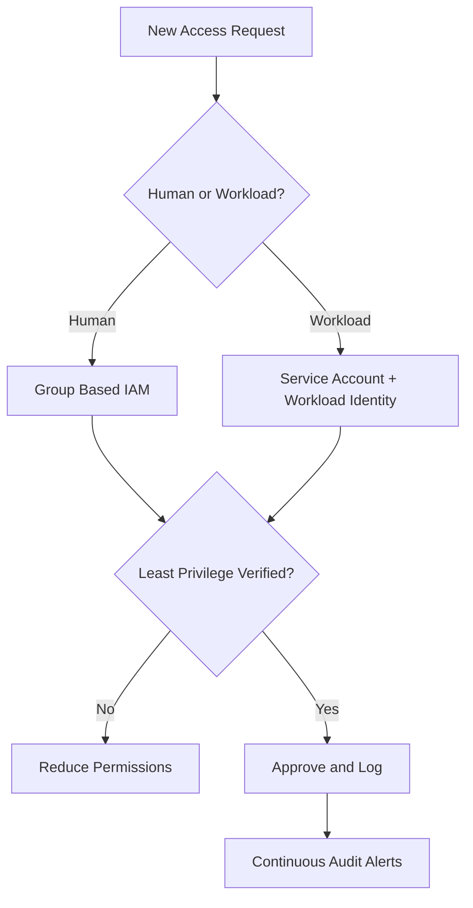
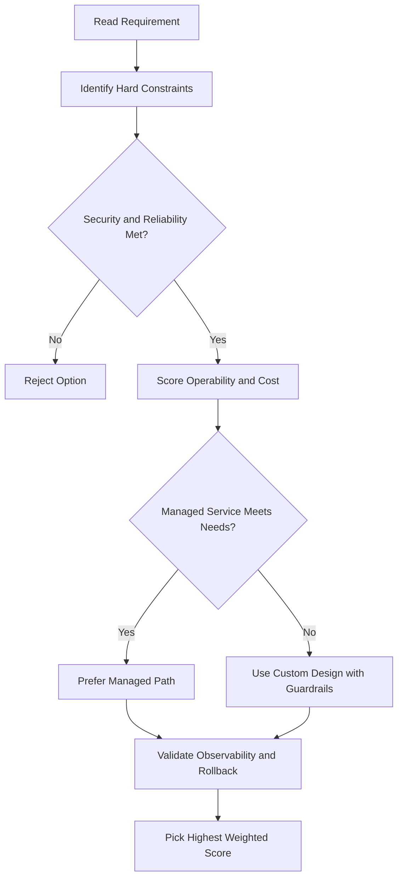
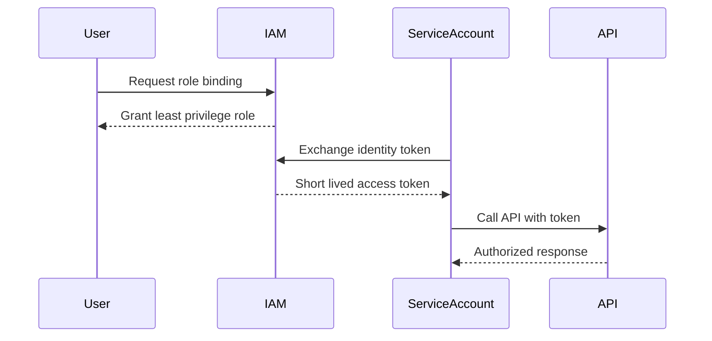

# IAM — Organization Restrictions

## What is it?

**Organization Restrictions** prevents data exfiltration through phishing or insider attacks by restricting managed devices to only access resources in **authorized Google Cloud organizations**.

---

## How it Works

Two admins collaborate to set it up:

| Role                   | Responsibility                                                                                                |
| ---------------------- | ------------------------------------------------------------------------------------------------------------- |
| **Google Cloud Admin** | Configures which organizations are authorized                                                                 |
| **Egress Proxy Admin** | Configures the proxy to inject organization restriction headers on all outbound requests from managed devices |

The egress proxy adds headers to every request from a managed device. Google Cloud inspects those headers and **allows or denies** the request based on whether the target organization is authorized.

---

## Use Cases

- **Restrict to your org only** — employees can only access resources in your Google Cloud organization, not any other
- **Restrict Cloud Storage reads** — allow employees to read Cloud Storage, but only from buckets in your org
- **Allow vendor org access** — permit access to both your org and a specific vendor's Google Cloud org

---

## Key Point

> Organization Restrictions are enforced at the **egress proxy level** on managed devices — employees using unmanaged devices are not subject to these restrictions.

## ACE Exam-Style Practice Questions

### Q1
In a Iam Organization Restrictions requirement, resources must be restricted to approved regions only. What should you use?

A. Budget alerts
B. Organization Policy for resource location restrictions
C. Cloud Scheduler
D. Labels only

Answer: B
Trap: IAM controls who can act; Org Policy controls what can be created under governance constraints.

### Q2
A new team needs isolated IAM, APIs, quotas, and billing in a Iam Organization Restrictions setup. What is best first step?

A. Create new project for the team
B. Add team as Editor to existing project
C. Create only a folder
D. Use one service account for all teams

Answer: A
Trap: Project is the operational boundary for billing, IAM bindings, API enablement, and quotas.

<!-- ACE_DEEP_ENRICHMENT_START -->
## ACE Deep Enrichment

### Think Like a Google Engineer
- Primary optimization axis: Security posture and blast-radius minimization.
- Start with constraints first: SLO, security, compliance, latency, budget, and team operations capacity.
- Prefer managed services if they satisfy requirements with lower long-term operational toil.
- Minimize blast radius using environment isolation, least privilege, and failure-domain awareness.
- Design for day-2 operations: observability, rollback strategy, and quota or budget guardrails.

### Most Correct Option Filter (60 Seconds)
1. Eliminate options with broad access, single points of failure, or missing monitoring.
2. Confirm the option meets non-negotiables first: security and reliability requirements.
3. Compare remaining options on operational simplicity and long-term maintainability.
4. Use cost as an optimizer only after requirements and risk controls are satisfied.

### Weighted Decision Matrix
| Dimension | Weight | Strong Signal |
| --- | --- | --- |
| Security | 3 | Least privilege, secure defaults, no exposed blast radius |
| Reliability | 3 | Multi-zone or HA design, health checks, tested recovery path |
| Operability | 2 | Clear monitoring, alerting, rollout and rollback simplicity |
| Cost Efficiency | 2 | Right-sized resources, no waste, no reliability regression |
| Performance | 1 | Meets latency and throughput targets with headroom |

### Real-Life Scenario
A fintech team is onboarding 40 engineers and 12 workloads in one quarter. They need strict access boundaries, auditability, and zero long-lived credentials while still shipping features fast.

### Worked Example
- Create separate projects for dev, staging, and prod so IAM and quotas are isolated.
- Map users to Google Groups and grant predefined roles at the narrowest scope.
- Use service accounts for workloads and rotate to short-lived credentials through Workload Identity.
- Enable audit logs and alert on policy changes and service account key creation.

### Flowchart


### Optimization Decision Flow


### Interaction Sequence


### Extra Exam Practice (10 Questions)
#### Q1
Scenario Focus: IAM — Organization Restrictions
Your team must grant temporary production access for incident response. Which approach is best?

A. Grant a time-bound least-privilege role through group membership and audit the binding.
B. Grant Owner role temporarily and remove it manually later.
C. Share one administrator account for faster troubleshooting.
D. Store service account keys in a shared drive because it is internal.

Answer: A
Why the other options are weaker: They typically ignore at least one hard constraint such as security, reliability, cost efficiency, or operational simplicity.
Google-engineer check: Reconfirm SLO fit, blast radius, and day-2 maintainability before finalizing.

#### Q2
Scenario Focus: IAM — Organization Restrictions
A workload is still using a JSON key file in source control. What is the best fix?

A. Share one administrator account for faster troubleshooting.
B. Move to service account impersonation or Workload Identity and disable long-lived keys.
C. Store service account keys in a shared drive because it is internal.
D. Apply organization-level broad roles so future access requests are avoided.

Answer: B
Why the other options are weaker: They typically ignore at least one hard constraint such as security, reliability, cost efficiency, or operational simplicity.
Google-engineer check: Reconfirm SLO fit, blast radius, and day-2 maintainability before finalizing.

#### Q3
Scenario Focus: IAM — Organization Restrictions
Which setup best reduces blast radius across environments?

A. Store service account keys in a shared drive because it is internal.
B. Apply organization-level broad roles so future access requests are avoided.
C. Use separate projects per environment with narrow IAM bindings at project or resource level.
D. Skip audit logs to reduce logging costs during non-peak hours.

Answer: C
Why the other options are weaker: They typically ignore at least one hard constraint such as security, reliability, cost efficiency, or operational simplicity.
Google-engineer check: Reconfirm SLO fit, blast radius, and day-2 maintainability before finalizing.

#### Q4
Scenario Focus: IAM — Organization Restrictions
What should you monitor first for IAM abuse detection?

A. Apply organization-level broad roles so future access requests are avoided.
B. Skip audit logs to reduce logging costs during non-peak hours.
C. Grant Owner role temporarily and remove it manually later.
D. Alert on IAM policy changes, service account key creation, and high-risk privilege grants.

Answer: D
Why the other options are weaker: They typically ignore at least one hard constraint such as security, reliability, cost efficiency, or operational simplicity.
Google-engineer check: Reconfirm SLO fit, blast radius, and day-2 maintainability before finalizing.

#### Q5
Scenario Focus: IAM — Organization Restrictions
A developer needs read-only billing visibility. Which decision is best?

A. Assign a billing viewer role at the required scope instead of broad project editor access.
B. Skip audit logs to reduce logging costs during non-peak hours.
C. Grant Owner role temporarily and remove it manually later.
D. Share one administrator account for faster troubleshooting.

Answer: A
Why the other options are weaker: They typically ignore at least one hard constraint such as security, reliability, cost efficiency, or operational simplicity.
Google-engineer check: Reconfirm SLO fit, blast radius, and day-2 maintainability before finalizing.

#### Q6
Scenario Focus: IAM — Organization Restrictions
Two designs both satisfy the happy path for IAM — Organization Restrictions. Which choice is most correct?

A. Grant Owner role temporarily and remove it manually later.
B. Choose the option that preserves reliability and security while reducing operational burden.
C. Share one administrator account for faster troubleshooting.
D. Store service account keys in a shared drive because it is internal.

Answer: B
Why the other options are weaker: They typically ignore at least one hard constraint such as security, reliability, cost efficiency, or operational simplicity.
Google-engineer check: Reconfirm SLO fit, blast radius, and day-2 maintainability before finalizing.

#### Q7
Scenario Focus: IAM — Organization Restrictions
What should you validate first before choosing an architecture for IAM — Organization Restrictions?

A. Share one administrator account for faster troubleshooting.
B. Store service account keys in a shared drive because it is internal.
C. Validate SLO fit, blast radius, and least-privilege controls before comparing convenience.
D. Apply organization-level broad roles so future access requests are avoided.

Answer: C
Why the other options are weaker: They typically ignore at least one hard constraint such as security, reliability, cost efficiency, or operational simplicity.
Google-engineer check: Reconfirm SLO fit, blast radius, and day-2 maintainability before finalizing.

#### Q8
Scenario Focus: IAM — Organization Restrictions
A proposal lowers cost but increases failure risk. What is the best decision?

A. Store service account keys in a shared drive because it is internal.
B. Apply organization-level broad roles so future access requests are avoided.
C. Skip audit logs to reduce logging costs during non-peak hours.
D. Reject it unless reliability and recovery objectives remain within required targets.

Answer: D
Why the other options are weaker: They typically ignore at least one hard constraint such as security, reliability, cost efficiency, or operational simplicity.
Google-engineer check: Reconfirm SLO fit, blast radius, and day-2 maintainability before finalizing.

#### Q9
Scenario Focus: IAM — Organization Restrictions
Which option best reflects optimization for Security posture and blast-radius minimization?

A. Select the design that best meets Security posture and blast-radius minimization while keeping constraints balanced.
B. Apply organization-level broad roles so future access requests are avoided.
C. Skip audit logs to reduce logging costs during non-peak hours.
D. Grant Owner role temporarily and remove it manually later.

Answer: A
Why the other options are weaker: They typically ignore at least one hard constraint such as security, reliability, cost efficiency, or operational simplicity.
Google-engineer check: Reconfirm SLO fit, blast radius, and day-2 maintainability before finalizing.

#### Q10
Scenario Focus: IAM — Organization Restrictions
How should you evaluate a design that needs frequent manual interventions?

A. Skip audit logs to reduce logging costs during non-peak hours.
B. Treat it as high risk and prefer automation-friendly designs with observability and rollback.
C. Grant Owner role temporarily and remove it manually later.
D. Share one administrator account for faster troubleshooting.

Answer: B
Why the other options are weaker: They typically ignore at least one hard constraint such as security, reliability, cost efficiency, or operational simplicity.
Google-engineer check: Reconfirm SLO fit, blast radius, and day-2 maintainability before finalizing.

### Quick Commands
```bash
gcloud projects get-iam-policy PROJECT_ID
gcloud projects add-iam-policy-binding PROJECT_ID --member=group:team@example.com --role=roles/viewer
gcloud iam service-accounts list --project=PROJECT_ID
gcloud logging read "protoPayload.methodName=\"SetIamPolicy\"" --freshness=7d --project=PROJECT_ID --limit=20
```

### Fast Recall
- Least privilege beats convenience in all exam scenarios.
- Prefer groups for humans and service accounts for workloads.
- Avoid long-lived keys whenever possible.
<!-- ACE_DEEP_ENRICHMENT_END -->