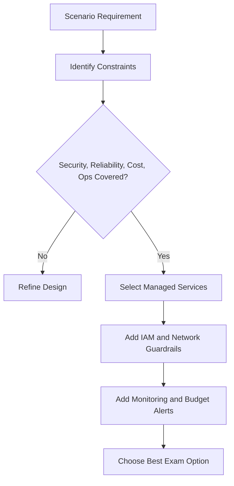
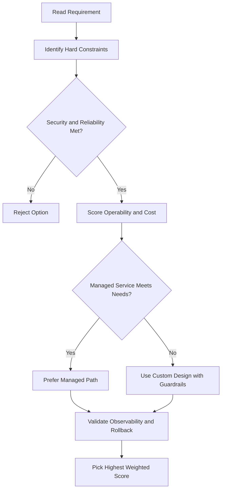
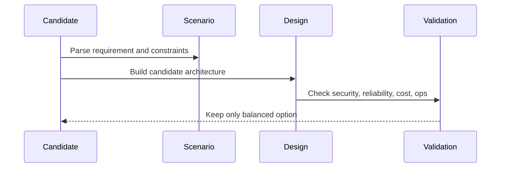

# Cross-Topic Mix Set 060

Coverage Window: topics 001 to 060
Newly Added Since Last Mix: topics 058 to 060

Focus Topics For This Set:
- Kubernetes Intro
- Spanner
- Gke Overview
- Gke Kubernetes Concepts Module Intro
- Kubernetes Object Model Declarative Management
- Kubernetes Components Control Plane Nodes
- Gke Autopilot Vs Standard
- Kubernetes Object Management

Question Count: 4
Each question mixes 2 to 5 previously covered concepts.

### Q1 (Mix 2 Concepts)
Concept Mix: Virtual Private Cloud + Dataflow
Scenario: You are deploying a production workload that combines the concepts above. The system must be secure, scalable, and cost-aware while minimizing operations overhead. What is the best approach?

A. Use broad Owner/Editor roles and one shared manual setup to reduce initial effort.
B. Use managed-service-first architecture with least-privilege controls; analytics pipeline with correct ingest, transform, and warehouse roles, and enforce least-privilege IAM with automated monitoring and alerts.
C. Optimize only for short-term cost and ignore latency, reliability, and recovery constraints.
D. Rely on ad-hoc scripts with public exposure defaults and fix controls later.

Answer: B
Trap: The wrong options either over-privilege access, over-index on one constraint, or increase manual operational risk.
### Q2 (Mix 3 Concepts)
Concept Mix: Cloud Load Balancing + Load Balancing Module Summary + Billing And Cost Controls
Scenario: You are deploying a production workload that combines the concepts above. The system must be secure, scalable, and cost-aware while minimizing operations overhead. What is the best approach?

A. Use broad Owner/Editor roles and one shared manual setup to reduce initial effort.
B. Optimize only for short-term cost and ignore latency, reliability, and recovery constraints.
C. Use correct load balancer type with DNS and edge strategy aligned to traffic pattern; budgets and alerts with quotas plus billing export visibility, and enforce least-privilege IAM with automated monitoring and alerts.
D. Rely on ad-hoc scripts with public exposure defaults and fix controls later.

Answer: C
Trap: The wrong options either over-privilege access, over-index on one constraint, or increase manual operational risk.
### Q3 (Mix 4 Concepts)
Concept Mix: Storage Overview + Internal Load Balancing + Gemini Enterprise Demo + Gke Overview
Scenario: You are deploying a production workload that combines the concepts above. The system must be secure, scalable, and cost-aware while minimizing operations overhead. What is the best approach?

A. Use storage class and lifecycle policy selected by access frequency and retention; correct load balancer type with DNS and edge strategy aligned to traffic pattern; managed-service-first architecture with least-privilege controls, and enforce least-privilege IAM with automated monitoring and alerts.
B. Use broad Owner/Editor roles and one shared manual setup to reduce initial effort.
C. Optimize only for short-term cost and ignore latency, reliability, and recovery constraints.
D. Rely on ad-hoc scripts with public exposure defaults and fix controls later.

Answer: A
Trap: The wrong options either over-privilege access, over-index on one constraint, or increase manual operational risk.
### Q4 (Mix 5 Concepts)
Concept Mix: Choosing Hybrid Connectivity + Internal Load Balancer Lab + Managed Services Module Summary + What Is A Container + Compute Engine
Scenario: You are deploying a production workload that combines the concepts above. The system must be secure, scalable, and cost-aware while minimizing operations overhead. What is the best approach?

A. Use broad Owner/Editor roles and one shared manual setup to reduce initial effort.
B. Optimize only for short-term cost and ignore latency, reliability, and recovery constraints.
C. Rely on ad-hoc scripts with public exposure defaults and fix controls later.
D. Use private connectivity with HA VPN or Interconnect and correct egress design; managed-service-first architecture with least-privilege controls; analytics pipeline with correct ingest, transform, and warehouse roles, and enforce least-privilege IAM with automated monitoring and alerts.

Answer: D
Trap: The wrong options either over-privilege access, over-index on one constraint, or increase manual operational risk.

<!-- ACE_DEEP_ENRICHMENT_START -->
## ACE Deep Enrichment

### Think Like a Google Engineer
- Primary optimization axis: Balanced trade-offs across security, reliability, cost, and operability.
- Start with constraints first: SLO, security, compliance, latency, budget, and team operations capacity.
- Prefer managed services if they satisfy requirements with lower long-term operational toil.
- Minimize blast radius using environment isolation, least privilege, and failure-domain awareness.
- Design for day-2 operations: observability, rollback strategy, and quota or budget guardrails.

### Most Correct Option Filter (60 Seconds)
1. Eliminate options with broad access, single points of failure, or missing monitoring.
2. Confirm the option meets non-negotiables first: security and reliability requirements.
3. Compare remaining options on operational simplicity and long-term maintainability.
4. Use cost as an optimizer only after requirements and risk controls are satisfied.

### Weighted Decision Matrix
| Dimension | Weight | Strong Signal |
| --- | --- | --- |
| Security | 3 | Least privilege, secure defaults, no exposed blast radius |
| Reliability | 3 | Multi-zone or HA design, health checks, tested recovery path |
| Operability | 2 | Clear monitoring, alerting, rollout and rollback simplicity |
| Cost Efficiency | 2 | Right-sized resources, no waste, no reliability regression |
| Performance | 1 | Meets latency and throughput targets with headroom |

### Real-Life Scenario
This checkpoint combines multiple earlier topics. Treat it like a production architecture review where security, reliability, cost, and operations all matter at the same time.

### Worked Example
- Read requirements and classify them into security, reliability, performance, and cost.
- Pick managed services first, then add specific controls for access and observability.
- Validate failure handling across zone, region, and dependency boundaries.
- Reject options that optimize one constraint while breaking others.

### Flowchart


### Optimization Decision Flow


### Interaction Sequence


### Extra Exam Practice (10 Questions)
#### Q1
Scenario Focus: Cross-Topic Mix Set 060
A mixed-topic scenario has one option that is fast but insecure. What should you do?

A. Reject it and choose the option that balances security with reliability and operations.
B. Pick the shortest option because it saves reading time.
C. Optimize only for cost and ignore reliability requirements.
D. Assume manual fixes later are acceptable in production.

Answer: A
Why the other options are weaker: They typically ignore at least one hard constraint such as security, reliability, cost efficiency, or operational simplicity.
Google-engineer check: Reconfirm SLO fit, blast radius, and day-2 maintainability before finalizing.

#### Q2
Scenario Focus: Cross-Topic Mix Set 060
Which answer pattern is usually strongest in mixed scenarios?

A. Optimize only for cost and ignore reliability requirements.
B. Choose managed-service-first plus least-privilege IAM and observability controls.
C. Assume manual fixes later are acceptable in production.
D. Prefer options with broad admin access for simplicity.

Answer: B
Why the other options are weaker: They typically ignore at least one hard constraint such as security, reliability, cost efficiency, or operational simplicity.
Google-engineer check: Reconfirm SLO fit, blast radius, and day-2 maintainability before finalizing.

#### Q3
Scenario Focus: Cross-Topic Mix Set 060
A design is cheap but single-zone and unmonitored. How should you evaluate it?

A. Assume manual fixes later are acceptable in production.
B. Prefer options with broad admin access for simplicity.
C. Mark it as a trap because it violates reliability and operational readiness.
D. Skip checking observability and backup strategy.

Answer: C
Why the other options are weaker: They typically ignore at least one hard constraint such as security, reliability, cost efficiency, or operational simplicity.
Google-engineer check: Reconfirm SLO fit, blast radius, and day-2 maintainability before finalizing.

#### Q4
Scenario Focus: Cross-Topic Mix Set 060
What is the best exam-time method when two options look correct?

A. Prefer options with broad admin access for simplicity.
B. Skip checking observability and backup strategy.
C. Pick the shortest option because it saves reading time.
D. Score both options against all constraints and pick the one with fewer tradeoff risks.

Answer: D
Why the other options are weaker: They typically ignore at least one hard constraint such as security, reliability, cost efficiency, or operational simplicity.
Google-engineer check: Reconfirm SLO fit, blast radius, and day-2 maintainability before finalizing.

#### Q5
Scenario Focus: Cross-Topic Mix Set 060
How do you avoid trap choices in cumulative questions?

A. Eliminate options with broad access, single points of failure, or missing monitoring.
B. Skip checking observability and backup strategy.
C. Pick the shortest option because it saves reading time.
D. Optimize only for cost and ignore reliability requirements.

Answer: A
Why the other options are weaker: They typically ignore at least one hard constraint such as security, reliability, cost efficiency, or operational simplicity.
Google-engineer check: Reconfirm SLO fit, blast radius, and day-2 maintainability before finalizing.

#### Q6
Scenario Focus: Cross-Topic Mix Set 060
Two designs both satisfy the happy path for Cross-Topic Mix Set 060. Which choice is most correct?

A. Pick the shortest option because it saves reading time.
B. Choose the option that preserves reliability and security while reducing operational burden.
C. Optimize only for cost and ignore reliability requirements.
D. Assume manual fixes later are acceptable in production.

Answer: B
Why the other options are weaker: They typically ignore at least one hard constraint such as security, reliability, cost efficiency, or operational simplicity.
Google-engineer check: Reconfirm SLO fit, blast radius, and day-2 maintainability before finalizing.

#### Q7
Scenario Focus: Cross-Topic Mix Set 060
What should you validate first before choosing an architecture for Cross-Topic Mix Set 060?

A. Optimize only for cost and ignore reliability requirements.
B. Assume manual fixes later are acceptable in production.
C. Validate SLO fit, blast radius, and least-privilege controls before comparing convenience.
D. Prefer options with broad admin access for simplicity.

Answer: C
Why the other options are weaker: They typically ignore at least one hard constraint such as security, reliability, cost efficiency, or operational simplicity.
Google-engineer check: Reconfirm SLO fit, blast radius, and day-2 maintainability before finalizing.

#### Q8
Scenario Focus: Cross-Topic Mix Set 060
A proposal lowers cost but increases failure risk. What is the best decision?

A. Assume manual fixes later are acceptable in production.
B. Prefer options with broad admin access for simplicity.
C. Skip checking observability and backup strategy.
D. Reject it unless reliability and recovery objectives remain within required targets.

Answer: D
Why the other options are weaker: They typically ignore at least one hard constraint such as security, reliability, cost efficiency, or operational simplicity.
Google-engineer check: Reconfirm SLO fit, blast radius, and day-2 maintainability before finalizing.

#### Q9
Scenario Focus: Cross-Topic Mix Set 060
Which option best reflects optimization for Balanced trade-offs across security, reliability, cost, and operability?

A. Select the design that best meets Balanced trade-offs across security, reliability, cost, and operability while keeping constraints balanced.
B. Prefer options with broad admin access for simplicity.
C. Skip checking observability and backup strategy.
D. Pick the shortest option because it saves reading time.

Answer: A
Why the other options are weaker: They typically ignore at least one hard constraint such as security, reliability, cost efficiency, or operational simplicity.
Google-engineer check: Reconfirm SLO fit, blast radius, and day-2 maintainability before finalizing.

#### Q10
Scenario Focus: Cross-Topic Mix Set 060
How should you evaluate a design that needs frequent manual interventions?

A. Skip checking observability and backup strategy.
B. Treat it as high risk and prefer automation-friendly designs with observability and rollback.
C. Pick the shortest option because it saves reading time.
D. Optimize only for cost and ignore reliability requirements.

Answer: B
Why the other options are weaker: They typically ignore at least one hard constraint such as security, reliability, cost efficiency, or operational simplicity.
Google-engineer check: Reconfirm SLO fit, blast radius, and day-2 maintainability before finalizing.

### Quick Commands
```bash
gcloud projects list
gcloud services list --enabled --project=PROJECT_ID
gcloud logging read "severity>=ERROR" --project=PROJECT_ID --freshness=24h --limit=10
gcloud compute regions list
```

### Fast Recall
- Mixed questions reward balanced architecture decisions.
- Strong options usually include security and observability by default.
- Trap answers often trade production safety for short-term convenience.
<!-- ACE_DEEP_ENRICHMENT_END -->