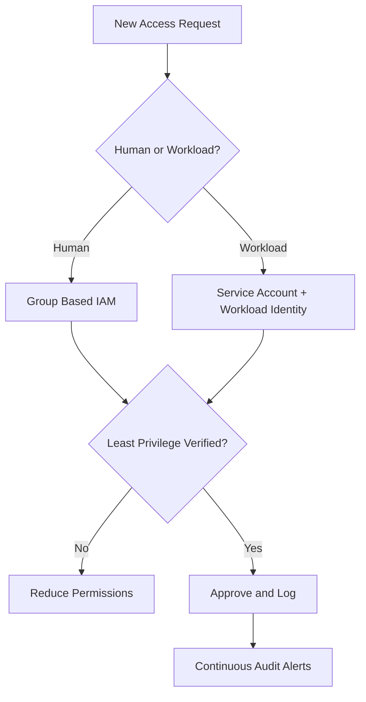
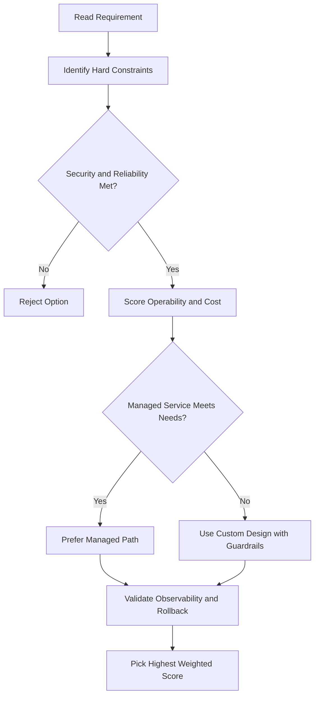
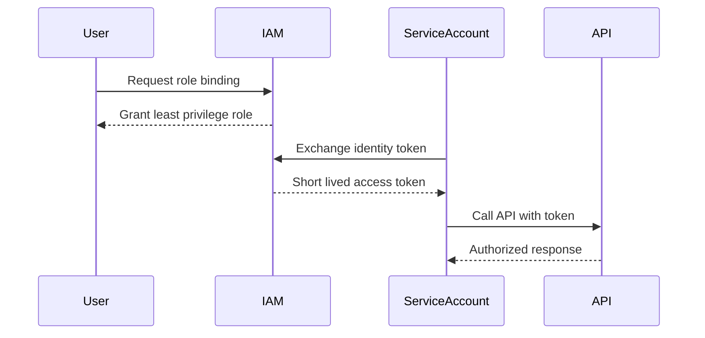

# IAM — Lab Walkthrough: Access Control with IAM

## Setup

- Two users provided by Qwiklabs: **Username 1** (admin) and **Username 2** (restricted)
- Username 1 has: App Engine Admin, BigQuery Admin, Editor, Owner, Viewer
- Username 2 starts with: **Viewer only**

---

## Task 1 & 2 — Explore the IAM Console

- Log in as both users in separate tabs
- In IAM, compare the roles assigned to each user
- Observe that role options are organized by product/service

---

## Task 3 — Create a Storage Bucket (as Username 1)

- Create a bucket using the **Project ID** as the name (globally unique)
- Upload any file and rename it to `sample.txt`
- Username 2 (Viewer) can see the bucket via inheritance

---

## Task 4 — Remove Viewer Role from Username 2

- In IAM (as Username 1), find Username 2 → Edit → delete the Viewer role → Save
- Verify: Username 2 can no longer list or view buckets
  - Error: _"List of buckets could not be loaded"_

---

## Task 5 — Add Storage Object Viewer to Username 2

- In IAM (as Username 1) → Add member → paste Username 2 → assign **Storage Object Viewer**
- Verify via Cloud Shell (as Username 2):

```bash
gsutil ls gs://BUCKET_NAME
# Expected: sample.txt is listed
```

> Note: Username 2 has no project Viewer role, so the console won't show resources — use Cloud Shell instead.

---

## Task 6 — Create a Service Account and Assign It to a VM

1. Go to **IAM & Admin → Service Accounts** → Create
   - Name: `read-bucket-objects`
   - Role: **Storage Object Viewer**
2. On the service account resource itself, grant **Service Account User** role to a domain (e.g. `autostrat.com`)
3. Grant **Compute Instance Admin v1** to the same domain via IAM
4. Create a VM:
   - Name: `demoIAM`
   - Region: `us-central1-c`
   - Machine type: `f1-micro`
   - Service account: `read-bucket-objects`

---

## Task 7 — Explore Service Account Permissions (via SSH into VM)

```bash
# This FAILS — service account has no permission to list instances
gcloud compute instances list

# This SUCCEEDS — service account has Storage Object Viewer
gsutil cp gs://BUCKET_NAME/sample.txt .

# This FAILS — service account cannot write to the bucket
gsutil cp sample.txt gs://BUCKET_NAME/
```

**Key takeaway:** The VM inherits only the permissions of its assigned service account — nothing more.

---

## Lab Summary

| Action                                    | Result                                               |
| ----------------------------------------- | ---------------------------------------------------- |
| Removed Viewer from Username 2            | Lost all console/bucket access                       |
| Added Storage Object Viewer to Username 2 | Can list bucket contents only                        |
| VM with `read-bucket-objects` SA          | Can read from bucket, cannot list instances or write |

> **Tip:** If you miss a checkpoint, go back 2–3 steps and re-check your work before assuming the lab is broken.

## ACE Exam-Style Practice Questions

### Q1
In a Iam Lab Walkthrough scenario, two answers seem technically possible. What tie-breaker should you apply first?

A. Pick the option with most manual steps
B. Pick the option with least privilege and least operational overhead that still meets requirements
C. Pick highest-cost option
D. Pick the oldest product

Answer: B
Trap: ACE-style scenarios reward secure, managed, requirement-fit decisions.

### Q2
For Iam Lab Walkthrough, what is the best way to reduce wrong answers in multi-choice questions?

A. Ignore scaling and security words
B. Identify trigger words, eliminate over-privileged choices, then choose the managed fit
C. Always pick Compute Engine
D. Always pick the shortest option

Answer: B
Trap: Structured elimination is more reliable than memorization alone.

<!-- ACE_DEEP_ENRICHMENT_START -->
## ACE Deep Enrichment

### Think Like a Google Engineer
- Primary optimization axis: Security posture and blast-radius minimization.
- Start with constraints first: SLO, security, compliance, latency, budget, and team operations capacity.
- Prefer managed services if they satisfy requirements with lower long-term operational toil.
- Minimize blast radius using environment isolation, least privilege, and failure-domain awareness.
- Design for day-2 operations: observability, rollback strategy, and quota or budget guardrails.

### Most Correct Option Filter (60 Seconds)
1. Eliminate options with broad access, single points of failure, or missing monitoring.
2. Confirm the option meets non-negotiables first: security and reliability requirements.
3. Compare remaining options on operational simplicity and long-term maintainability.
4. Use cost as an optimizer only after requirements and risk controls are satisfied.

### Weighted Decision Matrix
| Dimension | Weight | Strong Signal |
| --- | --- | --- |
| Security | 3 | Least privilege, secure defaults, no exposed blast radius |
| Reliability | 3 | Multi-zone or HA design, health checks, tested recovery path |
| Operability | 2 | Clear monitoring, alerting, rollout and rollback simplicity |
| Cost Efficiency | 2 | Right-sized resources, no waste, no reliability regression |
| Performance | 1 | Meets latency and throughput targets with headroom |

### Real-Life Scenario
A fintech team is onboarding 40 engineers and 12 workloads in one quarter. They need strict access boundaries, auditability, and zero long-lived credentials while still shipping features fast.

### Worked Example
- Create separate projects for dev, staging, and prod so IAM and quotas are isolated.
- Map users to Google Groups and grant predefined roles at the narrowest scope.
- Use service accounts for workloads and rotate to short-lived credentials through Workload Identity.
- Enable audit logs and alert on policy changes and service account key creation.

### Flowchart


### Optimization Decision Flow


### Interaction Sequence


### Extra Exam Practice (15 Questions)
#### Q1
Scenario Focus: IAM — Lab Walkthrough: Access Control with IAM
Your team must grant temporary production access for incident response. Which approach is best?

A. Grant a time-bound least-privilege role through group membership and audit the binding.
B. Grant Owner role temporarily and remove it manually later.
C. Share one administrator account for faster troubleshooting.
D. Store service account keys in a shared drive because it is internal.

Answer: A
Why the other options are weaker: They typically ignore at least one hard constraint such as security, reliability, cost efficiency, or operational simplicity.
Google-engineer check: Reconfirm SLO fit, blast radius, and day-2 maintainability before finalizing.

#### Q2
Scenario Focus: IAM — Lab Walkthrough: Access Control with IAM
A workload is still using a JSON key file in source control. What is the best fix?

A. Share one administrator account for faster troubleshooting.
B. Move to service account impersonation or Workload Identity and disable long-lived keys.
C. Store service account keys in a shared drive because it is internal.
D. Apply organization-level broad roles so future access requests are avoided.

Answer: B
Why the other options are weaker: They typically ignore at least one hard constraint such as security, reliability, cost efficiency, or operational simplicity.
Google-engineer check: Reconfirm SLO fit, blast radius, and day-2 maintainability before finalizing.

#### Q3
Scenario Focus: IAM — Lab Walkthrough: Access Control with IAM
Which setup best reduces blast radius across environments?

A. Store service account keys in a shared drive because it is internal.
B. Apply organization-level broad roles so future access requests are avoided.
C. Use separate projects per environment with narrow IAM bindings at project or resource level.
D. Skip audit logs to reduce logging costs during non-peak hours.

Answer: C
Why the other options are weaker: They typically ignore at least one hard constraint such as security, reliability, cost efficiency, or operational simplicity.
Google-engineer check: Reconfirm SLO fit, blast radius, and day-2 maintainability before finalizing.

#### Q4
Scenario Focus: IAM — Lab Walkthrough: Access Control with IAM
What should you monitor first for IAM abuse detection?

A. Apply organization-level broad roles so future access requests are avoided.
B. Skip audit logs to reduce logging costs during non-peak hours.
C. Grant Owner role temporarily and remove it manually later.
D. Alert on IAM policy changes, service account key creation, and high-risk privilege grants.

Answer: D
Why the other options are weaker: They typically ignore at least one hard constraint such as security, reliability, cost efficiency, or operational simplicity.
Google-engineer check: Reconfirm SLO fit, blast radius, and day-2 maintainability before finalizing.

#### Q5
Scenario Focus: IAM — Lab Walkthrough: Access Control with IAM
A developer needs read-only billing visibility. Which decision is best?

A. Assign a billing viewer role at the required scope instead of broad project editor access.
B. Skip audit logs to reduce logging costs during non-peak hours.
C. Grant Owner role temporarily and remove it manually later.
D. Share one administrator account for faster troubleshooting.

Answer: A
Why the other options are weaker: They typically ignore at least one hard constraint such as security, reliability, cost efficiency, or operational simplicity.
Google-engineer check: Reconfirm SLO fit, blast radius, and day-2 maintainability before finalizing.

#### Q6
Scenario Focus: IAM — Lab Walkthrough: Access Control with IAM
Two designs both satisfy the happy path for IAM — Lab Walkthrough: Access Control with IAM. Which choice is most correct?

A. Grant Owner role temporarily and remove it manually later.
B. Choose the option that preserves reliability and security while reducing operational burden.
C. Share one administrator account for faster troubleshooting.
D. Store service account keys in a shared drive because it is internal.

Answer: B
Why the other options are weaker: They typically ignore at least one hard constraint such as security, reliability, cost efficiency, or operational simplicity.
Google-engineer check: Reconfirm SLO fit, blast radius, and day-2 maintainability before finalizing.

#### Q7
Scenario Focus: IAM — Lab Walkthrough: Access Control with IAM
What should you validate first before choosing an architecture for IAM — Lab Walkthrough: Access Control with IAM?

A. Share one administrator account for faster troubleshooting.
B. Store service account keys in a shared drive because it is internal.
C. Validate SLO fit, blast radius, and least-privilege controls before comparing convenience.
D. Apply organization-level broad roles so future access requests are avoided.

Answer: C
Why the other options are weaker: They typically ignore at least one hard constraint such as security, reliability, cost efficiency, or operational simplicity.
Google-engineer check: Reconfirm SLO fit, blast radius, and day-2 maintainability before finalizing.

#### Q8
Scenario Focus: IAM — Lab Walkthrough: Access Control with IAM
A proposal lowers cost but increases failure risk. What is the best decision?

A. Store service account keys in a shared drive because it is internal.
B. Apply organization-level broad roles so future access requests are avoided.
C. Skip audit logs to reduce logging costs during non-peak hours.
D. Reject it unless reliability and recovery objectives remain within required targets.

Answer: D
Why the other options are weaker: They typically ignore at least one hard constraint such as security, reliability, cost efficiency, or operational simplicity.
Google-engineer check: Reconfirm SLO fit, blast radius, and day-2 maintainability before finalizing.

#### Q9
Scenario Focus: IAM — Lab Walkthrough: Access Control with IAM
Which option best reflects optimization for Security posture and blast-radius minimization?

A. Select the design that best meets Security posture and blast-radius minimization while keeping constraints balanced.
B. Apply organization-level broad roles so future access requests are avoided.
C. Skip audit logs to reduce logging costs during non-peak hours.
D. Grant Owner role temporarily and remove it manually later.

Answer: A
Why the other options are weaker: They typically ignore at least one hard constraint such as security, reliability, cost efficiency, or operational simplicity.
Google-engineer check: Reconfirm SLO fit, blast radius, and day-2 maintainability before finalizing.

#### Q10
Scenario Focus: IAM — Lab Walkthrough: Access Control with IAM
How should you evaluate a design that needs frequent manual interventions?

A. Skip audit logs to reduce logging costs during non-peak hours.
B. Treat it as high risk and prefer automation-friendly designs with observability and rollback.
C. Grant Owner role temporarily and remove it manually later.
D. Share one administrator account for faster troubleshooting.

Answer: B
Why the other options are weaker: They typically ignore at least one hard constraint such as security, reliability, cost efficiency, or operational simplicity.
Google-engineer check: Reconfirm SLO fit, blast radius, and day-2 maintainability before finalizing.

#### Q11
Scenario Focus: IAM — Lab Walkthrough: Access Control with IAM
Two options have similar latency. Which tie-breaker is best?

A. Grant Owner role temporarily and remove it manually later.
B. Share one administrator account for faster troubleshooting.
C. Pick the option with stronger operability, clearer failure isolation, and simpler incident response.
D. Store service account keys in a shared drive because it is internal.

Answer: C
Why the other options are weaker: They typically ignore at least one hard constraint such as security, reliability, cost efficiency, or operational simplicity.
Google-engineer check: Reconfirm SLO fit, blast radius, and day-2 maintainability before finalizing.

#### Q12
Scenario Focus: IAM — Lab Walkthrough: Access Control with IAM
What is the best way to choose between a custom stack and a managed service?

A. Share one administrator account for faster troubleshooting.
B. Store service account keys in a shared drive because it is internal.
C. Apply organization-level broad roles so future access requests are avoided.
D. Prefer managed services when they meet requirements with lower long-term maintenance effort.

Answer: D
Why the other options are weaker: They typically ignore at least one hard constraint such as security, reliability, cost efficiency, or operational simplicity.
Google-engineer check: Reconfirm SLO fit, blast radius, and day-2 maintainability before finalizing.

#### Q13
Scenario Focus: IAM — Lab Walkthrough: Access Control with IAM
How do you confirm a solution is production-ready for 

A. Verify monitoring, alerting, rollback path, quota and budget controls, and secure defaults.
B. Store service account keys in a shared drive because it is internal.
C. Apply organization-level broad roles so future access requests are avoided.
D. Skip audit logs to reduce logging costs during non-peak hours.

Answer: A
Why the other options are weaker: They typically ignore at least one hard constraint such as security, reliability, cost efficiency, or operational simplicity.
Google-engineer check: Reconfirm SLO fit, blast radius, and day-2 maintainability before finalizing.

#### Q14
Scenario Focus: IAM — Lab Walkthrough: Access Control with IAM
Which pattern usually wins in ACE scenario tie-breakers?

A. Apply organization-level broad roles so future access requests are avoided.
B. Managed-service-first plus least-privilege access plus clear observability usually wins.
C. Skip audit logs to reduce logging costs during non-peak hours.
D. Grant Owner role temporarily and remove it manually later.

Answer: B
Why the other options are weaker: They typically ignore at least one hard constraint such as security, reliability, cost efficiency, or operational simplicity.
Google-engineer check: Reconfirm SLO fit, blast radius, and day-2 maintainability before finalizing.

#### Q15
Scenario Focus: IAM — Lab Walkthrough: Access Control with IAM
What is the best final check before locking the answer?

A. Skip audit logs to reduce logging costs during non-peak hours.
B. Grant Owner role temporarily and remove it manually later.
C. Run a weighted check across security, reliability, cost, performance, and operability.
D. Share one administrator account for faster troubleshooting.

Answer: C
Why the other options are weaker: They typically ignore at least one hard constraint such as security, reliability, cost efficiency, or operational simplicity.
Google-engineer check: Reconfirm SLO fit, blast radius, and day-2 maintainability before finalizing.

### Quick Commands
```bash
gcloud projects get-iam-policy PROJECT_ID
gcloud projects add-iam-policy-binding PROJECT_ID --member=group:team@example.com --role=roles/viewer
gcloud iam service-accounts list --project=PROJECT_ID
gcloud logging read "protoPayload.methodName=\"SetIamPolicy\"" --freshness=7d --project=PROJECT_ID --limit=20
```

### Fast Recall
- Least privilege beats convenience in all exam scenarios.
- Prefer groups for humans and service accounts for workloads.
- Avoid long-lived keys whenever possible.
<!-- ACE_DEEP_ENRICHMENT_END -->