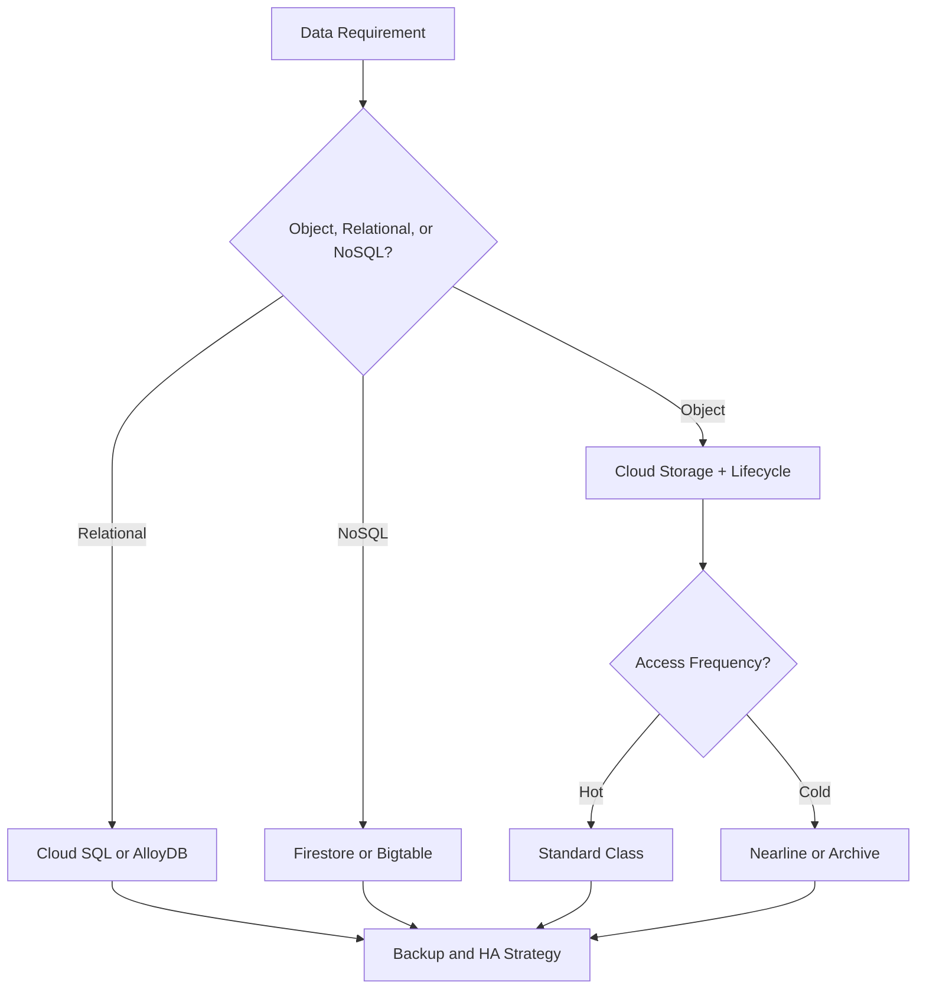
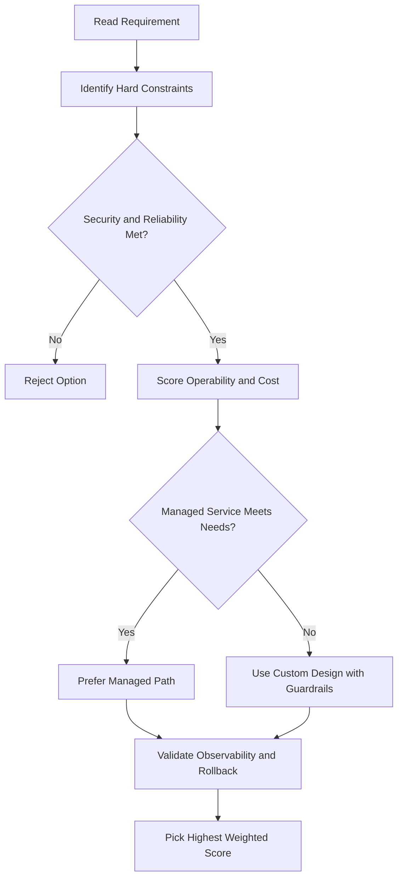
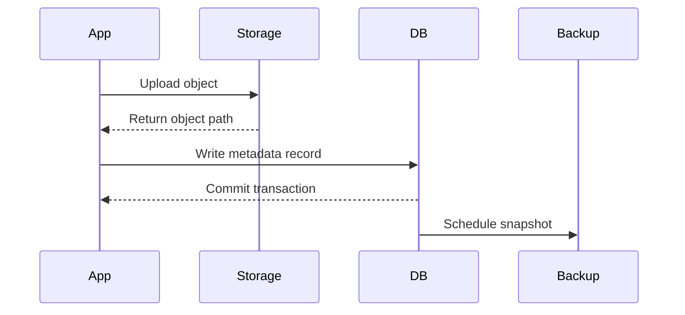

# Cloud Storage — Deep Dive

## Key Characteristics

- Scalable to **exabytes** of data
- Time to first byte: **milliseconds**
- **11 nines of durability** (99.999999999%) — you won't lose data, but availability varies by class
- Single API across all storage classes
- Not a file system — it's a collection of **buckets** containing **objects**, accessed via unique URLs

---

## Storage Classes

| Class        | Min Duration | Retrieval Cost | Best For                                   |
| ------------ | ------------ | -------------- | ------------------------------------------ |
| **Standard** | None         | None           | Hot data, frequently accessed, short-lived |
| **Nearline** | 30 days      | Yes            | Backups, infrequent access (~once/month)   |
| **Coldline** | 90 days      | Higher         | Rarely accessed (~once/quarter)            |
| **Archive**  | 365 days     | Highest        | Long-term archival, DR (<once/year)        |

> Archive data is still available within **milliseconds** — unlike cold storage on other clouds that takes hours.

### Location Types (apply to all storage classes)

| Type             | Description                                           | Redundancy    |
| ---------------- | ----------------------------------------------------- | ------------- |
| **Region**       | Single geographic location (e.g. London)              | Zonal         |
| **Dual-region**  | Specific pair of regions (e.g. Finland + Netherlands) | Geo-redundant |
| **Multi-region** | Large area containing 2+ regions (e.g. US)            | Geo-redundant |

> You **cannot** change location type after bucket creation (e.g. regional → multi-region).

---

## Buckets and Objects

- Bucket names must be **globally unique**; buckets cannot be nested
- Objects inherit the bucket's storage class by default — but you can set a **per-object storage class**
- You can change the storage class of an object **without moving it** or changing its URL
- Use **Object Lifecycle Management** to automate class transitions (e.g. move to Nearline after 30 days)

---

## Access Control — Four Layers

From broadest to most granular:

| Mechanism                   | Scope                                  | Use When                                           |
| --------------------------- | -------------------------------------- | -------------------------------------------------- |
| **IAM**                     | Project → bucket → object              | Standard access control (recommended)              |
| **ACLs**                    | Per bucket or object (max 100 entries) | Fine-grained control beyond IAM                    |
| **Signed URLs**             | Per object, time-limited               | Granting temporary access without a Google account |
| **Signed Policy Documents** | Upload restrictions on signed URL      | Controlling what files can be uploaded             |

### ACLs

Each ACL entry has:

- **Scope** — who (specific user, group, `allUsers`, `allAuthenticatedUsers`)
- **Permission** — what (read, write)

> `allUsers` = anyone on the internet (no Google account needed)
> `allAuthenticatedUsers` = anyone signed in with a Google account

### Signed URLs

- Grant **read or write** access to a specific object for a limited time
- Signed with a **private key** tied to a service account
- Once issued, you can't revoke it — keep expiry short
- Useful when users don't have Google accounts

---

## gcloud Commands

```bash
# Create a bucket
gcloud storage buckets create gs://my-bucket --location=us-central1

# Upload an object
gcloud storage cp my-file.txt gs://my-bucket/

# Change the storage class of a bucket
gcloud storage buckets update gs://my-bucket --default-storage-class=NEARLINE

# Change the storage class of a specific object
gcloud storage objects update gs://my-bucket/my-file.txt \
  --storage-class=COLDLINE

# Set a lifecycle policy on a bucket
gcloud storage buckets update gs://my-bucket \
  --lifecycle-file=lifecycle.json

# Generate a signed URL (valid for 1 hour)
gcloud storage sign-url gs://my-bucket/my-file.txt \
  --duration=1h --private-key-file=key.json

# List ACL entries on a bucket
gcloud storage buckets get-iam-policy gs://my-bucket
```

---

## Object Versioning

Keeps previous versions of an object whenever it is overwritten or deleted:

```bash
# Enable versioning
gcloud storage buckets update gs://my-bucket --versioning

# List all versions of an object
gcloud storage ls -a gs://my-bucket/my-file.txt

# Restore a previous version (copy it back)
gcloud storage cp gs://my-bucket/my-file.txt#GENERATION_NUMBER gs://my-bucket/my-file.txt

# Delete a specific version
gcloud storage rm gs://my-bucket/my-file.txt#GENERATION_NUMBER
```

- Non-current versions still incur storage costs — use lifecycle rules to delete old versions automatically

---

## Retention Policies and Legal Holds

| Feature              | Description                                                                   |
| -------------------- | ----------------------------------------------------------------------------- |
| **Retention policy** | Objects cannot be deleted or replaced until the retention period expires      |
| **Retention lock**   | Makes the policy permanent (cannot be shortened or removed)                   |
| **Legal hold**       | Temporarily blocks deletion regardless of retention period; released manually |

```bash
# Set a 30-day retention policy
gcloud storage buckets update gs://my-bucket --retention-period=30d

# Place a legal hold on an object
gcloud storage objects update gs://my-bucket/my-file.txt --event-based-hold
```

- WORM (**Write Once Read Many**) compliance: use retention lock

---

## Pub/Sub Notifications

Trigger downstream processing whenever objects are created, updated, or deleted:

```bash
# Create a Pub/Sub notification for new objects
gcloud storage buckets notifications create gs://my-bucket \
  --topic=my-topic \
  --event-types=OBJECT_FINALIZE
```

| Event type               | Trigger                                          |
| ------------------------ | ------------------------------------------------ |
| `OBJECT_FINALIZE`        | Object successfully created or overwritten       |
| `OBJECT_DELETE`          | Object permanently deleted                       |
| `OBJECT_ARCHIVE`         | Non-current version created (versioning enabled) |
| `OBJECT_METADATA_UPDATE` | Object metadata changed                          |

---

## Encryption Options

| Type                         | Who manages keys           | Use case                                               |
| ---------------------------- | -------------------------- | ------------------------------------------------------ |
| **Google-managed** (default) | Google                     | Zero effort; suitable for most workloads               |
| **Customer-managed (CMEK)**  | You (via Cloud KMS)        | Compliance requiring key control; key rotation audit   |
| **Customer-supplied (CSEK)** | You (supplied per request) | Maximum key control; you hold key material, not Google |

```bash
# Create a bucket with CMEK
gcloud storage buckets create gs://my-bucket \
  --location=us-central1 \
  --default-encryption-key=projects/PROJECT/locations/global/keyRings/my-ring/cryptoKeys/my-key
```

- CSEK: you pass the AES-256 key in the API request header. If you lose the key, data is unrecoverable.

---

## CORS Configuration

Required when a web browser calls Cloud Storage from a different origin (e.g. a web app reading files from a bucket):

```json
[
  {
    "origin": ["https://example.com"],
    "method": ["GET", "HEAD"],
    "responseHeader": ["Content-Type"],
    "maxAgeSeconds": 3600
  }
]
```

```bash
gcloud storage buckets update gs://my-bucket --cors-file=cors.json
```

---

## Storage Transfer Service

Managed service for large-scale data transfers **into** Cloud Storage:

| Source                                              | Use case                  |
| --------------------------------------------------- | ------------------------- |
| Another GCS bucket                                  | Cross-region/project copy |
| AWS S3                                              | Cloud migration           |
| HTTP/HTTPS URLs                                     | Public dataset ingestion  |
| On-premises (Transfer Service for On Premises Data) | Local file servers        |

- Supports filters (by prefix, creation time), scheduling, and deletions after transfer
- For one-off transfers < 1TB, `gsutil rsync` or `gcloud storage rsync` is simpler

---

## Access Logging

Captures who accessed what object and when:

```bash
# Enable access logs (writes logs to a destination bucket)
gcloud storage buckets update gs://my-bucket \
  --log-bucket=gs://my-log-bucket \
  --log-object-prefix=access-logs/
```

- Each log object is a CSV file with fields: time, requester, bucket, object, bytes, status
- Log objects themselves are billed as standard storage

---

## Key Takeaways — Cloud Storage Deep Dive

| Topic                     | Key Point                                                  |
| ------------------------- | ---------------------------------------------------------- |
| **Versioning**            | Keeps old copies; add lifecycle rules to control costs     |
| **Retention policy**      | WORM compliance; lock to make permanent                    |
| **Legal hold**            | Blocks deletion independently of retention period          |
| **CMEK vs CSEK**          | CMEK = Cloud KMS; CSEK = you supply key bytes per request  |
| **Pub/Sub notifications** | Use to trigger Cloud Functions/Cloud Run on object changes |
| **Transfer Service**      | Best for large migrations from S3 or on-premises           |

## ACE Exam-Style Practice Questions

### Q1
In a Cloud Storage Deep Dive scenario, files are used continually by an analytics pipeline in one region. Which storage class is best for minimal cost and performance fit?

A. Standard in closest region
B. Nearline in closest region
C. Archive in dual-region
D. Coldline in dual-region

Answer: A
Trap: Continual access generally means Standard, while colder classes penalize frequent retrieval.

### Q2
Backup files older than 90 days must be removed automatically in a Cloud Storage Deep Dive bucket. What should you do?

A. Manual deletion script only
B. Lifecycle rule in JSON with Delete action and Age condition 90
C. Rename old files to another prefix only
D. Disable object versioning

Answer: B
Trap: Lifecycle rules are the managed and auditable approach for retention cleanup.

<!-- ACE_DEEP_ENRICHMENT_START -->
## ACE Deep Enrichment

### Think Like a Google Engineer
- Primary optimization axis: Durability and access-pattern fit at the lowest lifecycle cost.
- Start with constraints first: SLO, security, compliance, latency, budget, and team operations capacity.
- Prefer managed services if they satisfy requirements with lower long-term operational toil.
- Minimize blast radius using environment isolation, least privilege, and failure-domain awareness.
- Design for day-2 operations: observability, rollback strategy, and quota or budget guardrails.

### Most Correct Option Filter (60 Seconds)
1. Eliminate options with broad access, single points of failure, or missing monitoring.
2. Confirm the option meets non-negotiables first: security and reliability requirements.
3. Compare remaining options on operational simplicity and long-term maintainability.
4. Use cost as an optimizer only after requirements and risk controls are satisfied.

### Weighted Decision Matrix
| Dimension | Weight | Strong Signal |
| --- | --- | --- |
| Security | 3 | Least privilege, secure defaults, no exposed blast radius |
| Reliability | 3 | Multi-zone or HA design, health checks, tested recovery path |
| Operability | 2 | Clear monitoring, alerting, rollout and rollback simplicity |
| Cost Efficiency | 2 | Right-sized resources, no waste, no reliability regression |
| Performance | 1 | Meets latency and throughput targets with headroom |

### Real-Life Scenario
A healthcare SaaS stores user documents, transactional data, and low-latency session state. They must balance cost, durability, and performance under compliance constraints.

### Worked Example
- Map each data type to the right storage service by access pattern and consistency needs.
- Use lifecycle policies for object storage to control long-term cost.
- Select database engines based on query shape, scale, and relational requirements.
- Back up critical datasets and validate restore runbooks regularly.

### Flowchart


### Optimization Decision Flow


### Interaction Sequence


### Extra Exam Practice (15 Questions)
#### Q1

Scenario Focus: Cloud Storage — Deep Dive

Your logs are rarely accessed after 90 days. What storage policy is best?

A. Use lifecycle rules to transition objects to colder storage classes after 90 days.  
B. Keep everything in the most expensive hot class forever.  
C. Use local disk snapshots as the only backup strategy.  
D. Pick a database only by familiarity and ignore access patterns.

Answer: A  
Why the other options are weaker: They typically ignore at least one hard constraint such as security, reliability, cost efficiency, or operational simplicity.  
Google-engineer check: Reconfirm SLO fit, blast radius, and day-2 maintainability before finalizing.

#### Q2

Scenario Focus: Cloud Storage — Deep Dive

A workload requires relational transactions and managed operations. Which database is best?

A. Use local disk snapshots as the only backup strategy.  
B. Use Cloud SQL or AlloyDB for managed relational workloads with transaction support.  
C. Pick a database only by familiarity and ignore access patterns.  
D. Store transactional records only in object storage.

Answer: B  
Why the other options are weaker: They typically ignore at least one hard constraint such as security, reliability, cost efficiency, or operational simplicity.  
Google-engineer check: Reconfirm SLO fit, blast radius, and day-2 maintainability before finalizing.

#### Q3

Scenario Focus: Cloud Storage — Deep Dive

Which practice improves durability and recovery posture most?

A. Pick a database only by familiarity and ignore access patterns.  
B. Store transactional records only in object storage.  
C. Enable backups with tested restore procedures and clear recovery objectives.  
D. Skip restore drills because backups are assumed valid.

Answer: C  
Why the other options are weaker: They typically ignore at least one hard constraint such as security, reliability, cost efficiency, or operational simplicity.  
Google-engineer check: Reconfirm SLO fit, blast radius, and day-2 maintainability before finalizing.

#### Q4

Scenario Focus: Cloud Storage — Deep Dive

A key-value workload needs very high scale and low latency. Which service fits?

A. Store transactional records only in object storage.  
B. Skip restore drills because backups are assumed valid.  
C. Keep everything in the most expensive hot class forever.  
D. Use Bigtable for high-throughput low-latency wide-column workloads.

Answer: D  
Why the other options are weaker: They typically ignore at least one hard constraint such as security, reliability, cost efficiency, or operational simplicity.  
Google-engineer check: Reconfirm SLO fit, blast radius, and day-2 maintainability before finalizing.

#### Q5

Scenario Focus: Cloud Storage — Deep Dive

How should you choose a storage class on the exam?

A. Choose based on access frequency, retention period, and retrieval latency requirements.  
B. Skip restore drills because backups are assumed valid.  
C. Keep everything in the most expensive hot class forever.  
D. Use local disk snapshots as the only backup strategy.

Answer: A  
Why the other options are weaker: They typically ignore at least one hard constraint such as security, reliability, cost efficiency, or operational simplicity.  
Google-engineer check: Reconfirm SLO fit, blast radius, and day-2 maintainability before finalizing.

#### Q6

Scenario Focus: Cloud Storage — Deep Dive

Two designs both satisfy the happy path for Cloud Storage — Deep Dive. Which choice is most correct?

A. Keep everything in the most expensive hot class forever.  
B. Choose the option that preserves reliability and security while reducing operational burden.  
C. Use local disk snapshots as the only backup strategy.  
D. Pick a database only by familiarity and ignore access patterns.

Answer: B  
Why the other options are weaker: They typically ignore at least one hard constraint such as security, reliability, cost efficiency, or operational simplicity.  
Google-engineer check: Reconfirm SLO fit, blast radius, and day-2 maintainability before finalizing.

#### Q7

Scenario Focus: Cloud Storage — Deep Dive

What should you validate first before choosing an architecture for Cloud Storage — Deep Dive?

A. Use local disk snapshots as the only backup strategy.  
B. Pick a database only by familiarity and ignore access patterns.  
C. Validate SLO fit, blast radius, and least-privilege controls before comparing convenience.  
D. Store transactional records only in object storage.

Answer: C  
Why the other options are weaker: They typically ignore at least one hard constraint such as security, reliability, cost efficiency, or operational simplicity.  
Google-engineer check: Reconfirm SLO fit, blast radius, and day-2 maintainability before finalizing.

#### Q8

Scenario Focus: Cloud Storage — Deep Dive

A proposal lowers cost but increases failure risk. What is the best decision?

A. Pick a database only by familiarity and ignore access patterns.  
B. Store transactional records only in object storage.  
C. Skip restore drills because backups are assumed valid.  
D. Reject it unless reliability and recovery objectives remain within required targets.

Answer: D  
Why the other options are weaker: They typically ignore at least one hard constraint such as security, reliability, cost efficiency, or operational simplicity.  
Google-engineer check: Reconfirm SLO fit, blast radius, and day-2 maintainability before finalizing.

#### Q9

Scenario Focus: Cloud Storage — Deep Dive

Which option best reflects optimization for Durability and access-pattern fit at the lowest lifecycle cost?

A. Select the design that best meets Durability and access-pattern fit at the lowest lifecycle cost while keeping constraints balanced.  
B. Store transactional records only in object storage.  
C. Skip restore drills because backups are assumed valid.  
D. Keep everything in the most expensive hot class forever.

Answer: A  
Why the other options are weaker: They typically ignore at least one hard constraint such as security, reliability, cost efficiency, or operational simplicity.  
Google-engineer check: Reconfirm SLO fit, blast radius, and day-2 maintainability before finalizing.

#### Q10

Scenario Focus: Cloud Storage — Deep Dive

How should you evaluate a design that needs frequent manual interventions?

A. Skip restore drills because backups are assumed valid.  
B. Treat it as high risk and prefer automation-friendly designs with observability and rollback.  
C. Keep everything in the most expensive hot class forever.  
D. Use local disk snapshots as the only backup strategy.

Answer: B  
Why the other options are weaker: They typically ignore at least one hard constraint such as security, reliability, cost efficiency, or operational simplicity.  
Google-engineer check: Reconfirm SLO fit, blast radius, and day-2 maintainability before finalizing.

#### Q11

Scenario Focus: Cloud Storage — Deep Dive

Two options have similar latency. Which tie-breaker is best?

A. Keep everything in the most expensive hot class forever.  
B. Use local disk snapshots as the only backup strategy.  
C. Pick the option with stronger operability, clearer failure isolation, and simpler incident response.  
D. Pick a database only by familiarity and ignore access patterns.

Answer: C  
Why the other options are weaker: They typically ignore at least one hard constraint such as security, reliability, cost efficiency, or operational simplicity.  
Google-engineer check: Reconfirm SLO fit, blast radius, and day-2 maintainability before finalizing.

#### Q12

Scenario Focus: Cloud Storage — Deep Dive

What is the best way to choose between a custom stack and a managed service?

A. Use local disk snapshots as the only backup strategy.  
B. Pick a database only by familiarity and ignore access patterns.  
C. Store transactional records only in object storage.  
D. Prefer managed services when they meet requirements with lower long-term maintenance effort.

Answer: D  
Why the other options are weaker: They typically ignore at least one hard constraint such as security, reliability, cost efficiency, or operational simplicity.  
Google-engineer check: Reconfirm SLO fit, blast radius, and day-2 maintainability before finalizing.

#### Q13

Scenario Focus: Cloud Storage — Deep Dive

How do you confirm a solution is production-ready for 

A. Verify monitoring, alerting, rollback path, quota and budget controls, and secure defaults.  
B. Pick a database only by familiarity and ignore access patterns.  
C. Store transactional records only in object storage.  
D. Skip restore drills because backups are assumed valid.

Answer: A  
Why the other options are weaker: They typically ignore at least one hard constraint such as security, reliability, cost efficiency, or operational simplicity.  
Google-engineer check: Reconfirm SLO fit, blast radius, and day-2 maintainability before finalizing.

#### Q14

Scenario Focus: Cloud Storage — Deep Dive

Which pattern usually wins in ACE scenario tie-breakers?

A. Store transactional records only in object storage.  
B. Managed-service-first plus least-privilege access plus clear observability usually wins.  
C. Skip restore drills because backups are assumed valid.  
D. Keep everything in the most expensive hot class forever.

Answer: B  
Why the other options are weaker: They typically ignore at least one hard constraint such as security, reliability, cost efficiency, or operational simplicity.  
Google-engineer check: Reconfirm SLO fit, blast radius, and day-2 maintainability before finalizing.

#### Q15

Scenario Focus: Cloud Storage — Deep Dive

What is the best final check before locking the answer?

A. Skip restore drills because backups are assumed valid.  
B. Keep everything in the most expensive hot class forever.  
C. Run a weighted check across security, reliability, cost, performance, and operability.  
D. Use local disk snapshots as the only backup strategy.

Answer: C  
Why the other options are weaker: They typically ignore at least one hard constraint such as security, reliability, cost efficiency, or operational simplicity.  
Google-engineer check: Reconfirm SLO fit, blast radius, and day-2 maintainability before finalizing.

### Quick Commands
```bash
gcloud storage ls --project=PROJECT_ID
gcloud sql instances list --project=PROJECT_ID
gcloud firestore databases list --project=PROJECT_ID
gcloud bigtable instances list --project=PROJECT_ID
```

### Fast Recall
- Data service choice is a pattern-matching question.
- Lifecycle rules are a common cost optimization lever.
- Backup without restore validation is not a complete strategy.
<!-- ACE_DEEP_ENRICHMENT_END -->