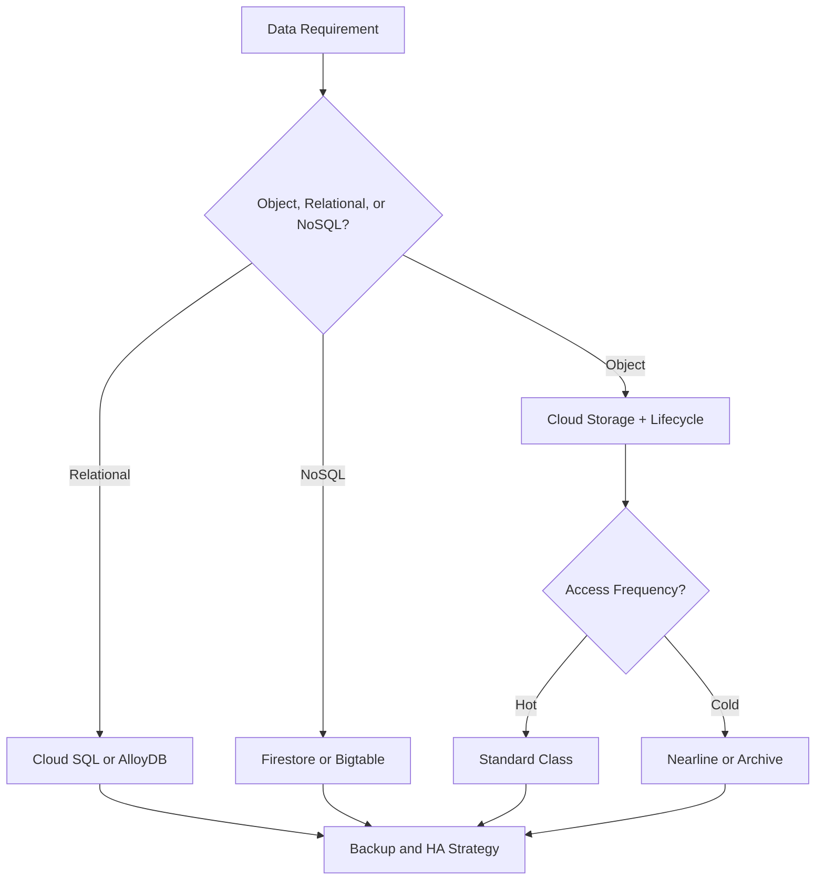
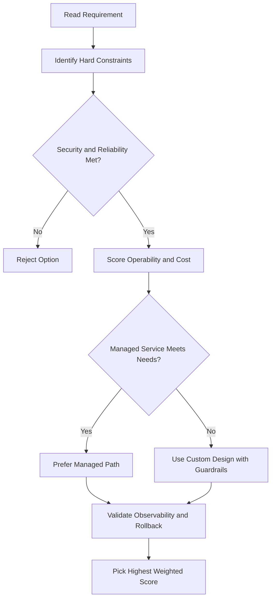
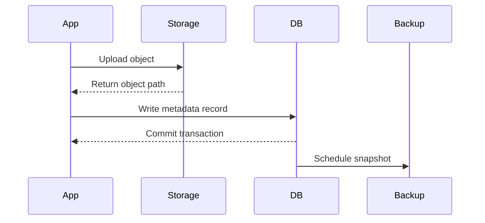

# Cloud SQL

## Managed vs Self-Managed

| Approach            | Details                                                                                      |
| ------------------- | -------------------------------------------------------------------------------------------- |
| Self-managed (VM)   | Install MySQL/PostgreSQL/SQL Server on a Compute Engine VM; you manage patching, backups, HA |
| Cloud SQL (managed) | Google handles patches, updates, replication, backups; you manage database users             |

---

## What Is Cloud SQL?

- Fully managed service for **MySQL**, **PostgreSQL**, or **Microsoft SQL Server**
- Patches and updates applied automatically
- You still manage database users via native auth tools

### Supported Clients

- Cloud Shell, App Engine, Google Workspace scripts
- SQL Workbench, Toad, any app using standard MySQL/PostgreSQL drivers

---

## Performance & Scale

| Resource      | Limit                     |
| ------------- | ------------------------- |
| Storage       | Up to 64 TB               |
| IOPS          | Up to 60,000              |
| RAM           | Up to 624 GB per instance |
| CPU cores     | Up to 96 (scale up)       |
| Read replicas | Yes (scale out)           |

---

## Supported Versions

| Engine     | Versions                                          |
| ---------- | ------------------------------------------------- |
| MySQL      | 5.6, 5.7, 8.0                                     |
| PostgreSQL | 9.6, 10, 11, 12, 13, 14, 15                       |
| SQL Server | Web, Express, Standard, Enterprise — 2017 or 2019 |

---

## High Availability (HA)

- Regional instance = **primary** + **standby** instance across two zones
- Writes are **synchronously replicated** to persistent disks in both zones before being committed
- On instance or zone failure → persistent disk attaches to standby → standby becomes new primary
- Users are rerouted automatically — this is called a **failover**

---

## Other Features

| Feature                | Details                                                     |
| ---------------------- | ----------------------------------------------------------- |
| Backups                | Automated and on-demand backups                             |
| Point-in-time recovery | Restore to any point in time                                |
| Import/Export          | `mysqldump` or CSV files                                    |
| Scaling                | Scale up (requires restart) or scale out with read replicas |

> For **horizontal scalability**, consider **Spanner** instead.

---

## Connection Types

| Scenario                                       | Recommended Connection                                                          |
| ---------------------------------------------- | ------------------------------------------------------------------------------- |
| App in same project & region as Cloud SQL      | **Private IP** — never exposed to internet; most performant & secure            |
| App in different region/project or outside GCP | **Cloud SQL Auth Proxy** — handles auth, encryption, key rotation automatically |
| Need manual SSL control                        | Generate and rotate certificates yourself                                       |
| Simple/dev use case                            | Authorize a specific IP over external IP (unencrypted)                          |

---

## Relational Database Decision Tree

```
Need microsecond response / traffic spikes (gaming, real-time)?
  └─ Yes → Memorystore (in-memory)
  └─ No  → Is the workload primarily analytics?
              └─ Yes → BigQuery
              └─ No  → Do you need horizontal scaling or global availability?
                          └─ Yes → Spanner
                          └─ No  → Cloud SQL (cost-effective)
```

---

## gcloud Commands

```bash
# List Cloud SQL instances
gcloud sql instances list

# Create a MySQL instance
gcloud sql instances create my-instance \
  --database-version=MYSQL_8_0 \
  --tier=db-n1-standard-2 \
  --region=us-central1

# Create a PostgreSQL instance
gcloud sql instances create my-pg-instance \
  --database-version=POSTGRES_15 \
  --tier=db-n1-standard-2 \
  --region=us-central1

# Enable High Availability on an instance
gcloud sql instances patch my-instance \
  --availability-type=REGIONAL

# Create a database inside an instance
gcloud sql databases create my-database --instance=my-instance

# Connect to an instance via Cloud SQL Auth Proxy (download proxy first)
./cloud-sql-proxy my-project:us-central1:my-instance

# Create a backup
gcloud sql backups create --instance=my-instance

# List backups
gcloud sql backups list --instance=my-instance

# Create a read replica
gcloud sql instances create my-replica \
  --master-instance-name=my-instance \
  --region=us-central1

# Scale up instance tier
gcloud sql instances patch my-instance --tier=db-n1-standard-4

# Import from Cloud Storage (CSV)
gcloud sql import csv my-instance gs://my-bucket/data.csv \
  --database=my-database \
  --table=my-table

# Export to Cloud Storage
gcloud sql export csv my-instance gs://my-bucket/export.csv \
  --database=my-database \
  --query="SELECT * FROM my-table"
```

---

## Backups and Point-in-Time Recovery (PITR)

| Feature               | Details                                                             |
| --------------------- | ------------------------------------------------------------------- |
| **Automated backups** | Daily snapshots; retained for 7 days by default (up to 365)         |
| **On-demand backups** | Triggered manually; kept until you delete them                      |
| **PITR**              | Restore to any second within the retention window; uses binary logs |
| **PITR retention**    | 7 days by default; configurable                                     |

```bash
# Restore to a point in time
gcloud sql instances restore-backup my-restored-instance \
  --restore-instance=my-instance \
  --backup-instance=my-instance \
  --restore-time=2024-06-15T14:30:00Z

# Enable PITR (enabled by default; verify it's on)
gcloud sql instances patch my-instance --enable-point-in-time-recovery
```

---

## SSL/TLS and Connection Options

| Option                              | Description                                             |
| ----------------------------------- | ------------------------------------------------------- |
| **Cloud SQL Auth Proxy**            | Recommended; handles mTLS and IAM auth automatically    |
| **Private IP**                      | Connect via VPC; no public internet exposure            |
| **Public IP + SSL**                 | Allow external connections with client cert requirement |
| **Public IP + Authorized Networks** | Whitelist specific IP ranges (less preferred)           |

```bash
# Require SSL for all connections
gcloud sql instances patch my-instance --require-ssl

# Create a client certificate
gcloud sql ssl client-certs create my-cert cert.pem --instance=my-instance
```

- Auth Proxy uses IAM for authentication — no IP whitelisting needed
- Download the proxy binary: `gcloud sql auth-proxy download`

---

## Database Flags

Database flags let you tune engine-level parameters without restart (most flags require instance restart):

```bash
# Set MySQL max_connections flag
gcloud sql instances patch my-instance \
  --database-flags=max_connections=500

# Set PostgreSQL log_min_duration_statement (log slow queries)
gcloud sql instances patch my-instance \
  --database-flags=log_min_duration_statement=1000
```

Common flags:

| Engine     | Flag                           | Purpose                      |
| ---------- | ------------------------------ | ---------------------------- |
| MySQL      | `max_connections`              | Limit concurrent connections |
| MySQL      | `slow_query_log=on`            | Enable slow query log        |
| PostgreSQL | `log_min_duration_statement`   | Log queries slower than N ms |
| PostgreSQL | `pg_stat_statements.track=all` | Enable query stats           |

---

## Query Insights

Built-in query performance tool for Cloud SQL (PostgreSQL and MySQL):

- Shows **top queries** by latency, execution count, and rows affected
- Identifies **slow queries** and **lock waits**
- No extra setup for PostgreSQL; enabled via `enable-query-insights` flag

```bash
gcloud sql instances patch my-instance --insights-config-query-insights-enabled
```

---

## Cross-Region Read Replicas

Read replicas can be created in a **different region** from the primary:

```bash
gcloud sql instances create my-replica \
  --master-instance-name=my-instance \
  --region=europe-west1
```

- Useful for disaster recovery (can be promoted to standalone instance)
- Replication is asynchronous — replica may lag behind primary
- Can be promoted to a standalone instance during failover:

```bash
gcloud sql instances promote-replica my-replica
```

---

## Key Takeaways — Cloud SQL

| Topic              | Key Point                                                  |
| ------------------ | ---------------------------------------------------------- |
| **HA**             | Regional (synchronous standby); automatic failover in ~60s |
| **Backups**        | Automated daily + PITR for any second in retention window  |
| **Connections**    | Always prefer Auth Proxy or Private IP over public IP      |
| **Read replicas**  | Offload reads; cross-region replicas support DR            |
| **Flags**          | Engine-level tuning; most require restart                  |
| **Query Insights** | Built-in slow query analysis; no extra cost                |

# Delete an instance

gcloud sql instances delete my-instance

```

```

## ACE Exam-Style Practice Questions

### Q1
In a Cloud Sql scenario, production MySQL must survive zonal failure with minimal manual intervention. What is the best setup?

A. Single-zone instance with snapshots only
B. Cloud SQL with availability type set to REGIONAL
C. Cloud SQL read replica in same zone only
D. Self-managed MySQL on one VM

Answer: B
Trap: Read replicas improve read scale but are not the same as HA failover configuration.

### Q2
For Cloud Sql audit requirements, month-end data must be retained for three years in low-cost storage. What should you do?

A. Rely only on automatic backup retention
B. Create scheduled Cloud SQL export jobs to Archive class Cloud Storage
C. Keep data only in local SSD snapshots
D. Use Cloud NAT logging only

Answer: B
Trap: Long-term audit retention is an export and archive policy problem, not only operational backup.

<!-- ACE_DEEP_ENRICHMENT_START -->
## ACE Deep Enrichment

### Think Like a Google Engineer
- Primary optimization axis: Durability and access-pattern fit at the lowest lifecycle cost.
- Start with constraints first: SLO, security, compliance, latency, budget, and team operations capacity.
- Prefer managed services if they satisfy requirements with lower long-term operational toil.
- Minimize blast radius using environment isolation, least privilege, and failure-domain awareness.
- Design for day-2 operations: observability, rollback strategy, and quota or budget guardrails.

### Most Correct Option Filter (60 Seconds)
1. Eliminate options with broad access, single points of failure, or missing monitoring.
2. Confirm the option meets non-negotiables first: security and reliability requirements.
3. Compare remaining options on operational simplicity and long-term maintainability.
4. Use cost as an optimizer only after requirements and risk controls are satisfied.

### Weighted Decision Matrix
| Dimension | Weight | Strong Signal |
| --- | --- | --- |
| Security | 3 | Least privilege, secure defaults, no exposed blast radius |
| Reliability | 3 | Multi-zone or HA design, health checks, tested recovery path |
| Operability | 2 | Clear monitoring, alerting, rollout and rollback simplicity |
| Cost Efficiency | 2 | Right-sized resources, no waste, no reliability regression |
| Performance | 1 | Meets latency and throughput targets with headroom |

### Real-Life Scenario
A healthcare SaaS stores user documents, transactional data, and low-latency session state. They must balance cost, durability, and performance under compliance constraints.

### Worked Example
- Map each data type to the right storage service by access pattern and consistency needs.
- Use lifecycle policies for object storage to control long-term cost.
- Select database engines based on query shape, scale, and relational requirements.
- Back up critical datasets and validate restore runbooks regularly.

### Flowchart


### Optimization Decision Flow


### Interaction Sequence


### Extra Exam Practice (15 Questions)
#### Q1
Scenario Focus: Cloud SQL
Your logs are rarely accessed after 90 days. What storage policy is best?

A. Use lifecycle rules to transition objects to colder storage classes after 90 days.
B. Keep everything in the most expensive hot class forever.
C. Use local disk snapshots as the only backup strategy.
D. Pick a database only by familiarity and ignore access patterns.

Answer: A
Why the other options are weaker: They typically ignore at least one hard constraint such as security, reliability, cost efficiency, or operational simplicity.
Google-engineer check: Reconfirm SLO fit, blast radius, and day-2 maintainability before finalizing.

#### Q2
Scenario Focus: Cloud SQL
A workload requires relational transactions and managed operations. Which database is best?

A. Use local disk snapshots as the only backup strategy.
B. Use Cloud SQL or AlloyDB for managed relational workloads with transaction support.
C. Pick a database only by familiarity and ignore access patterns.
D. Store transactional records only in object storage.

Answer: B
Why the other options are weaker: They typically ignore at least one hard constraint such as security, reliability, cost efficiency, or operational simplicity.
Google-engineer check: Reconfirm SLO fit, blast radius, and day-2 maintainability before finalizing.

#### Q3
Scenario Focus: Cloud SQL
Which practice improves durability and recovery posture most?

A. Pick a database only by familiarity and ignore access patterns.
B. Store transactional records only in object storage.
C. Enable backups with tested restore procedures and clear recovery objectives.
D. Skip restore drills because backups are assumed valid.

Answer: C
Why the other options are weaker: They typically ignore at least one hard constraint such as security, reliability, cost efficiency, or operational simplicity.
Google-engineer check: Reconfirm SLO fit, blast radius, and day-2 maintainability before finalizing.

#### Q4
Scenario Focus: Cloud SQL
A key-value workload needs very high scale and low latency. Which service fits?

A. Store transactional records only in object storage.
B. Skip restore drills because backups are assumed valid.
C. Keep everything in the most expensive hot class forever.
D. Use Bigtable for high-throughput low-latency wide-column workloads.

Answer: D
Why the other options are weaker: They typically ignore at least one hard constraint such as security, reliability, cost efficiency, or operational simplicity.
Google-engineer check: Reconfirm SLO fit, blast radius, and day-2 maintainability before finalizing.

#### Q5
Scenario Focus: Cloud SQL
How should you choose a storage class on the exam?

A. Choose based on access frequency, retention period, and retrieval latency requirements.
B. Skip restore drills because backups are assumed valid.
C. Keep everything in the most expensive hot class forever.
D. Use local disk snapshots as the only backup strategy.

Answer: A
Why the other options are weaker: They typically ignore at least one hard constraint such as security, reliability, cost efficiency, or operational simplicity.
Google-engineer check: Reconfirm SLO fit, blast radius, and day-2 maintainability before finalizing.

#### Q6
Scenario Focus: Cloud SQL
Two designs both satisfy the happy path for Cloud SQL. Which choice is most correct?

A. Keep everything in the most expensive hot class forever.
B. Choose the option that preserves reliability and security while reducing operational burden.
C. Use local disk snapshots as the only backup strategy.
D. Pick a database only by familiarity and ignore access patterns.

Answer: B
Why the other options are weaker: They typically ignore at least one hard constraint such as security, reliability, cost efficiency, or operational simplicity.
Google-engineer check: Reconfirm SLO fit, blast radius, and day-2 maintainability before finalizing.

#### Q7
Scenario Focus: Cloud SQL
What should you validate first before choosing an architecture for Cloud SQL?

A. Use local disk snapshots as the only backup strategy.
B. Pick a database only by familiarity and ignore access patterns.
C. Validate SLO fit, blast radius, and least-privilege controls before comparing convenience.
D. Store transactional records only in object storage.

Answer: C
Why the other options are weaker: They typically ignore at least one hard constraint such as security, reliability, cost efficiency, or operational simplicity.
Google-engineer check: Reconfirm SLO fit, blast radius, and day-2 maintainability before finalizing.

#### Q8
Scenario Focus: Cloud SQL
A proposal lowers cost but increases failure risk. What is the best decision?

A. Pick a database only by familiarity and ignore access patterns.
B. Store transactional records only in object storage.
C. Skip restore drills because backups are assumed valid.
D. Reject it unless reliability and recovery objectives remain within required targets.

Answer: D
Why the other options are weaker: They typically ignore at least one hard constraint such as security, reliability, cost efficiency, or operational simplicity.
Google-engineer check: Reconfirm SLO fit, blast radius, and day-2 maintainability before finalizing.

#### Q9
Scenario Focus: Cloud SQL
Which option best reflects optimization for Durability and access-pattern fit at the lowest lifecycle cost?

A. Select the design that best meets Durability and access-pattern fit at the lowest lifecycle cost while keeping constraints balanced.
B. Store transactional records only in object storage.
C. Skip restore drills because backups are assumed valid.
D. Keep everything in the most expensive hot class forever.

Answer: A
Why the other options are weaker: They typically ignore at least one hard constraint such as security, reliability, cost efficiency, or operational simplicity.
Google-engineer check: Reconfirm SLO fit, blast radius, and day-2 maintainability before finalizing.

#### Q10
Scenario Focus: Cloud SQL
How should you evaluate a design that needs frequent manual interventions?

A. Skip restore drills because backups are assumed valid.
B. Treat it as high risk and prefer automation-friendly designs with observability and rollback.
C. Keep everything in the most expensive hot class forever.
D. Use local disk snapshots as the only backup strategy.

Answer: B
Why the other options are weaker: They typically ignore at least one hard constraint such as security, reliability, cost efficiency, or operational simplicity.
Google-engineer check: Reconfirm SLO fit, blast radius, and day-2 maintainability before finalizing.

#### Q11
Scenario Focus: Cloud SQL
Two options have similar latency. Which tie-breaker is best?

A. Keep everything in the most expensive hot class forever.
B. Use local disk snapshots as the only backup strategy.
C. Pick the option with stronger operability, clearer failure isolation, and simpler incident response.
D. Pick a database only by familiarity and ignore access patterns.

Answer: C
Why the other options are weaker: They typically ignore at least one hard constraint such as security, reliability, cost efficiency, or operational simplicity.
Google-engineer check: Reconfirm SLO fit, blast radius, and day-2 maintainability before finalizing.

#### Q12
Scenario Focus: Cloud SQL
What is the best way to choose between a custom stack and a managed service?

A. Use local disk snapshots as the only backup strategy.
B. Pick a database only by familiarity and ignore access patterns.
C. Store transactional records only in object storage.
D. Prefer managed services when they meet requirements with lower long-term maintenance effort.

Answer: D
Why the other options are weaker: They typically ignore at least one hard constraint such as security, reliability, cost efficiency, or operational simplicity.
Google-engineer check: Reconfirm SLO fit, blast radius, and day-2 maintainability before finalizing.

#### Q13
Scenario Focus: Cloud SQL
How do you confirm a solution is production-ready for 

A. Verify monitoring, alerting, rollback path, quota and budget controls, and secure defaults.
B. Pick a database only by familiarity and ignore access patterns.
C. Store transactional records only in object storage.
D. Skip restore drills because backups are assumed valid.

Answer: A
Why the other options are weaker: They typically ignore at least one hard constraint such as security, reliability, cost efficiency, or operational simplicity.
Google-engineer check: Reconfirm SLO fit, blast radius, and day-2 maintainability before finalizing.

#### Q14
Scenario Focus: Cloud SQL
Which pattern usually wins in ACE scenario tie-breakers?

A. Store transactional records only in object storage.
B. Managed-service-first plus least-privilege access plus clear observability usually wins.
C. Skip restore drills because backups are assumed valid.
D. Keep everything in the most expensive hot class forever.

Answer: B
Why the other options are weaker: They typically ignore at least one hard constraint such as security, reliability, cost efficiency, or operational simplicity.
Google-engineer check: Reconfirm SLO fit, blast radius, and day-2 maintainability before finalizing.

#### Q15
Scenario Focus: Cloud SQL
What is the best final check before locking the answer?

A. Skip restore drills because backups are assumed valid.
B. Keep everything in the most expensive hot class forever.
C. Run a weighted check across security, reliability, cost, performance, and operability.
D. Use local disk snapshots as the only backup strategy.

Answer: C
Why the other options are weaker: They typically ignore at least one hard constraint such as security, reliability, cost efficiency, or operational simplicity.
Google-engineer check: Reconfirm SLO fit, blast radius, and day-2 maintainability before finalizing.

### Quick Commands
```bash
gcloud storage ls --project=PROJECT_ID
gcloud sql instances list --project=PROJECT_ID
gcloud firestore databases list --project=PROJECT_ID
gcloud bigtable instances list --project=PROJECT_ID
```

### Fast Recall
- Data service choice is a pattern-matching question.
- Lifecycle rules are a common cost optimization lever.
- Backup without restore validation is not a complete strategy.
<!-- ACE_DEEP_ENRICHMENT_END -->