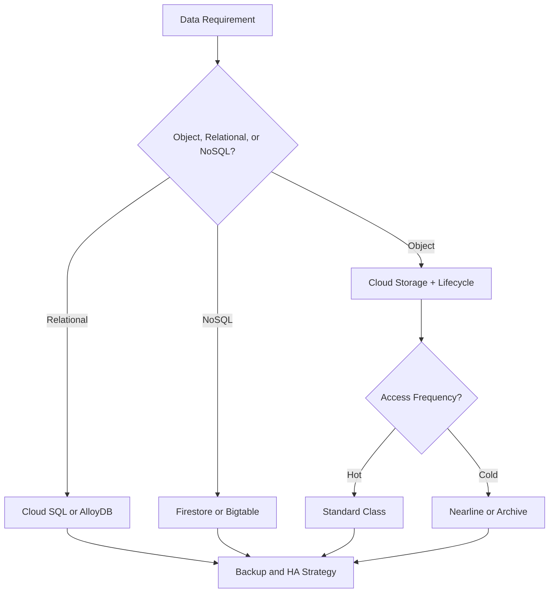
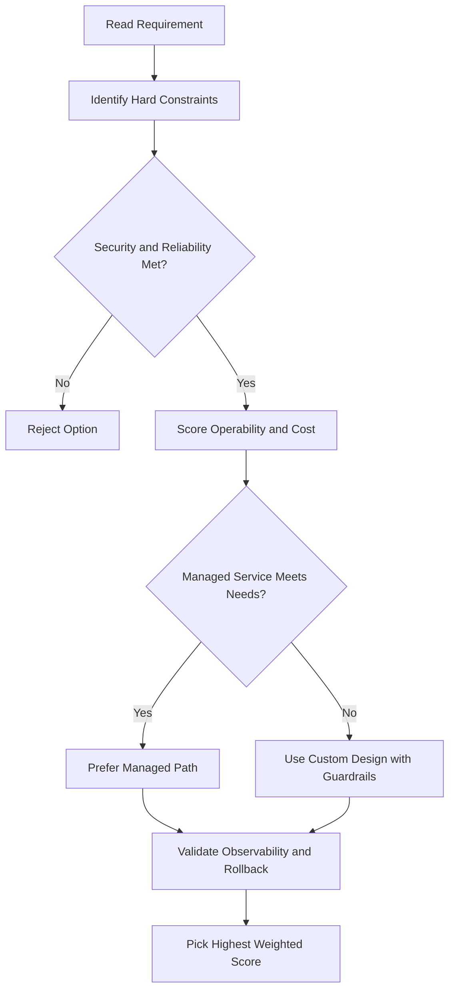
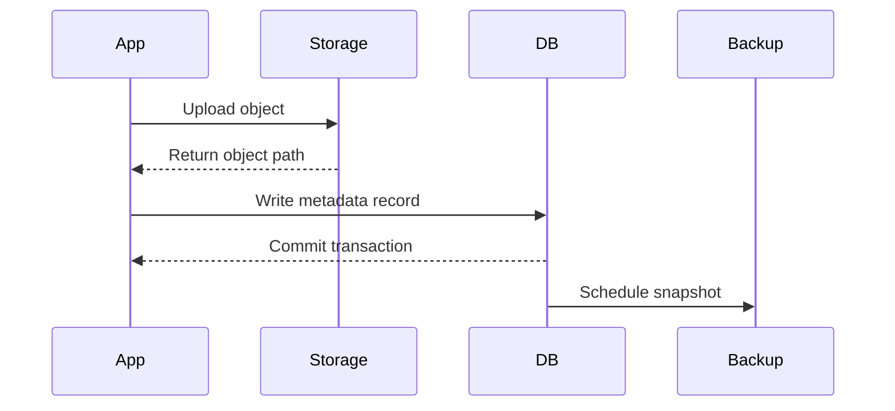

# Cloud SQL Lab Walkthrough

## Lab Overview

- Create a Cloud SQL (MySQL) instance
- Connect to it via **Cloud SQL Auth Proxy** (external, secure)
- Connect to it via **Private IP** (internal, direct)
- Deploy a WordPress application backed by Cloud SQL

---

## Task 1 — Create a Cloud SQL Instance

1. Navigate to **SQL** → **Create Instance** → **MySQL**
2. Name: `wordpress-db`, set a simple password, region: `us-central1`
3. Expand configuration → **Connectivity** → select **Private IP**
4. Click **Enable API** → **Allocate and Connect** (takes a few minutes)
5. Once IP is allocated, click **Create** (instance creation takes 3–5 min)

> While the instance is creating, you can proceed with other tasks.

---

## Task 2 — Set Up the Proxy VM

Two Compute Engine VMs are pre-created:

- `wordpress-europe-proxy` — for the proxy connection
- `wordpress-private-ip` — for the private IP connection

### On the proxy VM (SSH):

```bash
# Download Cloud SQL Proxy
wget https://dl.google.com/cloudsql/cloud_sql_proxy.linux.amd64 -O cloud_sql_proxy
chmod +x cloud_sql_proxy

# Set the instance connection name as an env variable
export SQL_CONNECTION=<your-project>:<region>:<instance-name>

# Verify it's set
echo $SQL_CONNECTION

# Start the proxy in the background
./cloud_sql_proxy -instances=$SQL_CONNECTION=tcp:3306 &
# Expected output: Ready for new connections
```

> The instance connection name is found in Cloud SQL → click instance → **Overview** → `Instance connection name`

---

## Task 3 — Create the Database

Once the instance shows a green checkmark:

1. Go to **Cloud SQL** → `wordpress-db` → **Databases** → **Create Database**
2. Name: `wordpress` → **Create**

---

## Task 4 — Connect WordPress via Proxy

1. Get the external IP of the proxy VM: `curl -H "Metadata-Flavor: Google" http://metadata/computeMetadata/v1/instance/network-interfaces/0/access-configs/0/external-ip`
2. Open that IP in a browser → WordPress setup page → **Let's Go**
3. Settings:
   - Database name: `wordpress`
   - Username: `root`
   - Password: `password`
   - Database host: `127.0.0.1` (proxy listens on localhost)
4. Submit → **Run the Installation** → fill in site details → **Install WordPress**
5. Navigate to the external IP → WordPress blog loads ✅

> Traffic flows: Browser → VM external IP → proxy on 127.0.0.1 → Cloud SQL Auth Proxy → Cloud SQL instance

---

## Task 5 — Connect WordPress via Private IP

1. Go to **Cloud SQL** → `wordpress-db` → note the **Private IP address**
2. Go to **Compute Engine** → copy external IP of `wordpress-private-ip` VM
3. Open that IP in browser → WordPress setup → **Let's Go**
4. Settings:
   - Database host: `<Cloud SQL private IP>` (instead of 127.0.0.1)
   - Username: `root`, Password: `password`
5. Submit → **Run the Installation** → **Already Installed** (WordPress recognizes the same DB)
6. Navigate to the VM's external IP → same WordPress blog loads ✅

> Traffic flows: VM → Cloud SQL private IP directly (never leaves Google's network)

---

## Key Takeaways

| Connection Type         | When to Use                              | Traffic Path                                   |
| ----------------------- | ---------------------------------------- | ---------------------------------------------- |
| Cloud SQL Auth Proxy    | App in different region, VPC, or project | Encrypted tunnel over external IP              |
| Private IP              | App in same region/VPC as Cloud SQL      | Internal Google network, never public internet |
| Unencrypted external IP | Dev/test only                            | Public internet — not recommended              |

## ACE Exam-Style Practice Questions

### Q1
In a Cloud Sql Lab Walkthrough scenario, production MySQL must survive zonal failure with minimal manual intervention. What is the best setup?

A. Single-zone instance with snapshots only
B. Cloud SQL with availability type set to REGIONAL
C. Cloud SQL read replica in same zone only
D. Self-managed MySQL on one VM

Answer: B
Trap: Read replicas improve read scale but are not the same as HA failover configuration.

### Q2
For Cloud Sql Lab Walkthrough audit requirements, month-end data must be retained for three years in low-cost storage. What should you do?

A. Rely only on automatic backup retention
B. Create scheduled Cloud SQL export jobs to Archive class Cloud Storage
C. Keep data only in local SSD snapshots
D. Use Cloud NAT logging only

Answer: B
Trap: Long-term audit retention is an export and archive policy problem, not only operational backup.

<!-- ACE_DEEP_ENRICHMENT_START -->
## ACE Deep Enrichment

### Think Like a Google Engineer
- Primary optimization axis: Durability and access-pattern fit at the lowest lifecycle cost.
- Start with constraints first: SLO, security, compliance, latency, budget, and team operations capacity.
- Prefer managed services if they satisfy requirements with lower long-term operational toil.
- Minimize blast radius using environment isolation, least privilege, and failure-domain awareness.
- Design for day-2 operations: observability, rollback strategy, and quota or budget guardrails.

### Most Correct Option Filter (60 Seconds)
1. Eliminate options with broad access, single points of failure, or missing monitoring.
2. Confirm the option meets non-negotiables first: security and reliability requirements.
3. Compare remaining options on operational simplicity and long-term maintainability.
4. Use cost as an optimizer only after requirements and risk controls are satisfied.

### Weighted Decision Matrix
| Dimension | Weight | Strong Signal |
| --- | --- | --- |
| Security | 3 | Least privilege, secure defaults, no exposed blast radius |
| Reliability | 3 | Multi-zone or HA design, health checks, tested recovery path |
| Operability | 2 | Clear monitoring, alerting, rollout and rollback simplicity |
| Cost Efficiency | 2 | Right-sized resources, no waste, no reliability regression |
| Performance | 1 | Meets latency and throughput targets with headroom |

### Real-Life Scenario
A healthcare SaaS stores user documents, transactional data, and low-latency session state. They must balance cost, durability, and performance under compliance constraints.

### Worked Example
- Map each data type to the right storage service by access pattern and consistency needs.
- Use lifecycle policies for object storage to control long-term cost.
- Select database engines based on query shape, scale, and relational requirements.
- Back up critical datasets and validate restore runbooks regularly.

### Flowchart


### Optimization Decision Flow


### Interaction Sequence


### Extra Exam Practice (15 Questions)
#### Q1
Scenario Focus: Cloud SQL Lab Walkthrough
Your logs are rarely accessed after 90 days. What storage policy is best?

A. Use lifecycle rules to transition objects to colder storage classes after 90 days.
B. Keep everything in the most expensive hot class forever.
C. Use local disk snapshots as the only backup strategy.
D. Pick a database only by familiarity and ignore access patterns.

Answer: A
Why the other options are weaker: They typically ignore at least one hard constraint such as security, reliability, cost efficiency, or operational simplicity.
Google-engineer check: Reconfirm SLO fit, blast radius, and day-2 maintainability before finalizing.

#### Q2
Scenario Focus: Cloud SQL Lab Walkthrough
A workload requires relational transactions and managed operations. Which database is best?

A. Use local disk snapshots as the only backup strategy.
B. Use Cloud SQL or AlloyDB for managed relational workloads with transaction support.
C. Pick a database only by familiarity and ignore access patterns.
D. Store transactional records only in object storage.

Answer: B
Why the other options are weaker: They typically ignore at least one hard constraint such as security, reliability, cost efficiency, or operational simplicity.
Google-engineer check: Reconfirm SLO fit, blast radius, and day-2 maintainability before finalizing.

#### Q3
Scenario Focus: Cloud SQL Lab Walkthrough
Which practice improves durability and recovery posture most?

A. Pick a database only by familiarity and ignore access patterns.
B. Store transactional records only in object storage.
C. Enable backups with tested restore procedures and clear recovery objectives.
D. Skip restore drills because backups are assumed valid.

Answer: C
Why the other options are weaker: They typically ignore at least one hard constraint such as security, reliability, cost efficiency, or operational simplicity.
Google-engineer check: Reconfirm SLO fit, blast radius, and day-2 maintainability before finalizing.

#### Q4
Scenario Focus: Cloud SQL Lab Walkthrough
A key-value workload needs very high scale and low latency. Which service fits?

A. Store transactional records only in object storage.
B. Skip restore drills because backups are assumed valid.
C. Keep everything in the most expensive hot class forever.
D. Use Bigtable for high-throughput low-latency wide-column workloads.

Answer: D
Why the other options are weaker: They typically ignore at least one hard constraint such as security, reliability, cost efficiency, or operational simplicity.
Google-engineer check: Reconfirm SLO fit, blast radius, and day-2 maintainability before finalizing.

#### Q5
Scenario Focus: Cloud SQL Lab Walkthrough
How should you choose a storage class on the exam?

A. Choose based on access frequency, retention period, and retrieval latency requirements.
B. Skip restore drills because backups are assumed valid.
C. Keep everything in the most expensive hot class forever.
D. Use local disk snapshots as the only backup strategy.

Answer: A
Why the other options are weaker: They typically ignore at least one hard constraint such as security, reliability, cost efficiency, or operational simplicity.
Google-engineer check: Reconfirm SLO fit, blast radius, and day-2 maintainability before finalizing.

#### Q6
Scenario Focus: Cloud SQL Lab Walkthrough
Two designs both satisfy the happy path for Cloud SQL Lab Walkthrough. Which choice is most correct?

A. Keep everything in the most expensive hot class forever.
B. Choose the option that preserves reliability and security while reducing operational burden.
C. Use local disk snapshots as the only backup strategy.
D. Pick a database only by familiarity and ignore access patterns.

Answer: B
Why the other options are weaker: They typically ignore at least one hard constraint such as security, reliability, cost efficiency, or operational simplicity.
Google-engineer check: Reconfirm SLO fit, blast radius, and day-2 maintainability before finalizing.

#### Q7
Scenario Focus: Cloud SQL Lab Walkthrough
What should you validate first before choosing an architecture for Cloud SQL Lab Walkthrough?

A. Use local disk snapshots as the only backup strategy.
B. Pick a database only by familiarity and ignore access patterns.
C. Validate SLO fit, blast radius, and least-privilege controls before comparing convenience.
D. Store transactional records only in object storage.

Answer: C
Why the other options are weaker: They typically ignore at least one hard constraint such as security, reliability, cost efficiency, or operational simplicity.
Google-engineer check: Reconfirm SLO fit, blast radius, and day-2 maintainability before finalizing.

#### Q8
Scenario Focus: Cloud SQL Lab Walkthrough
A proposal lowers cost but increases failure risk. What is the best decision?

A. Pick a database only by familiarity and ignore access patterns.
B. Store transactional records only in object storage.
C. Skip restore drills because backups are assumed valid.
D. Reject it unless reliability and recovery objectives remain within required targets.

Answer: D
Why the other options are weaker: They typically ignore at least one hard constraint such as security, reliability, cost efficiency, or operational simplicity.
Google-engineer check: Reconfirm SLO fit, blast radius, and day-2 maintainability before finalizing.

#### Q9
Scenario Focus: Cloud SQL Lab Walkthrough
Which option best reflects optimization for Durability and access-pattern fit at the lowest lifecycle cost?

A. Select the design that best meets Durability and access-pattern fit at the lowest lifecycle cost while keeping constraints balanced.
B. Store transactional records only in object storage.
C. Skip restore drills because backups are assumed valid.
D. Keep everything in the most expensive hot class forever.

Answer: A
Why the other options are weaker: They typically ignore at least one hard constraint such as security, reliability, cost efficiency, or operational simplicity.
Google-engineer check: Reconfirm SLO fit, blast radius, and day-2 maintainability before finalizing.

#### Q10
Scenario Focus: Cloud SQL Lab Walkthrough
How should you evaluate a design that needs frequent manual interventions?

A. Skip restore drills because backups are assumed valid.
B. Treat it as high risk and prefer automation-friendly designs with observability and rollback.
C. Keep everything in the most expensive hot class forever.
D. Use local disk snapshots as the only backup strategy.

Answer: B
Why the other options are weaker: They typically ignore at least one hard constraint such as security, reliability, cost efficiency, or operational simplicity.
Google-engineer check: Reconfirm SLO fit, blast radius, and day-2 maintainability before finalizing.

#### Q11
Scenario Focus: Cloud SQL Lab Walkthrough
Two options have similar latency. Which tie-breaker is best?

A. Keep everything in the most expensive hot class forever.
B. Use local disk snapshots as the only backup strategy.
C. Pick the option with stronger operability, clearer failure isolation, and simpler incident response.
D. Pick a database only by familiarity and ignore access patterns.

Answer: C
Why the other options are weaker: They typically ignore at least one hard constraint such as security, reliability, cost efficiency, or operational simplicity.
Google-engineer check: Reconfirm SLO fit, blast radius, and day-2 maintainability before finalizing.

#### Q12
Scenario Focus: Cloud SQL Lab Walkthrough
What is the best way to choose between a custom stack and a managed service?

A. Use local disk snapshots as the only backup strategy.
B. Pick a database only by familiarity and ignore access patterns.
C. Store transactional records only in object storage.
D. Prefer managed services when they meet requirements with lower long-term maintenance effort.

Answer: D
Why the other options are weaker: They typically ignore at least one hard constraint such as security, reliability, cost efficiency, or operational simplicity.
Google-engineer check: Reconfirm SLO fit, blast radius, and day-2 maintainability before finalizing.

#### Q13
Scenario Focus: Cloud SQL Lab Walkthrough
How do you confirm a solution is production-ready for 

A. Verify monitoring, alerting, rollback path, quota and budget controls, and secure defaults.
B. Pick a database only by familiarity and ignore access patterns.
C. Store transactional records only in object storage.
D. Skip restore drills because backups are assumed valid.

Answer: A
Why the other options are weaker: They typically ignore at least one hard constraint such as security, reliability, cost efficiency, or operational simplicity.
Google-engineer check: Reconfirm SLO fit, blast radius, and day-2 maintainability before finalizing.

#### Q14
Scenario Focus: Cloud SQL Lab Walkthrough
Which pattern usually wins in ACE scenario tie-breakers?

A. Store transactional records only in object storage.
B. Managed-service-first plus least-privilege access plus clear observability usually wins.
C. Skip restore drills because backups are assumed valid.
D. Keep everything in the most expensive hot class forever.

Answer: B
Why the other options are weaker: They typically ignore at least one hard constraint such as security, reliability, cost efficiency, or operational simplicity.
Google-engineer check: Reconfirm SLO fit, blast radius, and day-2 maintainability before finalizing.

#### Q15
Scenario Focus: Cloud SQL Lab Walkthrough
What is the best final check before locking the answer?

A. Skip restore drills because backups are assumed valid.
B. Keep everything in the most expensive hot class forever.
C. Run a weighted check across security, reliability, cost, performance, and operability.
D. Use local disk snapshots as the only backup strategy.

Answer: C
Why the other options are weaker: They typically ignore at least one hard constraint such as security, reliability, cost efficiency, or operational simplicity.
Google-engineer check: Reconfirm SLO fit, blast radius, and day-2 maintainability before finalizing.

### Quick Commands
```bash
gcloud storage ls --project=PROJECT_ID
gcloud sql instances list --project=PROJECT_ID
gcloud firestore databases list --project=PROJECT_ID
gcloud bigtable instances list --project=PROJECT_ID
```

### Fast Recall
- Data service choice is a pattern-matching question.
- Lifecycle rules are a common cost optimization lever.
- Backup without restore validation is not a complete strategy.
<!-- ACE_DEEP_ENRICHMENT_END -->