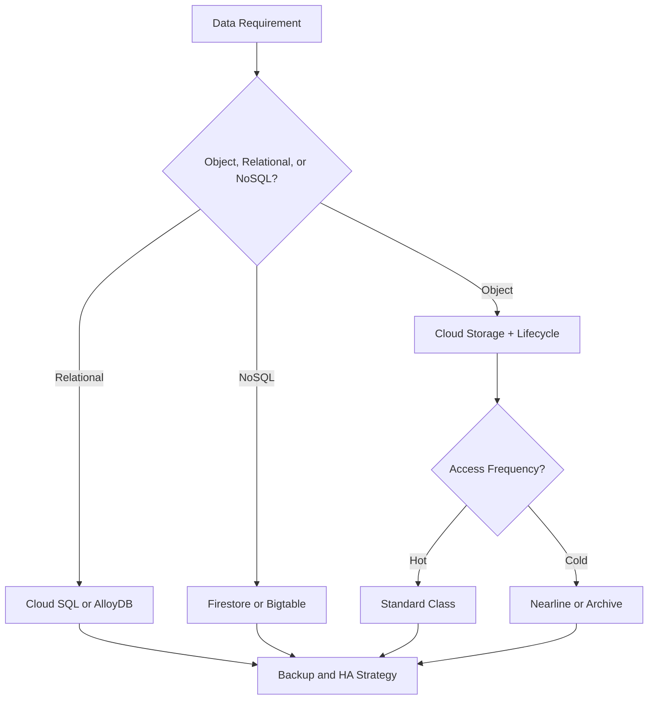
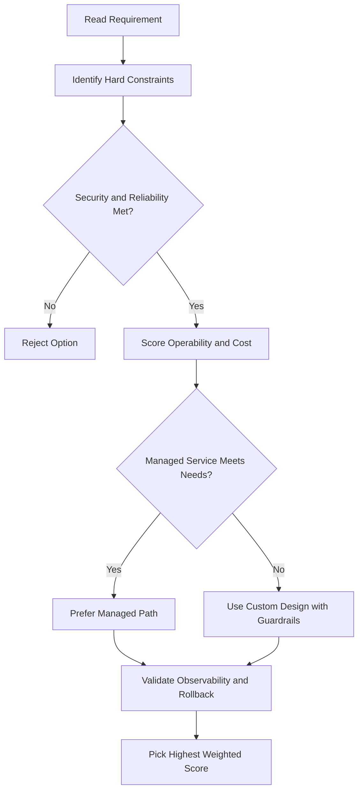
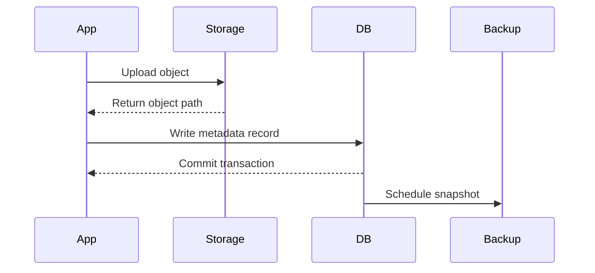

# Cloud Spanner

## What Is Spanner?

- Fully managed **relational database** with **non-relational horizontal scale**
- Built specifically for the cloud
- Combines: schemas, SQL, strong consistency + high availability, horizontal scaling, global replication

### Key Stats

- Capacity: up to **petabytes**
- Replication: **automatic synchronous** replication across zones/regions
- Consistency: **transactional consistency at global scale**
- SLA: differs for regional vs multi-regional instances (check docs for current numbers)

---

## Spanner vs Relational vs Non-Relational

| Feature                  | Relational DB | Non-Relational DB | Spanner |
| ------------------------ | ------------- | ----------------- | ------- |
| Schema                   | ✅            | ❌                | ✅      |
| SQL                      | ✅            | ❌                | ✅      |
| Strong consistency       | ✅            | ❌                | ✅      |
| High availability        | ❌ (limited)  | ✅                | ✅      |
| Horizontal scalability   | ❌            | ✅                | ✅      |
| Configurable replication | ❌            | ✅                | ✅      |

> Spanner gives you the best of both worlds.

---

## Architecture

- A Spanner instance replicates data across **N cloud zones** (one region or multiple regions)
- Database placement is **configurable** — you choose the region
- Replication synchronized via **Google's global fiber network**
- Uses **atomic clocks** to ensure atomicity during updates

---

## Use Cases

- Financial applications (transactions, payments)
- Inventory management (retail)
- Any mission-critical system requiring global consistency

---

## When to Use Spanner — Decision Tree

```
Have you outgrown your relational DB? OR
Are you sharding databases for throughput? OR
Do you need transactional consistency + global data + strong consistency? OR
Want to consolidate multiple databases?
  └─ Yes → Spanner

  └─ No → Do you need full relational capabilities?
              └─ No → Consider NoSQL (e.g. Firestore)
              └─ Yes → Cloud SQL (if no horizontal scale needed)
```

---

## Spanner vs Cloud SQL

|                     | Cloud SQL                           | Spanner                          |
| ------------------- | ----------------------------------- | -------------------------------- |
| Scale               | Vertical (scale up) + read replicas | Horizontal (truly distributed)   |
| Capacity            | Up to 64 TB                         | Petabytes                        |
| Global availability | Regional                            | Regional or multi-regional       |
| Use case            | Standard web/app databases          | Global, mission-critical systems |
| Cost                | Lower                               | Higher                           |

> If you're currently using MySQL and want to migrate to Spanner, refer to the official migration documentation.

---

## gcloud Commands

```bash
# List Spanner instances
gcloud spanner instances list

# Create a Spanner instance (regional)
gcloud spanner instances create my-instance \
  --config=regional-us-central1 \
  --description="My Spanner Instance" \
  --nodes=1

# Create a Spanner instance (multi-regional)
gcloud spanner instances create my-global-instance \
  --config=nam6 \
  --description="Multi-region Spanner" \
  --nodes=3

# Create a database inside an instance
gcloud spanner databases create my-database \
  --instance=my-instance

# Run a SQL query
gcloud spanner databases execute-sql my-database \
  --instance=my-instance \
  --sql="SELECT * FROM my-table"

# Describe an instance
gcloud spanner instances describe my-instance

# Delete a Spanner instance
gcloud spanner instances delete my-instance
```

---

## Schema Design

### Interleaved Tables

Spanner co-locates child rows physically next to their parent row — eliminates cross-node joins for parent-child queries:

```sql
CREATE TABLE Singers (
  SingerId INT64 NOT NULL,
  Name     STRING(MAX),
) PRIMARY KEY (SingerId);

CREATE TABLE Albums (
  SingerId  INT64 NOT NULL,
  AlbumId   INT64 NOT NULL,
  Title     STRING(MAX),
) PRIMARY KEY (SingerId, AlbumId),
  INTERLEAVE IN PARENT Singers ON DELETE CASCADE;
```

- Use interleaving when you always query child rows by parent key
- Maximum interleave depth: 7 levels

### Primary Key Design — Avoid Hotspots

Sequential keys (auto-increment integers, timestamps) cause **write hotspots** because all new rows land on the same split:

| Bad (hotspot)             | Good (distributed)                        |
| ------------------------- | ----------------------------------------- |
| `id INT64 AUTO_INCREMENT` | `id STRING(36) DEFAULT (GENERATE_UUID())` |
| `created_at TIMESTAMP`    | Hash prefix + timestamp                   |
| Sequential user IDs       | UUID or bit-reversed keys                 |

### Secondary Indexes

```sql
CREATE INDEX AlbumsByTitle ON Albums(Title);
```

- Indexes are stored as separate tables — writes update both base table and index
- Use `STORING` clause to avoid index-only table lookups:
  ```sql
  CREATE INDEX AlbumsByTitle ON Albums(Title) STORING (SingerId);
  ```

---

## Instance Configuration and Cost

### Instance Types

| Type                    | Use                                           |
| ----------------------- | --------------------------------------------- |
| **Provisioned**         | Fixed node count; predictable cost            |
| **Spanner Autoscaling** | Scales node count automatically based on load |

### Pricing Components

| Component           | Cost driver                                              |
| ------------------- | -------------------------------------------------------- |
| **Compute (nodes)** | Per node per hour (regional cheaper than multi-regional) |
| **Storage**         | Per GB per month                                         |
| **Network egress**  | Charged for cross-region reads                           |

- Regional instance: ~1/3 the cost of multi-regional
- Rule of thumb: start with 1 node per 2 TB of data or 2000 QPS writes

```bash
# Scale up/down node count
gcloud spanner instances update my-instance --nodes=3
```

---

## Backup and Restore

```bash
# Create a backup
gcloud spanner backups create my-backup \
  --instance=my-instance \
  --database=my-database \
  --expiration-date=2025-12-31T23:59:00Z

# Restore from backup
gcloud spanner databases restore my-database-restored \
  --instance=my-instance \
  --source-backup=my-backup \
  --source-instance=my-instance
```

- Backups are stored within the same instance config (regional/multi-regional)
- Retention: configurable, max 1 year
- **Point-in-time recovery** is not supported — use backups + Dataflow for fine-grained recovery

---

## Commit Timestamps and TrueTime

- Spanner assigns a **globally consistent commit timestamp** to every transaction
- Timestamps use **TrueTime** — Google's GPS/atomic-clock-based time API
- This guarantees **external consistency**: if transaction T1 commits before T2 starts, T1's timestamp is always lower
- You can store commit timestamps as columns for automatic audit trails:
  ```sql
  LastUpdated TIMESTAMP OPTIONS (allow_commit_timestamp=true)
  ```

---

## Key Takeaways

- **Interleave** child tables into parents for locality; avoid sequential primary keys to prevent hotspots
- **Secondary indexes** speed up reads but add write overhead — use `STORING` to reduce double lookups
- **Regional** for lower cost; **multi-regional** for global availability and higher SLA
- Use **UUID or hash-prefixed keys** to distribute writes evenly across splits
- Spanner is expensive — only use when Cloud SQL is no longer sufficient (global scale, horizontal sharding, >64 TB)

## ACE Exam-Style Practice Questions

### Q1
A Spanner workload is global, relational, and requires strong consistency with unpredictable growth. Which service is best?

A. Cloud SQL
B. Cloud Spanner
C. Firestore
D. Memorystore

Answer: B
Trap: Global consistency plus horizontal relational scale strongly signals Spanner.

### Q2
You need automatic up and down scaling for a predictable Spanner traffic pattern. What is best?

A. Manual weekly node changes only
B. Monitoring alert to webhook plus Cloud Function that resizes Spanner nodes
C. Ask Google support to resize when alerted
D. Restart application servers nightly

Answer: B
Trap: Automation should be policy-driven and integrated with monitoring, not manual email workflows.

<!-- ACE_DEEP_ENRICHMENT_START -->
## ACE Deep Enrichment

### Think Like a Google Engineer
- Primary optimization axis: Durability and access-pattern fit at the lowest lifecycle cost.
- Start with constraints first: SLO, security, compliance, latency, budget, and team operations capacity.
- Prefer managed services if they satisfy requirements with lower long-term operational toil.
- Minimize blast radius using environment isolation, least privilege, and failure-domain awareness.
- Design for day-2 operations: observability, rollback strategy, and quota or budget guardrails.

### Most Correct Option Filter (60 Seconds)
1. Eliminate options with broad access, single points of failure, or missing monitoring.
2. Confirm the option meets non-negotiables first: security and reliability requirements.
3. Compare remaining options on operational simplicity and long-term maintainability.
4. Use cost as an optimizer only after requirements and risk controls are satisfied.

### Weighted Decision Matrix
| Dimension | Weight | Strong Signal |
| --- | --- | --- |
| Security | 3 | Least privilege, secure defaults, no exposed blast radius |
| Reliability | 3 | Multi-zone or HA design, health checks, tested recovery path |
| Operability | 2 | Clear monitoring, alerting, rollout and rollback simplicity |
| Cost Efficiency | 2 | Right-sized resources, no waste, no reliability regression |
| Performance | 1 | Meets latency and throughput targets with headroom |

### Real-Life Scenario
A healthcare SaaS stores user documents, transactional data, and low-latency session state. They must balance cost, durability, and performance under compliance constraints.

### Worked Example
- Map each data type to the right storage service by access pattern and consistency needs.
- Use lifecycle policies for object storage to control long-term cost.
- Select database engines based on query shape, scale, and relational requirements.
- Back up critical datasets and validate restore runbooks regularly.

### Flowchart


### Optimization Decision Flow


### Interaction Sequence


### Extra Exam Practice (10 Questions)
#### Q1
Scenario Focus: Cloud Spanner
Your logs are rarely accessed after 90 days. What storage policy is best?

A. Use lifecycle rules to transition objects to colder storage classes after 90 days.
B. Keep everything in the most expensive hot class forever.
C. Use local disk snapshots as the only backup strategy.
D. Pick a database only by familiarity and ignore access patterns.

Answer: A
Why the other options are weaker: They typically ignore at least one hard constraint such as security, reliability, cost efficiency, or operational simplicity.
Google-engineer check: Reconfirm SLO fit, blast radius, and day-2 maintainability before finalizing.

#### Q2
Scenario Focus: Cloud Spanner
A workload requires relational transactions and managed operations. Which database is best?

A. Use local disk snapshots as the only backup strategy.
B. Use Cloud SQL or AlloyDB for managed relational workloads with transaction support.
C. Pick a database only by familiarity and ignore access patterns.
D. Store transactional records only in object storage.

Answer: B
Why the other options are weaker: They typically ignore at least one hard constraint such as security, reliability, cost efficiency, or operational simplicity.
Google-engineer check: Reconfirm SLO fit, blast radius, and day-2 maintainability before finalizing.

#### Q3
Scenario Focus: Cloud Spanner
Which practice improves durability and recovery posture most?

A. Pick a database only by familiarity and ignore access patterns.
B. Store transactional records only in object storage.
C. Enable backups with tested restore procedures and clear recovery objectives.
D. Skip restore drills because backups are assumed valid.

Answer: C
Why the other options are weaker: They typically ignore at least one hard constraint such as security, reliability, cost efficiency, or operational simplicity.
Google-engineer check: Reconfirm SLO fit, blast radius, and day-2 maintainability before finalizing.

#### Q4
Scenario Focus: Cloud Spanner
A key-value workload needs very high scale and low latency. Which service fits?

A. Store transactional records only in object storage.
B. Skip restore drills because backups are assumed valid.
C. Keep everything in the most expensive hot class forever.
D. Use Bigtable for high-throughput low-latency wide-column workloads.

Answer: D
Why the other options are weaker: They typically ignore at least one hard constraint such as security, reliability, cost efficiency, or operational simplicity.
Google-engineer check: Reconfirm SLO fit, blast radius, and day-2 maintainability before finalizing.

#### Q5
Scenario Focus: Cloud Spanner
How should you choose a storage class on the exam?

A. Choose based on access frequency, retention period, and retrieval latency requirements.
B. Skip restore drills because backups are assumed valid.
C. Keep everything in the most expensive hot class forever.
D. Use local disk snapshots as the only backup strategy.

Answer: A
Why the other options are weaker: They typically ignore at least one hard constraint such as security, reliability, cost efficiency, or operational simplicity.
Google-engineer check: Reconfirm SLO fit, blast radius, and day-2 maintainability before finalizing.

#### Q6
Scenario Focus: Cloud Spanner
Two designs both satisfy the happy path for Cloud Spanner. Which choice is most correct?

A. Keep everything in the most expensive hot class forever.
B. Choose the option that preserves reliability and security while reducing operational burden.
C. Use local disk snapshots as the only backup strategy.
D. Pick a database only by familiarity and ignore access patterns.

Answer: B
Why the other options are weaker: They typically ignore at least one hard constraint such as security, reliability, cost efficiency, or operational simplicity.
Google-engineer check: Reconfirm SLO fit, blast radius, and day-2 maintainability before finalizing.

#### Q7
Scenario Focus: Cloud Spanner
What should you validate first before choosing an architecture for Cloud Spanner?

A. Use local disk snapshots as the only backup strategy.
B. Pick a database only by familiarity and ignore access patterns.
C. Validate SLO fit, blast radius, and least-privilege controls before comparing convenience.
D. Store transactional records only in object storage.

Answer: C
Why the other options are weaker: They typically ignore at least one hard constraint such as security, reliability, cost efficiency, or operational simplicity.
Google-engineer check: Reconfirm SLO fit, blast radius, and day-2 maintainability before finalizing.

#### Q8
Scenario Focus: Cloud Spanner
A proposal lowers cost but increases failure risk. What is the best decision?

A. Pick a database only by familiarity and ignore access patterns.
B. Store transactional records only in object storage.
C. Skip restore drills because backups are assumed valid.
D. Reject it unless reliability and recovery objectives remain within required targets.

Answer: D
Why the other options are weaker: They typically ignore at least one hard constraint such as security, reliability, cost efficiency, or operational simplicity.
Google-engineer check: Reconfirm SLO fit, blast radius, and day-2 maintainability before finalizing.

#### Q9
Scenario Focus: Cloud Spanner
Which option best reflects optimization for Durability and access-pattern fit at the lowest lifecycle cost?

A. Select the design that best meets Durability and access-pattern fit at the lowest lifecycle cost while keeping constraints balanced.
B. Store transactional records only in object storage.
C. Skip restore drills because backups are assumed valid.
D. Keep everything in the most expensive hot class forever.

Answer: A
Why the other options are weaker: They typically ignore at least one hard constraint such as security, reliability, cost efficiency, or operational simplicity.
Google-engineer check: Reconfirm SLO fit, blast radius, and day-2 maintainability before finalizing.

#### Q10
Scenario Focus: Cloud Spanner
How should you evaluate a design that needs frequent manual interventions?

A. Skip restore drills because backups are assumed valid.
B. Treat it as high risk and prefer automation-friendly designs with observability and rollback.
C. Keep everything in the most expensive hot class forever.
D. Use local disk snapshots as the only backup strategy.

Answer: B
Why the other options are weaker: They typically ignore at least one hard constraint such as security, reliability, cost efficiency, or operational simplicity.
Google-engineer check: Reconfirm SLO fit, blast radius, and day-2 maintainability before finalizing.

### Quick Commands
```bash
gcloud storage ls --project=PROJECT_ID
gcloud sql instances list --project=PROJECT_ID
gcloud firestore databases list --project=PROJECT_ID
gcloud bigtable instances list --project=PROJECT_ID
```

### Fast Recall
- Data service choice is a pattern-matching question.
- Lifecycle rules are a common cost optimization lever.
- Backup without restore validation is not a complete strategy.
<!-- ACE_DEEP_ENRICHMENT_END -->