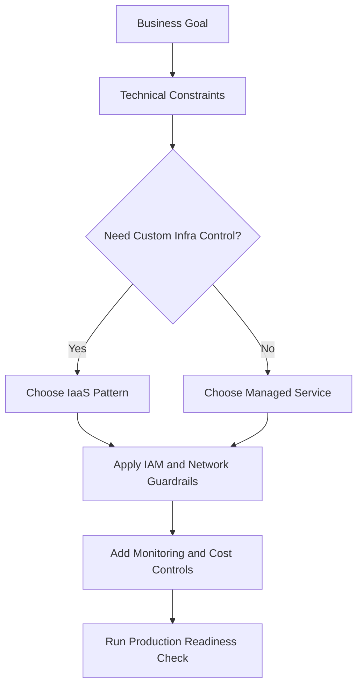
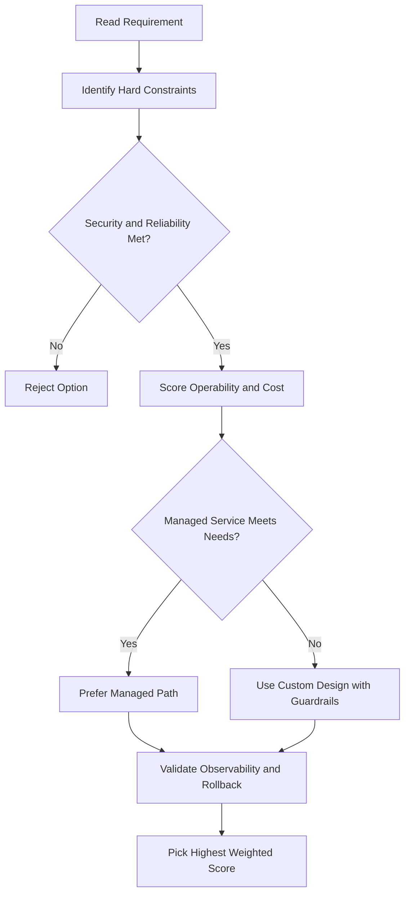
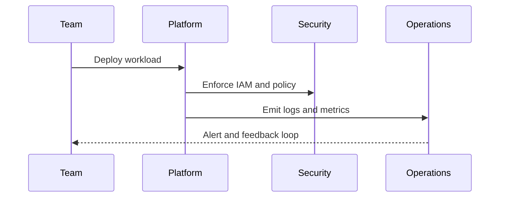

# Resource Manager Overview

## What Is Resource Manager?

- Lets you **hierarchically manage resources** by project, folder, and organization
- Ties together IAM policies, billing, and resource consumption

---

## Policy Inheritance

- Policies contain **roles + members** and are set on resources
- Resources **inherit policies from their parent** (top-down)
- Resource policy = **union of parent policy + resource policy** (for IAM allow policies)
- **IAM deny policies** override inherited roles — they can block specific principals from specific permissions regardless of what roles they hold
- **Billing** accumulates **bottom-up** (resource → project → billing account → organization)

---

## Billing Flow

```
Organization
  └─ Billing Account (one per org)
        └─ Project (one billing account per project)
              └─ Resources (consumption tracked per project)
```

- Resource consumption measured by: rate of use/time, number of items, feature use
- A resource belongs to **only one project**
- A project accumulates consumption of all its resources

---

## Organization, Projects, and Resources

### Organization Node

- Root node for all Google Cloud resources
- Managed via the **Organization Admin** role

### Example

- **Bob** = Organization Admin (controls the org domain)
- **Alice** = Project Creator (delegated by Bob to manage individual projects)

### What Projects Enable

- Track resource and quota usage
- Enable billing
- Manage permissions and credentials
- Enable services and APIs

> Every request to Google Cloud must include identifying project information.

---

## Project Identifiers

| Identifier     | Description                                   | Set By                                    |
| -------------- | --------------------------------------------- | ----------------------------------------- |
| Project Name   | Human-readable label; not used by Google APIs | You                                       |
| Project Number | Unique numeric ID                             | Auto-generated by Google                  |
| Project ID     | Unique string ID derived from project name    | Auto-generated (customizable at creation) |

> Find all three on the **Google Cloud Console Dashboard** or via the Resource Manager API.

---

## Resource Scope (Physical Organization)

| Scope    | Examples                        |
| -------- | ------------------------------- |
| Global   | Images, snapshots, VPC networks |
| Regional | External IP addresses           |
| Zonal    | VM instances, persistent disks  |

Regardless of scope, **every resource is organized into a project** — enabling per-project billing and reporting.

---

## gcloud Commands

```bash
# List all projects
gcloud projects list

# Describe a project (shows project ID, number, name)
gcloud projects describe my-project-id

# Create a new project
gcloud projects create my-new-project --name="My New Project"

# Set the active project for gcloud commands
gcloud config set project my-project-id

# Get IAM policy for a project
gcloud projects get-iam-policy my-project-id

# List folders under an organization
gcloud resource-manager folders list --organization=ORG_ID

# Describe an organization
gcloud organizations describe ORG_ID
```

## ACE Exam-Style Practice Questions

### Q1
In a Resource Manager Overview requirement, resources must be restricted to approved regions only. What should you use?

A. Budget alerts
B. Organization Policy for resource location restrictions
C. Cloud Scheduler
D. Labels only

Answer: B
Trap: IAM controls who can act; Org Policy controls what can be created under governance constraints.

### Q2
A new team needs isolated IAM, APIs, quotas, and billing in a Resource Manager Overview setup. What is best first step?

A. Create new project for the team
B. Add team as Editor to existing project
C. Create only a folder
D. Use one service account for all teams

Answer: A
Trap: Project is the operational boundary for billing, IAM bindings, API enablement, and quotas.

<!-- ACE_DEEP_ENRICHMENT_START -->
## ACE Deep Enrichment

### Think Like a Google Engineer
- Primary optimization axis: Managed-service-first design with reliability and security by default.
- Start with constraints first: SLO, security, compliance, latency, budget, and team operations capacity.
- Prefer managed services if they satisfy requirements with lower long-term operational toil.
- Minimize blast radius using environment isolation, least privilege, and failure-domain awareness.
- Design for day-2 operations: observability, rollback strategy, and quota or budget guardrails.

### Most Correct Option Filter (60 Seconds)
1. Eliminate options with broad access, single points of failure, or missing monitoring.
2. Confirm the option meets non-negotiables first: security and reliability requirements.
3. Compare remaining options on operational simplicity and long-term maintainability.
4. Use cost as an optimizer only after requirements and risk controls are satisfied.

### Weighted Decision Matrix
| Dimension | Weight | Strong Signal |
| --- | --- | --- |
| Security | 3 | Least privilege, secure defaults, no exposed blast radius |
| Reliability | 3 | Multi-zone or HA design, health checks, tested recovery path |
| Operability | 2 | Clear monitoring, alerting, rollout and rollback simplicity |
| Cost Efficiency | 2 | Right-sized resources, no waste, no reliability regression |
| Performance | 1 | Meets latency and throughput targets with headroom |

### Real-Life Scenario
A growing startup is moving from manual infrastructure to Google Cloud. They need fast delivery, better reliability, and clear operational controls while keeping architecture simple.

### Worked Example
- Translate business goals into technical constraints before selecting services.
- Favor managed services to reduce operational burden where possible.
- Apply least-privilege IAM and private-by-default networking decisions.
- Add monitoring, logging, and budget controls from the start.

### Flowchart


### Optimization Decision Flow


### Interaction Sequence


### Extra Exam Practice (10 Questions)
#### Q1
Scenario Focus: Resource Manager Overview
Which design pattern is usually best for fast, safe cloud adoption?

A. Use managed services with least-privilege IAM and clear observability controls.
B. Start with manual scripts and unrestricted access, then harden later.
C. Use one project for everything to reduce setup effort.
D. Ignore telemetry until after first production incident.

Answer: A
Why the other options are weaker: They typically ignore at least one hard constraint such as security, reliability, cost efficiency, or operational simplicity.
Google-engineer check: Reconfirm SLO fit, blast radius, and day-2 maintainability before finalizing.

#### Q2
Scenario Focus: Resource Manager Overview
A team wants speed and low ops overhead. What should they prioritize?

A. Use one project for everything to reduce setup effort.
B. Prefer services that reduce operational toil while meeting reliability goals.
C. Ignore telemetry until after first production incident.
D. Pick only the cheapest service regardless of reliability needs.

Answer: B
Why the other options are weaker: They typically ignore at least one hard constraint such as security, reliability, cost efficiency, or operational simplicity.
Google-engineer check: Reconfirm SLO fit, blast radius, and day-2 maintainability before finalizing.

#### Q3
Scenario Focus: Resource Manager Overview
What is a common architecture trap in early cloud projects?

A. Ignore telemetry until after first production incident.
B. Pick only the cheapest service regardless of reliability needs.
C. Over-broad access and missing monitoring are high-risk trap patterns.
D. Keep architecture opaque to avoid governance overhead.

Answer: C
Why the other options are weaker: They typically ignore at least one hard constraint such as security, reliability, cost efficiency, or operational simplicity.
Google-engineer check: Reconfirm SLO fit, blast radius, and day-2 maintainability before finalizing.

#### Q4
Scenario Focus: Resource Manager Overview
Which control set should be baseline for production?

A. Pick only the cheapest service regardless of reliability needs.
B. Keep architecture opaque to avoid governance overhead.
C. Start with manual scripts and unrestricted access, then harden later.
D. Baseline should include IAM guardrails, logging, monitoring, and cost alerts.

Answer: D
Why the other options are weaker: They typically ignore at least one hard constraint such as security, reliability, cost efficiency, or operational simplicity.
Google-engineer check: Reconfirm SLO fit, blast radius, and day-2 maintainability before finalizing.

#### Q5
Scenario Focus: Resource Manager Overview
How should you evaluate conflicting requirements on the exam?

A. Choose the option that balances security, reliability, cost, and operability.
B. Keep architecture opaque to avoid governance overhead.
C. Start with manual scripts and unrestricted access, then harden later.
D. Use one project for everything to reduce setup effort.

Answer: A
Why the other options are weaker: They typically ignore at least one hard constraint such as security, reliability, cost efficiency, or operational simplicity.
Google-engineer check: Reconfirm SLO fit, blast radius, and day-2 maintainability before finalizing.

#### Q6
Scenario Focus: Resource Manager Overview
Two designs both satisfy the happy path for Resource Manager Overview. Which choice is most correct?

A. Start with manual scripts and unrestricted access, then harden later.
B. Choose the option that preserves reliability and security while reducing operational burden.
C. Use one project for everything to reduce setup effort.
D. Ignore telemetry until after first production incident.

Answer: B
Why the other options are weaker: They typically ignore at least one hard constraint such as security, reliability, cost efficiency, or operational simplicity.
Google-engineer check: Reconfirm SLO fit, blast radius, and day-2 maintainability before finalizing.

#### Q7
Scenario Focus: Resource Manager Overview
What should you validate first before choosing an architecture for Resource Manager Overview?

A. Use one project for everything to reduce setup effort.
B. Ignore telemetry until after first production incident.
C. Validate SLO fit, blast radius, and least-privilege controls before comparing convenience.
D. Pick only the cheapest service regardless of reliability needs.

Answer: C
Why the other options are weaker: They typically ignore at least one hard constraint such as security, reliability, cost efficiency, or operational simplicity.
Google-engineer check: Reconfirm SLO fit, blast radius, and day-2 maintainability before finalizing.

#### Q8
Scenario Focus: Resource Manager Overview
A proposal lowers cost but increases failure risk. What is the best decision?

A. Ignore telemetry until after first production incident.
B. Pick only the cheapest service regardless of reliability needs.
C. Keep architecture opaque to avoid governance overhead.
D. Reject it unless reliability and recovery objectives remain within required targets.

Answer: D
Why the other options are weaker: They typically ignore at least one hard constraint such as security, reliability, cost efficiency, or operational simplicity.
Google-engineer check: Reconfirm SLO fit, blast radius, and day-2 maintainability before finalizing.

#### Q9
Scenario Focus: Resource Manager Overview
Which option best reflects optimization for Managed-service-first design with reliability and security by default?

A. Select the design that best meets Managed-service-first design with reliability and security by default while keeping constraints balanced.
B. Pick only the cheapest service regardless of reliability needs.
C. Keep architecture opaque to avoid governance overhead.
D. Start with manual scripts and unrestricted access, then harden later.

Answer: A
Why the other options are weaker: They typically ignore at least one hard constraint such as security, reliability, cost efficiency, or operational simplicity.
Google-engineer check: Reconfirm SLO fit, blast radius, and day-2 maintainability before finalizing.

#### Q10
Scenario Focus: Resource Manager Overview
How should you evaluate a design that needs frequent manual interventions?

A. Keep architecture opaque to avoid governance overhead.
B. Treat it as high risk and prefer automation-friendly designs with observability and rollback.
C. Start with manual scripts and unrestricted access, then harden later.
D. Use one project for everything to reduce setup effort.

Answer: B
Why the other options are weaker: They typically ignore at least one hard constraint such as security, reliability, cost efficiency, or operational simplicity.
Google-engineer check: Reconfirm SLO fit, blast radius, and day-2 maintainability before finalizing.

### Quick Commands
```bash
gcloud config list
gcloud projects describe PROJECT_ID
gcloud services list --enabled --project=PROJECT_ID
gcloud logging read "severity>=WARNING" --project=PROJECT_ID --freshness=2d --limit=20
```

### Fast Recall
- Good cloud design is constraint-driven, not tool-driven.
- Managed services usually improve delivery speed and reliability.
- Security and observability should be built in from day one.
<!-- ACE_DEEP_ENRICHMENT_END -->