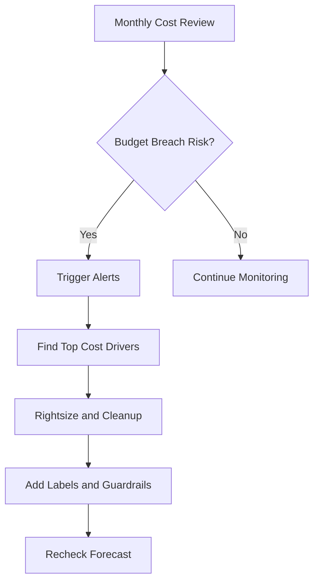
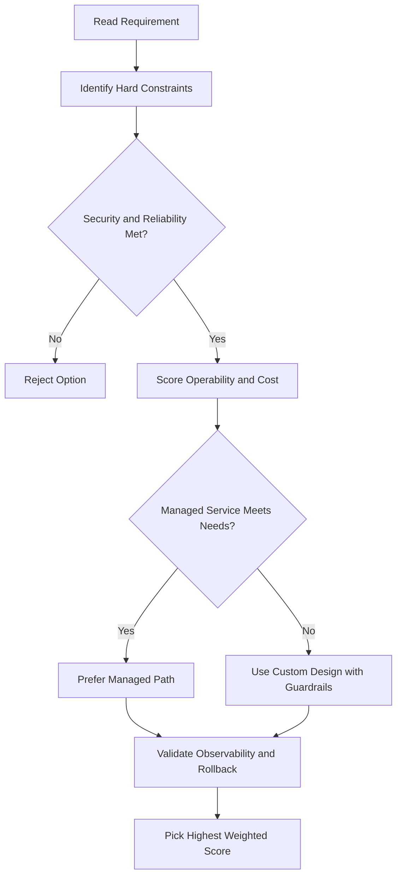
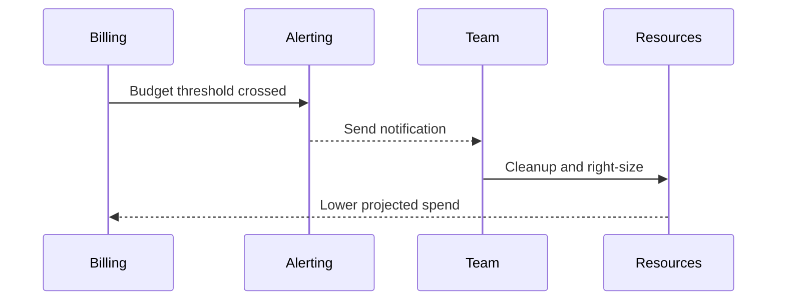

# Billing, Budgets, and Cost Management

## Budgets

Set a budget to track spend and get alerted before costs grow out of control.

### How to Set a Budget

1. Go to **Billing** → **Budgets & Alerts** → **Create Budget**
2. Set a **budget name** and select the **project** it applies to
3. Set the budget amount:
   - A specific dollar amount, OR
   - Match it to the **previous month's spend**
4. Configure **alert thresholds**

---

## Budget Alerts

Alerts send emails to **Billing Admins** when spend crosses a threshold.

| Alert Type        | Example                                                                  |
| ----------------- | ------------------------------------------------------------------------ |
| Percent of budget | Alert at 50%, 90%, 100% of budget                                        |
| Forecasted spend  | Alert when spend is **forecasted** to exceed the budget by end of period |

### Email Notification Contains

- Project name
- Percent of budget exceeded
- Budget amount

---

## Programmatic Alerts with Pub/Sub

- Connect a budget to a **Pub/Sub topic** to receive spend updates programmatically
- Create a **Cloud Run function** that listens to the Pub/Sub topic to automate cost management (e.g. shut down non-critical resources when budget is exceeded)

```
Budget threshold exceeded
        │
        ▼
   Pub/Sub Topic
        │
        ▼
 Cloud Run Function  →  automated action (e.g. stop VMs)
```

---

## Cost Optimization with Labels

- Label VM instances and resources across regions
- Identify resources sending traffic to distant continents (higher networking cost)
- Actions to reduce cost:
  - Relocate instances closer to users
  - Use **Cloud CDN** to cache content closer to users → reduces networking spend

---

## Analyzing Billing Data

| Tool              | Purpose                                                                          |
| ----------------- | -------------------------------------------------------------------------------- |
| **BigQuery**      | Export billing data; run SQL queries to analyze spend by label, project, service |
| **Looker Studio** | Visualize spend over time; create dashboards sliced by labels, projects, regions |

### Recommended Workflow

1. Label all resources (team, env, component, etc.)
2. Export billing data to BigQuery
3. Query spend by label/project/service
4. Visualize with Looker Studio dashboards

---

## gcloud Commands

```bash
# List billing accounts
gcloud billing accounts list

# Link a billing account to a project
gcloud billing projects link my-project \
  --billing-account=BILLING_ACCOUNT_ID

# Describe billing info for a project
gcloud billing projects describe my-project

# List projects linked to a billing account
gcloud billing projects list --billing-account=BILLING_ACCOUNT_ID

# Export billing data to BigQuery (done via Console or Billing API — no direct gcloud command)
# Recommended: Billing → Billing Export → BigQuery Export in Cloud Console
```

## ACE Exam-Style Practice Questions

### Q1
For Billing And Cost Management, you need to be notified at 50%, 90%, and 100% spend and also prevent runaway usage. What is best?

A. Budgets only
B. Quotas only
C. Budget alerts plus quotas
D. Cloud Trace only

Answer: C
Trap: Budgets notify while quotas enforce hard limits.

### Q2
You manage many sandbox projects in a Billing And Cost Management scenario and need owner-specific overspend alerts. What is best?

A. One shared budget for all projects
B. Budget per project with alert thresholds
C. CSV export once per quarter
D. Single alert at billing account only

Answer: B
Trap: Per-project budgets improve accountability and alert precision.

<!-- ACE_DEEP_ENRICHMENT_START -->
## ACE Deep Enrichment

### Think Like a Google Engineer
- Primary optimization axis: Predictable spend guardrails without reliability regression.
- Start with constraints first: SLO, security, compliance, latency, budget, and team operations capacity.
- Prefer managed services if they satisfy requirements with lower long-term operational toil.
- Minimize blast radius using environment isolation, least privilege, and failure-domain awareness.
- Design for day-2 operations: observability, rollback strategy, and quota or budget guardrails.

### Most Correct Option Filter (60 Seconds)
1. Eliminate options with broad access, single points of failure, or missing monitoring.
2. Confirm the option meets non-negotiables first: security and reliability requirements.
3. Compare remaining options on operational simplicity and long-term maintainability.
4. Use cost as an optimizer only after requirements and risk controls are satisfied.

### Weighted Decision Matrix
| Dimension | Weight | Strong Signal |
| --- | --- | --- |
| Security | 3 | Least privilege, secure defaults, no exposed blast radius |
| Reliability | 3 | Multi-zone or HA design, health checks, tested recovery path |
| Operability | 2 | Clear monitoring, alerting, rollout and rollback simplicity |
| Cost Efficiency | 2 | Right-sized resources, no waste, no reliability regression |
| Performance | 1 | Meets latency and throughput targets with headroom |

### Real-Life Scenario
A scale-up exceeded budget for two months due to idle resources and untracked growth. Leadership needs predictable spend without breaking product velocity.

### Worked Example
- Set budgets and alerts at billing account and project levels.
- Use labels for environment, team, and cost center to attribute spend.
- Right-size compute and remove idle disks, snapshots, and static IPs.
- Export billing data for trend analysis and anomaly detection.

### Flowchart


### Optimization Decision Flow


### Interaction Sequence


### Extra Exam Practice (15 Questions)
#### Q1
Scenario Focus: Billing, Budgets, and Cost Management
A project is constantly over budget. What is the highest-impact first step?

A. Create budgets with alerts and investigate top cost drivers immediately.
B. Wait until the invoice arrives, then react next month.
C. Disable all monitoring because it has a minor cost.
D. Give every team unrestricted quotas for speed.

Answer: A
Why the other options are weaker: They typically ignore at least one hard constraint such as security, reliability, cost efficiency, or operational simplicity.
Google-engineer check: Reconfirm SLO fit, blast radius, and day-2 maintainability before finalizing.

#### Q2
Scenario Focus: Billing, Budgets, and Cost Management
Which resource tagging strategy improves chargeback visibility?

A. Disable all monitoring because it has a minor cost.
B. Apply consistent labels for owner, environment, and cost center.
C. Give every team unrestricted quotas for speed.
D. Keep orphaned resources as backups without tracking.

Answer: B
Why the other options are weaker: They typically ignore at least one hard constraint such as security, reliability, cost efficiency, or operational simplicity.
Google-engineer check: Reconfirm SLO fit, blast radius, and day-2 maintainability before finalizing.

#### Q3
Scenario Focus: Billing, Budgets, and Cost Management
How should you control runaway spend in exam scenarios?

A. Give every team unrestricted quotas for speed.
B. Keep orphaned resources as backups without tracking.
C. Use quotas, budgets, and alerting guardrails before incidents happen.
D. Use one shared project for all environments and teams.

Answer: C
Why the other options are weaker: They typically ignore at least one hard constraint such as security, reliability, cost efficiency, or operational simplicity.
Google-engineer check: Reconfirm SLO fit, blast radius, and day-2 maintainability before finalizing.

#### Q4
Scenario Focus: Billing, Budgets, and Cost Management
What is the best way to identify long-term cost trends?

A. Keep orphaned resources as backups without tracking.
B. Use one shared project for all environments and teams.
C. Wait until the invoice arrives, then react next month.
D. Export billing data and analyze trends with dashboards and anomaly checks.

Answer: D
Why the other options are weaker: They typically ignore at least one hard constraint such as security, reliability, cost efficiency, or operational simplicity.
Google-engineer check: Reconfirm SLO fit, blast radius, and day-2 maintainability before finalizing.

#### Q5
Scenario Focus: Billing, Budgets, and Cost Management
Which decision reduces waste while preserving reliability?

A. Right-size resources using utilization metrics and remove idle assets.
B. Use one shared project for all environments and teams.
C. Wait until the invoice arrives, then react next month.
D. Disable all monitoring because it has a minor cost.

Answer: A
Why the other options are weaker: They typically ignore at least one hard constraint such as security, reliability, cost efficiency, or operational simplicity.
Google-engineer check: Reconfirm SLO fit, blast radius, and day-2 maintainability before finalizing.

#### Q6
Scenario Focus: Billing, Budgets, and Cost Management
Two designs both satisfy the happy path for Billing, Budgets, and Cost Management. Which choice is most correct?

A. Wait until the invoice arrives, then react next month.
B. Choose the option that preserves reliability and security while reducing operational burden.
C. Disable all monitoring because it has a minor cost.
D. Give every team unrestricted quotas for speed.

Answer: B
Why the other options are weaker: They typically ignore at least one hard constraint such as security, reliability, cost efficiency, or operational simplicity.
Google-engineer check: Reconfirm SLO fit, blast radius, and day-2 maintainability before finalizing.

#### Q7
Scenario Focus: Billing, Budgets, and Cost Management
What should you validate first before choosing an architecture for Billing, Budgets, and Cost Management?

A. Disable all monitoring because it has a minor cost.
B. Give every team unrestricted quotas for speed.
C. Validate SLO fit, blast radius, and least-privilege controls before comparing convenience.
D. Keep orphaned resources as backups without tracking.

Answer: C
Why the other options are weaker: They typically ignore at least one hard constraint such as security, reliability, cost efficiency, or operational simplicity.
Google-engineer check: Reconfirm SLO fit, blast radius, and day-2 maintainability before finalizing.

#### Q8
Scenario Focus: Billing, Budgets, and Cost Management
A proposal lowers cost but increases failure risk. What is the best decision?

A. Give every team unrestricted quotas for speed.
B. Keep orphaned resources as backups without tracking.
C. Use one shared project for all environments and teams.
D. Reject it unless reliability and recovery objectives remain within required targets.

Answer: D
Why the other options are weaker: They typically ignore at least one hard constraint such as security, reliability, cost efficiency, or operational simplicity.
Google-engineer check: Reconfirm SLO fit, blast radius, and day-2 maintainability before finalizing.

#### Q9
Scenario Focus: Billing, Budgets, and Cost Management
Which option best reflects optimization for Predictable spend guardrails without reliability regression?

A. Select the design that best meets Predictable spend guardrails without reliability regression while keeping constraints balanced.
B. Keep orphaned resources as backups without tracking.
C. Use one shared project for all environments and teams.
D. Wait until the invoice arrives, then react next month.

Answer: A
Why the other options are weaker: They typically ignore at least one hard constraint such as security, reliability, cost efficiency, or operational simplicity.
Google-engineer check: Reconfirm SLO fit, blast radius, and day-2 maintainability before finalizing.

#### Q10
Scenario Focus: Billing, Budgets, and Cost Management
How should you evaluate a design that needs frequent manual interventions?

A. Use one shared project for all environments and teams.
B. Treat it as high risk and prefer automation-friendly designs with observability and rollback.
C. Wait until the invoice arrives, then react next month.
D. Disable all monitoring because it has a minor cost.

Answer: B
Why the other options are weaker: They typically ignore at least one hard constraint such as security, reliability, cost efficiency, or operational simplicity.
Google-engineer check: Reconfirm SLO fit, blast radius, and day-2 maintainability before finalizing.

#### Q11
Scenario Focus: Billing, Budgets, and Cost Management
Two options have similar latency. Which tie-breaker is best?

A. Wait until the invoice arrives, then react next month.
B. Disable all monitoring because it has a minor cost.
C. Pick the option with stronger operability, clearer failure isolation, and simpler incident response.
D. Give every team unrestricted quotas for speed.

Answer: C
Why the other options are weaker: They typically ignore at least one hard constraint such as security, reliability, cost efficiency, or operational simplicity.
Google-engineer check: Reconfirm SLO fit, blast radius, and day-2 maintainability before finalizing.

#### Q12
Scenario Focus: Billing, Budgets, and Cost Management
What is the best way to choose between a custom stack and a managed service?

A. Disable all monitoring because it has a minor cost.
B. Give every team unrestricted quotas for speed.
C. Keep orphaned resources as backups without tracking.
D. Prefer managed services when they meet requirements with lower long-term maintenance effort.

Answer: D
Why the other options are weaker: They typically ignore at least one hard constraint such as security, reliability, cost efficiency, or operational simplicity.
Google-engineer check: Reconfirm SLO fit, blast radius, and day-2 maintainability before finalizing.

#### Q13
Scenario Focus: Billing, Budgets, and Cost Management
How do you confirm a solution is production-ready for 

A. Verify monitoring, alerting, rollback path, quota and budget controls, and secure defaults.
B. Give every team unrestricted quotas for speed.
C. Keep orphaned resources as backups without tracking.
D. Use one shared project for all environments and teams.

Answer: A
Why the other options are weaker: They typically ignore at least one hard constraint such as security, reliability, cost efficiency, or operational simplicity.
Google-engineer check: Reconfirm SLO fit, blast radius, and day-2 maintainability before finalizing.

#### Q14
Scenario Focus: Billing, Budgets, and Cost Management
Which pattern usually wins in ACE scenario tie-breakers?

A. Keep orphaned resources as backups without tracking.
B. Managed-service-first plus least-privilege access plus clear observability usually wins.
C. Use one shared project for all environments and teams.
D. Wait until the invoice arrives, then react next month.

Answer: B
Why the other options are weaker: They typically ignore at least one hard constraint such as security, reliability, cost efficiency, or operational simplicity.
Google-engineer check: Reconfirm SLO fit, blast radius, and day-2 maintainability before finalizing.

#### Q15
Scenario Focus: Billing, Budgets, and Cost Management
What is the best final check before locking the answer?

A. Use one shared project for all environments and teams.
B. Wait until the invoice arrives, then react next month.
C. Run a weighted check across security, reliability, cost, performance, and operability.
D. Disable all monitoring because it has a minor cost.

Answer: C
Why the other options are weaker: They typically ignore at least one hard constraint such as security, reliability, cost efficiency, or operational simplicity.
Google-engineer check: Reconfirm SLO fit, blast radius, and day-2 maintainability before finalizing.

### Quick Commands
```bash
gcloud beta billing budgets list --billing-account=BILLING_ACCOUNT_ID
gcloud compute instances list --project=PROJECT_ID
gcloud compute disks list --project=PROJECT_ID
gcloud resource-manager tags keys list --parent=projects/PROJECT_NUMBER
```

### Fast Recall
- Budgets and alerts are preventive controls, not reporting after the fact.
- Label discipline enables real cost accountability.
- Rightsizing requires metrics, not assumptions.
<!-- ACE_DEEP_ENRICHMENT_END -->