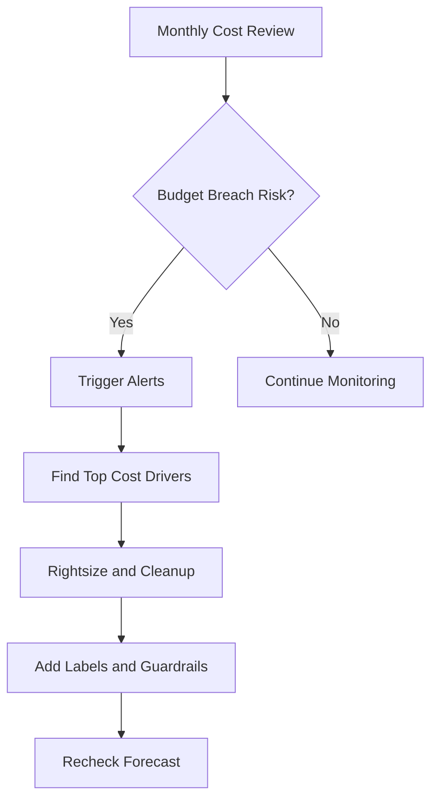
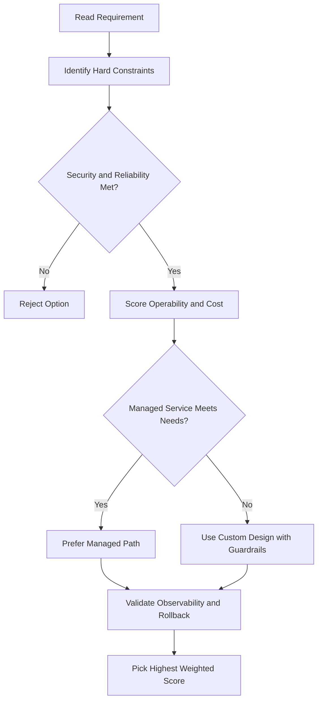
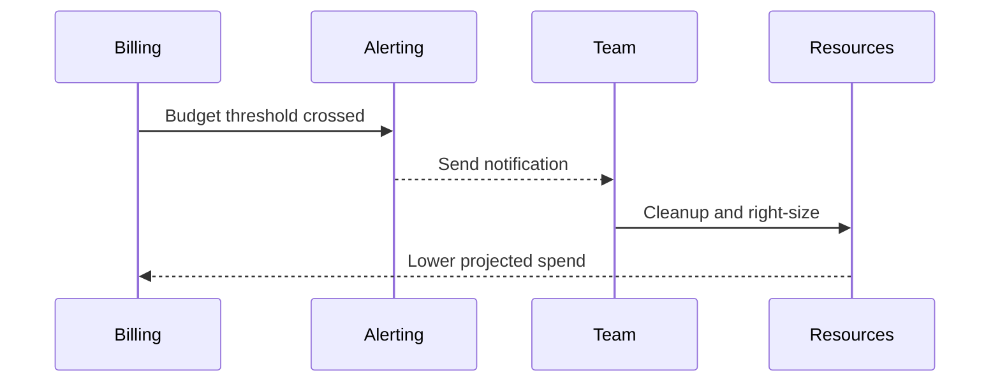

# Billing Administration Demo

## Billing Console Overview

Navigate to: **Navigation Menu → Billing**

- View current month's consumption and credits
- Switch between multiple billing accounts (if applicable)
- See billing account name, payment method

---

## Creating a Budget and Alert (Demo Walkthrough)

**Billing → Budgets & Alerts → Create Budget**

1. **Name** — e.g. `My-Budget-Alert`
2. **Projects** — select one or multiple projects to apply the budget to
3. **Amount** — choose one:
   - Specific dollar amount (e.g. `$500`)
   - Match last month's spend (auto-populated)
   - Option to include or exclude credits
4. **Alert thresholds** — default: 50%, 90%, 100%
   - Can add custom thresholds (e.g. 25%)
   - Choose between **actual** spend or **forecasted** spend
5. **Pub/Sub** — optionally connect to a Pub/Sub topic for automated cost management
6. Click **Finish**

> After creation, the budget page shows a visual indicator of how far along you are in your spend.

---

## Transactions Page

**Billing → Transactions**

- Shows all charges line by line (Compute Engine, disk, etc.)
- Credits offset charges on trial/promotional accounts
- Useful for auditing resource usage

---

## Billing Export

**Billing → Billing Export**

Two export options:

| Option          | Destination          | Format                 |
| --------------- | -------------------- | ---------------------- |
| BigQuery export | BigQuery dataset     | Tables (SQL-queryable) |
| File export     | Cloud Storage bucket | CSV or JSON            |

### BigQuery Export Setup

1. Click **BigQuery** → **Edit Settings**
2. Define a BigQuery dataset to export to
3. Click **Save**

### File Export Setup

1. Click **File Export** → **Edit Settings**
2. Create a Cloud Storage bucket first
3. Define bucket name and file prefix
4. Choose CSV or JSON format
5. Click **Save**

---

## Payment Settings

**Billing → Payment Method**

- Review payment profiles (credit card or bank account)
- Manage payment accounts

---

## Key Takeaways

- Billing administrators set up accounts, create budgets, and run reports as routine tasks
- Billing data can be exported as **JSON or CSV** to Cloud Storage, or to **BigQuery** for advanced querying
- More sophisticated filtering and analysis happens **after** export (explored in the upcoming BigQuery billing lab)

## ACE Exam-Style Practice Questions

### Q1
For Billing Admin Demo, you need to be notified at 50%, 90%, and 100% spend and also prevent runaway usage. What is best?

A. Budgets only
B. Quotas only
C. Budget alerts plus quotas
D. Cloud Trace only

Answer: C
Trap: Budgets notify while quotas enforce hard limits.

### Q2
You manage many sandbox projects in a Billing Admin Demo scenario and need owner-specific overspend alerts. What is best?

A. One shared budget for all projects
B. Budget per project with alert thresholds
C. CSV export once per quarter
D. Single alert at billing account only

Answer: B
Trap: Per-project budgets improve accountability and alert precision.

<!-- ACE_DEEP_ENRICHMENT_START -->
## ACE Deep Enrichment

### Think Like a Google Engineer
- Primary optimization axis: Predictable spend guardrails without reliability regression.
- Start with constraints first: SLO, security, compliance, latency, budget, and team operations capacity.
- Prefer managed services if they satisfy requirements with lower long-term operational toil.
- Minimize blast radius using environment isolation, least privilege, and failure-domain awareness.
- Design for day-2 operations: observability, rollback strategy, and quota or budget guardrails.

### Most Correct Option Filter (60 Seconds)
1. Eliminate options with broad access, single points of failure, or missing monitoring.
2. Confirm the option meets non-negotiables first: security and reliability requirements.
3. Compare remaining options on operational simplicity and long-term maintainability.
4. Use cost as an optimizer only after requirements and risk controls are satisfied.

### Weighted Decision Matrix
| Dimension | Weight | Strong Signal |
| --- | --- | --- |
| Security | 3 | Least privilege, secure defaults, no exposed blast radius |
| Reliability | 3 | Multi-zone or HA design, health checks, tested recovery path |
| Operability | 2 | Clear monitoring, alerting, rollout and rollback simplicity |
| Cost Efficiency | 2 | Right-sized resources, no waste, no reliability regression |
| Performance | 1 | Meets latency and throughput targets with headroom |

### Real-Life Scenario
A scale-up exceeded budget for two months due to idle resources and untracked growth. Leadership needs predictable spend without breaking product velocity.

### Worked Example
- Set budgets and alerts at billing account and project levels.
- Use labels for environment, team, and cost center to attribute spend.
- Right-size compute and remove idle disks, snapshots, and static IPs.
- Export billing data for trend analysis and anomaly detection.

### Flowchart


### Optimization Decision Flow


### Interaction Sequence


### Extra Exam Practice (15 Questions)
#### Q1

Scenario Focus: Billing Administration Demo

A project is constantly over budget. What is the highest-impact first step?

A. Create budgets with alerts and investigate top cost drivers immediately.  
B. Wait until the invoice arrives, then react next month.  
C. Disable all monitoring because it has a minor cost.  
D. Give every team unrestricted quotas for speed.

Answer: A  
Why the other options are weaker: They typically ignore at least one hard constraint such as security, reliability, cost efficiency, or operational simplicity.  
Google-engineer check: Reconfirm SLO fit, blast radius, and day-2 maintainability before finalizing.

#### Q2

Scenario Focus: Billing Administration Demo

Which resource tagging strategy improves chargeback visibility?

A. Disable all monitoring because it has a minor cost.  
B. Apply consistent labels for owner, environment, and cost center.  
C. Give every team unrestricted quotas for speed.  
D. Keep orphaned resources as backups without tracking.

Answer: B  
Why the other options are weaker: They typically ignore at least one hard constraint such as security, reliability, cost efficiency, or operational simplicity.  
Google-engineer check: Reconfirm SLO fit, blast radius, and day-2 maintainability before finalizing.

#### Q3

Scenario Focus: Billing Administration Demo

How should you control runaway spend in exam scenarios?

A. Give every team unrestricted quotas for speed.  
B. Keep orphaned resources as backups without tracking.  
C. Use quotas, budgets, and alerting guardrails before incidents happen.  
D. Use one shared project for all environments and teams.

Answer: C  
Why the other options are weaker: They typically ignore at least one hard constraint such as security, reliability, cost efficiency, or operational simplicity.  
Google-engineer check: Reconfirm SLO fit, blast radius, and day-2 maintainability before finalizing.

#### Q4

Scenario Focus: Billing Administration Demo

What is the best way to identify long-term cost trends?

A. Keep orphaned resources as backups without tracking.  
B. Use one shared project for all environments and teams.  
C. Wait until the invoice arrives, then react next month.  
D. Export billing data and analyze trends with dashboards and anomaly checks.

Answer: D  
Why the other options are weaker: They typically ignore at least one hard constraint such as security, reliability, cost efficiency, or operational simplicity.  
Google-engineer check: Reconfirm SLO fit, blast radius, and day-2 maintainability before finalizing.

#### Q5

Scenario Focus: Billing Administration Demo

Which decision reduces waste while preserving reliability?

A. Right-size resources using utilization metrics and remove idle assets.  
B. Use one shared project for all environments and teams.  
C. Wait until the invoice arrives, then react next month.  
D. Disable all monitoring because it has a minor cost.

Answer: A  
Why the other options are weaker: They typically ignore at least one hard constraint such as security, reliability, cost efficiency, or operational simplicity.  
Google-engineer check: Reconfirm SLO fit, blast radius, and day-2 maintainability before finalizing.

#### Q6

Scenario Focus: Billing Administration Demo

Two designs both satisfy the happy path for Billing Administration Demo. Which choice is most correct?

A. Wait until the invoice arrives, then react next month.  
B. Choose the option that preserves reliability and security while reducing operational burden.  
C. Disable all monitoring because it has a minor cost.  
D. Give every team unrestricted quotas for speed.

Answer: B  
Why the other options are weaker: They typically ignore at least one hard constraint such as security, reliability, cost efficiency, or operational simplicity.  
Google-engineer check: Reconfirm SLO fit, blast radius, and day-2 maintainability before finalizing.

#### Q7

Scenario Focus: Billing Administration Demo

What should you validate first before choosing an architecture for Billing Administration Demo?

A. Disable all monitoring because it has a minor cost.  
B. Give every team unrestricted quotas for speed.  
C. Validate SLO fit, blast radius, and least-privilege controls before comparing convenience.  
D. Keep orphaned resources as backups without tracking.

Answer: C  
Why the other options are weaker: They typically ignore at least one hard constraint such as security, reliability, cost efficiency, or operational simplicity.  
Google-engineer check: Reconfirm SLO fit, blast radius, and day-2 maintainability before finalizing.

#### Q8

Scenario Focus: Billing Administration Demo

A proposal lowers cost but increases failure risk. What is the best decision?

A. Give every team unrestricted quotas for speed.  
B. Keep orphaned resources as backups without tracking.  
C. Use one shared project for all environments and teams.  
D. Reject it unless reliability and recovery objectives remain within required targets.

Answer: D  
Why the other options are weaker: They typically ignore at least one hard constraint such as security, reliability, cost efficiency, or operational simplicity.  
Google-engineer check: Reconfirm SLO fit, blast radius, and day-2 maintainability before finalizing.

#### Q9

Scenario Focus: Billing Administration Demo

Which option best reflects optimization for Predictable spend guardrails without reliability regression?

A. Select the design that best meets Predictable spend guardrails without reliability regression while keeping constraints balanced.  
B. Keep orphaned resources as backups without tracking.  
C. Use one shared project for all environments and teams.  
D. Wait until the invoice arrives, then react next month.

Answer: A  
Why the other options are weaker: They typically ignore at least one hard constraint such as security, reliability, cost efficiency, or operational simplicity.  
Google-engineer check: Reconfirm SLO fit, blast radius, and day-2 maintainability before finalizing.

#### Q10

Scenario Focus: Billing Administration Demo

How should you evaluate a design that needs frequent manual interventions?

A. Use one shared project for all environments and teams.  
B. Treat it as high risk and prefer automation-friendly designs with observability and rollback.  
C. Wait until the invoice arrives, then react next month.  
D. Disable all monitoring because it has a minor cost.

Answer: B  
Why the other options are weaker: They typically ignore at least one hard constraint such as security, reliability, cost efficiency, or operational simplicity.  
Google-engineer check: Reconfirm SLO fit, blast radius, and day-2 maintainability before finalizing.

#### Q11

Scenario Focus: Billing Administration Demo

Two options have similar latency. Which tie-breaker is best?

A. Wait until the invoice arrives, then react next month.  
B. Disable all monitoring because it has a minor cost.  
C. Pick the option with stronger operability, clearer failure isolation, and simpler incident response.  
D. Give every team unrestricted quotas for speed.

Answer: C  
Why the other options are weaker: They typically ignore at least one hard constraint such as security, reliability, cost efficiency, or operational simplicity.  
Google-engineer check: Reconfirm SLO fit, blast radius, and day-2 maintainability before finalizing.

#### Q12

Scenario Focus: Billing Administration Demo

What is the best way to choose between a custom stack and a managed service?

A. Disable all monitoring because it has a minor cost.  
B. Give every team unrestricted quotas for speed.  
C. Keep orphaned resources as backups without tracking.  
D. Prefer managed services when they meet requirements with lower long-term maintenance effort.

Answer: D  
Why the other options are weaker: They typically ignore at least one hard constraint such as security, reliability, cost efficiency, or operational simplicity.  
Google-engineer check: Reconfirm SLO fit, blast radius, and day-2 maintainability before finalizing.

#### Q13

Scenario Focus: Billing Administration Demo

How do you confirm a solution is production-ready for 

A. Verify monitoring, alerting, rollback path, quota and budget controls, and secure defaults.  
B. Give every team unrestricted quotas for speed.  
C. Keep orphaned resources as backups without tracking.  
D. Use one shared project for all environments and teams.

Answer: A  
Why the other options are weaker: They typically ignore at least one hard constraint such as security, reliability, cost efficiency, or operational simplicity.  
Google-engineer check: Reconfirm SLO fit, blast radius, and day-2 maintainability before finalizing.

#### Q14

Scenario Focus: Billing Administration Demo

Which pattern usually wins in ACE scenario tie-breakers?

A. Keep orphaned resources as backups without tracking.  
B. Managed-service-first plus least-privilege access plus clear observability usually wins.  
C. Use one shared project for all environments and teams.  
D. Wait until the invoice arrives, then react next month.

Answer: B  
Why the other options are weaker: They typically ignore at least one hard constraint such as security, reliability, cost efficiency, or operational simplicity.  
Google-engineer check: Reconfirm SLO fit, blast radius, and day-2 maintainability before finalizing.

#### Q15

Scenario Focus: Billing Administration Demo

What is the best final check before locking the answer?

A. Use one shared project for all environments and teams.  
B. Wait until the invoice arrives, then react next month.  
C. Run a weighted check across security, reliability, cost, performance, and operability.  
D. Disable all monitoring because it has a minor cost.

Answer: C  
Why the other options are weaker: They typically ignore at least one hard constraint such as security, reliability, cost efficiency, or operational simplicity.  
Google-engineer check: Reconfirm SLO fit, blast radius, and day-2 maintainability before finalizing.

### Quick Commands
```bash
gcloud beta billing budgets list --billing-account=BILLING_ACCOUNT_ID
gcloud compute instances list --project=PROJECT_ID
gcloud compute disks list --project=PROJECT_ID
gcloud resource-manager tags keys list --parent=projects/PROJECT_NUMBER
```

### Fast Recall
- Budgets and alerts are preventive controls, not reporting after the fact.
- Label discipline enables real cost accountability.
- Rightsizing requires metrics, not assumptions.
<!-- ACE_DEEP_ENRICHMENT_END -->