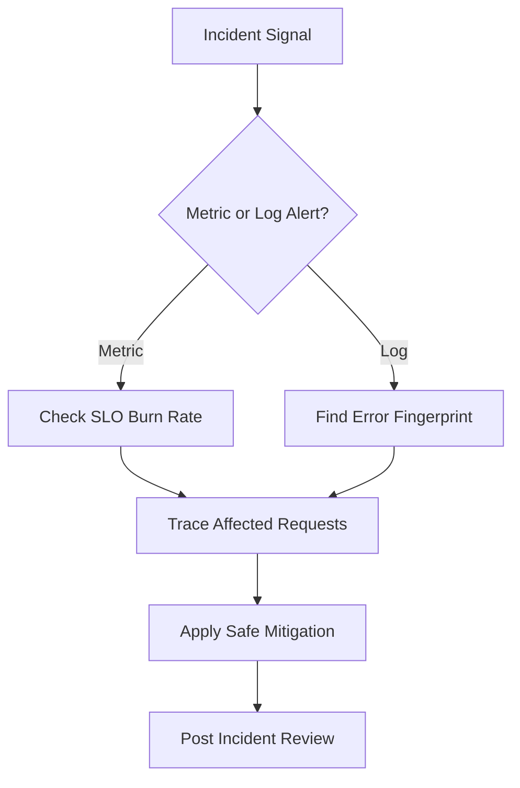
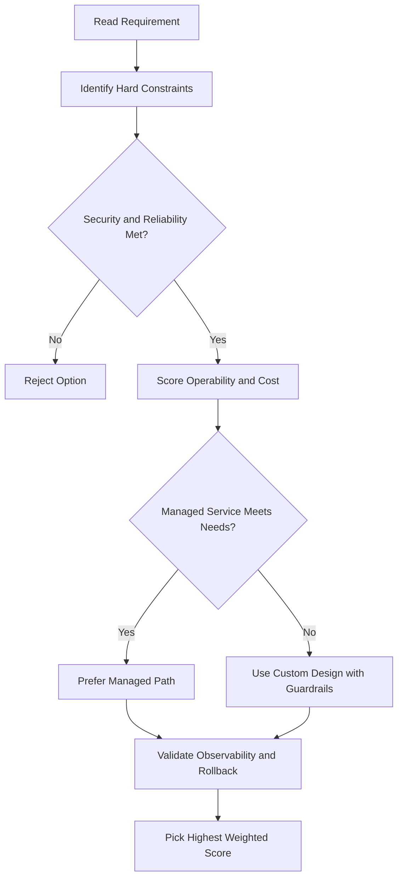
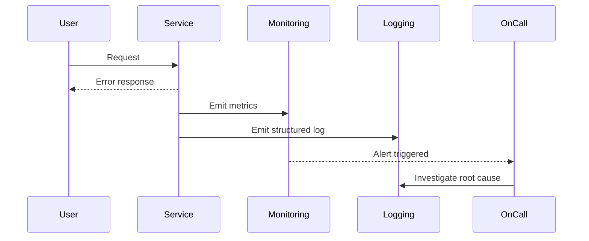

# Cloud Monitoring

## What Is Cloud Monitoring?

- Foundation of **Site Reliability Engineering (SRE)** — applies software engineering to operations for ultra-scalable, highly reliable systems
- Dynamically configures monitoring after resources are deployed
- Ingests **metrics, events, and metadata** to generate insights via dashboards, charts, and alerts

---

## Metrics Scope

- The **root entity** that holds monitoring and configuration in Cloud Monitoring
- Each metrics scope can monitor **1 to 375 projects**
- The first project added = **scoping project** (its name becomes the scope name)
- Contains: custom dashboards, alerting policies, uptime checks, notification channels, group definitions
- Metric data and log entries **remain in individual projects** — the scope just provides a unified view
- Acts as a **single pane of glass** across multiple GCP projects and AWS accounts

### Access Control Note

All users with access to a metrics scope see all data by default. A role assigned on one project applies equally to all monitored projects. To give different roles per project, place them in **separate metrics scopes**.

### AWS Support

Configure a Google Cloud project to hold an **AWS Connector** to monitor AWS accounts.

---

## Dashboards and Charts

- Create custom dashboards with charts for any metric
- Example metrics:
  - CPU utilization
  - Network packets/bytes sent and received
  - Packets/bytes dropped by firewall
- Customize charts with:
  - **Filters** — remove noise
  - **Groups** — reduce number of time series
  - **Aggregates** — combine multiple time series

---

## Alerting Policies

Notify you when specific conditions are met — without needing someone to watch dashboards 24/7.

### Example Alert

- Trigger: VM network egress exceeds a threshold for a specific timeframe
- Notification channels: email, SMS, or other channels

### Alerting Best Practices

| Best Practice                      | Detail                                                   |
| ---------------------------------- | -------------------------------------------------------- |
| Alert on symptoms, not causes      | Monitor failing DB queries → then identify if DB is down |
| Use multiple notification channels | Email + SMS — avoid single point of failure              |
| Customize alerts for the audience  | Describe what actions to take or what to examine         |
| Avoid noise                        | Only set actionable alerts; don't alert on everything    |

---

## Uptime Checks

Test availability of public services from locations around the world.

| Setting        | Options                                                                          |
| -------------- | -------------------------------------------------------------------------------- |
| Protocol       | HTTP, HTTPS, TCP                                                                 |
| Resource types | App Engine app, Compute Engine instance, URL/host, AWS instance or load balancer |
| Check interval | e.g. every 1 minute                                                              |
| Timeout        | e.g. 10 seconds (no response = failure)                                          |

- Each uptime check can have an associated alerting policy
- View latency per global check location

---

## Ops Agent (Data Collection for Compute Engine)

The hypervisor **cannot** access internal VM metrics (e.g. memory usage) — the **Ops Agent** fills that gap.

- **Primary agent** for collecting telemetry from Compute Engine instances
- Installed on the VM; collects data beyond system-level metrics
- Supports monitoring many third-party applications
- Supports: CentOS, Ubuntu, Windows, and most major OS

```
Compute Engine VM
  └─ Ops Agent
        └─ Collects metrics (CPU, memory, disk, app-specific)
              └─ Cloud Monitoring
                    └─ Dashboards, Alerts, Uptime Checks, Notifications
```

---

## Custom Metrics

Use when standard metrics don't fit your needs.

**Example:** A game server with a 50-user capacity.

- Standard approach: use CPU or network load as a proxy for user count
- Better approach: pass **current user count directly** from the app into Cloud Monitoring as a custom metric

### Custom Metrics + Autoscaling

| Scenario                                 | Autoscaler behavior                                          |
| ---------------------------------------- | ------------------------------------------------------------ |
| Metric comes from each VM in a MIG       | Takes average across all VMs; compares to utilization target |
| Metric applies to whole MIG (not per VM) | Compares metric value directly to utilization target         |
| Metric has multiple values               | Apply a filter to autoscale on a specific individual value   |

- Autoscaler **creates VMs** when metric > target
- Autoscaler **deletes VMs** when metric < target

---

## gcloud Commands

```bash
# List uptime checks
gcloud monitoring uptime list-configs

# Create an alerting policy from a JSON file
gcloud alpha monitoring policies create --policy-from-file=policy.json

# List alerting policies
gcloud alpha monitoring policies list

# List monitored resource descriptors
gcloud monitoring resource-descriptors list

# Install Ops Agent on a Compute Engine VM (run on the VM)
curl -sSO https://dl.google.com/cloudagents/add-google-cloud-ops-agent-repo.sh
sudo bash add-google-cloud-ops-agent-repo.sh --also-install

# Check Ops Agent status (run on the VM)
sudo systemctl status google-cloud-ops-agent

# List Cloud Monitoring dashboards
gcloud monitoring dashboards list

# Create a dashboard from a JSON file
gcloud monitoring dashboards create --config-from-file=dashboard.json
```

---

## Metric Types

| Type           | Description                                 | Example                           |
| -------------- | ------------------------------------------- | --------------------------------- |
| **Gauge**      | Point-in-time value (no aggregation needed) | CPU utilisation at a moment       |
| **Delta**      | Change over a time interval                 | Request count in the last minute  |
| **Cumulative** | Monotonically increasing total since reset  | Total bytes sent since VM started |

- Delta and cumulative metrics need an **alignment function** (rate, delta) before charting

---

## SLOs and Error Budgets

**Service Level Objective (SLO):** a target reliability goal (e.g. 99.9% availability).

**Error budget:** the allowed downtime/failures before the SLO is breached.

```
Error budget = 1 - SLO
99.9% SLO → 0.1% budget = ~43.8 min/month of allowed downtime
```

Cloud Monitoring supports SLO monitoring via the **Service Monitoring** section:

- Define a service and its SLI (request-based or window-based)
- Set the SLO percentage and rolling window
- Alert when error budget burn rate is too high

---

## Alerting Policy Details

### Notification Channels

| Channel       | Setup                             |
| ------------- | --------------------------------- |
| **Email**     | Add directly in Console           |
| **PagerDuty** | Provide integration key           |
| **Slack**     | OAuth integration; choose channel |
| **Webhook**   | HTTPS endpoint; payload is JSON   |
| **SMS**       | Via phone number                  |
| **Pub/Sub**   | Route to any downstream system    |

### Alert Conditions

- **Metric threshold** — value crosses a threshold for N consecutive minutes
- **Metric absence** — no data received (e.g. dead VM or broken agent)
- **Log-based metric** — alert when a log pattern exceeds a count
- **Uptime check failure** — HTTP/TCP health check fails from multiple regions

### Maintenance Windows

Suppress alerts during planned maintenance so on-call teams aren't paged:

```bash
gcloud alpha monitoring policies update POLICY_ID \
  --add-notification-channel=CHANNEL_ID
# Maintenance windows configured in Console (Cloud Monitoring > Alerting > Maintenance windows)
```

---

## Monitoring Query Language (MQL)

MQL is a text-based query language for writing complex metric queries in Cloud Monitoring:

```
fetch gce_instance
| metric 'compute.googleapis.com/instance/cpu/utilization'
| filter resource.zone = 'us-central1-a'
| align mean_aligner()
| every 1m
| mean
```

- More powerful than the GUI-based chart builder
- Supports joins, ratios, and multi-resource aggregations
- Used in both dashboards and alerting policies

---

## Ops Agent

The **Ops Agent** is the recommended agent for Compute Engine VMs (replaces the old Stackdriver Logging and Monitoring agents):

- Collects **system metrics** (CPU, memory, disk, network) and **logs** in one agent
- Configured via `/etc/google-cloud-ops-agent/config.yaml`
- Supports log parsing (syslog, Apache, Nginx, custom)

```bash
# Install Ops Agent
curl -sSO https://dl.google.com/cloudagents/add-google-cloud-ops-agent-repo.sh
sudo bash add-google-cloud-ops-agent-repo.sh --also-install
sudo systemctl status google-cloud-ops-agent
```

---

## Key Takeaways — Cloud Monitoring

| Topic                      | Key Point                                               |
| -------------------------- | ------------------------------------------------------- |
| **Gauge/Delta/Cumulative** | Choose correct alignment before aggregating metrics     |
| **SLOs**                   | Define SLI → SLO → alert on error budget burn rate      |
| **Notification channels**  | PagerDuty/Slack/Webhook all supported natively          |
| **MQL**                    | Use for complex multi-resource queries or ratio metrics |
| **Ops Agent**              | Replaces legacy agents; collects metrics + logs in one  |
| **Maintenance windows**    | Suppress noisy alerts during planned downtime           |

## ACE Exam-Style Practice Questions

### Q1
A Cloud Monitoring requirement asks to collect logs from all current and future production projects only. What should you do?

A. Configure manual exports in each project every month
B. Configure aggregated log sink at production folder level
C. Disable Cloud Logging and use VM files
D. Send logs to Cloud DNS

Answer: B
Trap: Folder-level aggregated sinks capture both existing and future child projects.

### Q2
In a Cloud Monitoring incident, only a few requests are slow across many microservices. Which tool is best to identify the slow hop?

A. Cloud Trace
B. Cloud Storage lifecycle
C. Cloud Build trigger
D. Cloud Armor policy

Answer: A
Trap: Distributed tracing is designed for per-hop latency diagnosis.

<!-- ACE_DEEP_ENRICHMENT_START -->
## ACE Deep Enrichment

### Think Like a Google Engineer
- Primary optimization axis: SLO-driven reliability and faster mean time to recovery.
- Start with constraints first: SLO, security, compliance, latency, budget, and team operations capacity.
- Prefer managed services if they satisfy requirements with lower long-term operational toil.
- Minimize blast radius using environment isolation, least privilege, and failure-domain awareness.
- Design for day-2 operations: observability, rollback strategy, and quota or budget guardrails.

### Most Correct Option Filter (60 Seconds)
1. Eliminate options with broad access, single points of failure, or missing monitoring.
2. Confirm the option meets non-negotiables first: security and reliability requirements.
3. Compare remaining options on operational simplicity and long-term maintainability.
4. Use cost as an optimizer only after requirements and risk controls are satisfied.

### Weighted Decision Matrix
| Dimension | Weight | Strong Signal |
| --- | --- | --- |
| Security | 3 | Least privilege, secure defaults, no exposed blast radius |
| Reliability | 3 | Multi-zone or HA design, health checks, tested recovery path |
| Operability | 2 | Clear monitoring, alerting, rollout and rollback simplicity |
| Cost Efficiency | 2 | Right-sized resources, no waste, no reliability regression |
| Performance | 1 | Meets latency and throughput targets with headroom |

### Real-Life Scenario
A customer-facing API has intermittent latency spikes and error bursts. The team needs faster detection, cleaner triage, and safer remediation during peak traffic.

### Worked Example
- Define SLOs and monitor latency, error rate, and saturation.
- Correlate logs, metrics, and traces using request IDs.
- Create alert policies for burn-rate and critical error thresholds.
- Run incident playbooks and validate post-incident action items.

### Flowchart


### Optimization Decision Flow


### Interaction Sequence


### Extra Exam Practice (15 Questions)
#### Q1
Scenario Focus: Cloud Monitoring
Latency increases only for one endpoint. What is the best first triage action?

A. Check endpoint-specific metrics and traces before broad scaling actions.
B. Restart all services immediately without diagnosis.
C. Rely only on CPU metrics and ignore user-facing latency.
D. Disable alerts during busy periods to avoid noise.

Answer: A
Why the other options are weaker: They typically ignore at least one hard constraint such as security, reliability, cost efficiency, or operational simplicity.
Google-engineer check: Reconfirm SLO fit, blast radius, and day-2 maintainability before finalizing.

#### Q2
Scenario Focus: Cloud Monitoring
Which monitoring strategy best protects user experience?

A. Rely only on CPU metrics and ignore user-facing latency.
B. Track SLO-aligned latency and error burn-rate alerts.
C. Disable alerts during busy periods to avoid noise.
D. Investigate incidents only from one log line sample.

Answer: B
Why the other options are weaker: They typically ignore at least one hard constraint such as security, reliability, cost efficiency, or operational simplicity.
Google-engineer check: Reconfirm SLO fit, blast radius, and day-2 maintainability before finalizing.

#### Q3
Scenario Focus: Cloud Monitoring
A team has logs but no trace correlation. What should they add?

A. Disable alerts during busy periods to avoid noise.
B. Investigate incidents only from one log line sample.
C. Add request correlation IDs across logs and traces.
D. Skip retrospectives once service is healthy again.

Answer: C
Why the other options are weaker: They typically ignore at least one hard constraint such as security, reliability, cost efficiency, or operational simplicity.
Google-engineer check: Reconfirm SLO fit, blast radius, and day-2 maintainability before finalizing.

#### Q4
Scenario Focus: Cloud Monitoring
How should alerting be tuned to reduce noisy pages?

A. Investigate incidents only from one log line sample.
B. Skip retrospectives once service is healthy again.
C. Restart all services immediately without diagnosis.
D. Use severity-based alerts with actionable thresholds and runbooks.

Answer: D
Why the other options are weaker: They typically ignore at least one hard constraint such as security, reliability, cost efficiency, or operational simplicity.
Google-engineer check: Reconfirm SLO fit, blast radius, and day-2 maintainability before finalizing.

#### Q5
Scenario Focus: Cloud Monitoring
What should happen after mitigation is applied?

A. Run a post-incident review and capture prevention tasks.
B. Skip retrospectives once service is healthy again.
C. Restart all services immediately without diagnosis.
D. Rely only on CPU metrics and ignore user-facing latency.

Answer: A
Why the other options are weaker: They typically ignore at least one hard constraint such as security, reliability, cost efficiency, or operational simplicity.
Google-engineer check: Reconfirm SLO fit, blast radius, and day-2 maintainability before finalizing.

#### Q6
Scenario Focus: Cloud Monitoring
Two designs both satisfy the happy path for Cloud Monitoring. Which choice is most correct?

A. Restart all services immediately without diagnosis.
B. Choose the option that preserves reliability and security while reducing operational burden.
C. Rely only on CPU metrics and ignore user-facing latency.
D. Disable alerts during busy periods to avoid noise.

Answer: B
Why the other options are weaker: They typically ignore at least one hard constraint such as security, reliability, cost efficiency, or operational simplicity.
Google-engineer check: Reconfirm SLO fit, blast radius, and day-2 maintainability before finalizing.

#### Q7
Scenario Focus: Cloud Monitoring
What should you validate first before choosing an architecture for Cloud Monitoring?

A. Rely only on CPU metrics and ignore user-facing latency.
B. Disable alerts during busy periods to avoid noise.
C. Validate SLO fit, blast radius, and least-privilege controls before comparing convenience.
D. Investigate incidents only from one log line sample.

Answer: C
Why the other options are weaker: They typically ignore at least one hard constraint such as security, reliability, cost efficiency, or operational simplicity.
Google-engineer check: Reconfirm SLO fit, blast radius, and day-2 maintainability before finalizing.

#### Q8
Scenario Focus: Cloud Monitoring
A proposal lowers cost but increases failure risk. What is the best decision?

A. Disable alerts during busy periods to avoid noise.
B. Investigate incidents only from one log line sample.
C. Skip retrospectives once service is healthy again.
D. Reject it unless reliability and recovery objectives remain within required targets.

Answer: D
Why the other options are weaker: They typically ignore at least one hard constraint such as security, reliability, cost efficiency, or operational simplicity.
Google-engineer check: Reconfirm SLO fit, blast radius, and day-2 maintainability before finalizing.

#### Q9
Scenario Focus: Cloud Monitoring
Which option best reflects optimization for SLO-driven reliability and faster mean time to recovery?

A. Select the design that best meets SLO-driven reliability and faster mean time to recovery while keeping constraints balanced.
B. Investigate incidents only from one log line sample.
C. Skip retrospectives once service is healthy again.
D. Restart all services immediately without diagnosis.

Answer: A
Why the other options are weaker: They typically ignore at least one hard constraint such as security, reliability, cost efficiency, or operational simplicity.
Google-engineer check: Reconfirm SLO fit, blast radius, and day-2 maintainability before finalizing.

#### Q10
Scenario Focus: Cloud Monitoring
How should you evaluate a design that needs frequent manual interventions?

A. Skip retrospectives once service is healthy again.
B. Treat it as high risk and prefer automation-friendly designs with observability and rollback.
C. Restart all services immediately without diagnosis.
D. Rely only on CPU metrics and ignore user-facing latency.

Answer: B
Why the other options are weaker: They typically ignore at least one hard constraint such as security, reliability, cost efficiency, or operational simplicity.
Google-engineer check: Reconfirm SLO fit, blast radius, and day-2 maintainability before finalizing.

#### Q11
Scenario Focus: Cloud Monitoring
Two options have similar latency. Which tie-breaker is best?

A. Restart all services immediately without diagnosis.
B. Rely only on CPU metrics and ignore user-facing latency.
C. Pick the option with stronger operability, clearer failure isolation, and simpler incident response.
D. Disable alerts during busy periods to avoid noise.

Answer: C
Why the other options are weaker: They typically ignore at least one hard constraint such as security, reliability, cost efficiency, or operational simplicity.
Google-engineer check: Reconfirm SLO fit, blast radius, and day-2 maintainability before finalizing.

#### Q12
Scenario Focus: Cloud Monitoring
What is the best way to choose between a custom stack and a managed service?

A. Rely only on CPU metrics and ignore user-facing latency.
B. Disable alerts during busy periods to avoid noise.
C. Investigate incidents only from one log line sample.
D. Prefer managed services when they meet requirements with lower long-term maintenance effort.

Answer: D
Why the other options are weaker: They typically ignore at least one hard constraint such as security, reliability, cost efficiency, or operational simplicity.
Google-engineer check: Reconfirm SLO fit, blast radius, and day-2 maintainability before finalizing.

#### Q13
Scenario Focus: Cloud Monitoring
How do you confirm a solution is production-ready for 

A. Verify monitoring, alerting, rollback path, quota and budget controls, and secure defaults.
B. Disable alerts during busy periods to avoid noise.
C. Investigate incidents only from one log line sample.
D. Skip retrospectives once service is healthy again.

Answer: A
Why the other options are weaker: They typically ignore at least one hard constraint such as security, reliability, cost efficiency, or operational simplicity.
Google-engineer check: Reconfirm SLO fit, blast radius, and day-2 maintainability before finalizing.

#### Q14
Scenario Focus: Cloud Monitoring
Which pattern usually wins in ACE scenario tie-breakers?

A. Investigate incidents only from one log line sample.
B. Managed-service-first plus least-privilege access plus clear observability usually wins.
C. Skip retrospectives once service is healthy again.
D. Restart all services immediately without diagnosis.

Answer: B
Why the other options are weaker: They typically ignore at least one hard constraint such as security, reliability, cost efficiency, or operational simplicity.
Google-engineer check: Reconfirm SLO fit, blast radius, and day-2 maintainability before finalizing.

#### Q15
Scenario Focus: Cloud Monitoring
What is the best final check before locking the answer?

A. Skip retrospectives once service is healthy again.
B. Restart all services immediately without diagnosis.
C. Run a weighted check across security, reliability, cost, performance, and operability.
D. Rely only on CPU metrics and ignore user-facing latency.

Answer: C
Why the other options are weaker: They typically ignore at least one hard constraint such as security, reliability, cost efficiency, or operational simplicity.
Google-engineer check: Reconfirm SLO fit, blast radius, and day-2 maintainability before finalizing.

### Quick Commands
```bash
gcloud monitoring policies list --project=PROJECT_ID
gcloud logging read "severity>=ERROR" --freshness=1d --project=PROJECT_ID --limit=30
gcloud alpha monitoring channels list --project=PROJECT_ID
gcloud logging metrics list --project=PROJECT_ID
```

### Fast Recall
- Observability is metrics plus logs plus traces together.
- Alerts should be actionable and aligned to SLO impact.
- Post-incident review turns outages into reliability improvements.
<!-- ACE_DEEP_ENRICHMENT_END -->