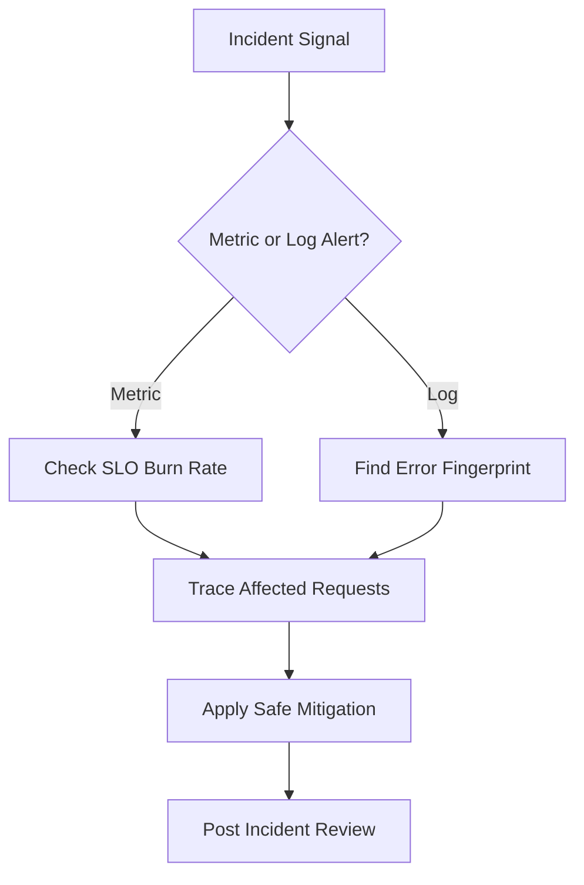
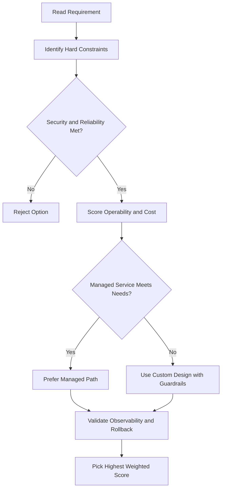
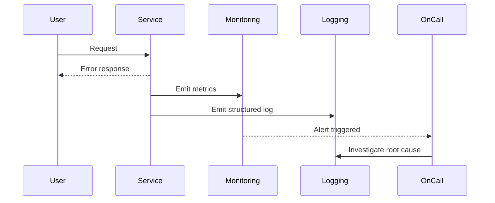

# Cloud Logging

## What Is Cloud Logging?

- Fully managed service to **store, search, analyze, monitor, and alert** on log data and events
- Ingests application and system log data from thousands of VMs
- Works with Google Cloud and AWS

---

## Core Components

| Component     | Description                   |
| ------------- | ----------------------------- |
| Log storage   | Built-in storage for log data |
| Logs Explorer | UI to search and view logs    |
| Logging API   | Manage logs programmatically  |

### What You Can Do

- Read and write log entries
- Search and filter logs
- Create **log-based metrics**
- Set alerts on log data

---

## Log Retention and Export

- Logs are retained for **30 days** by default
- Export to extend retention or enable deeper analysis:

| Export Destination | Use Case                                                                           |
| ------------------ | ---------------------------------------------------------------------------------- |
| **Cloud Storage**  | Long-term retention (> 30 days)                                                    |
| **BigQuery**       | SQL analysis, capacity forecasting, network forensics, Looker Studio visualization |
| **Pub/Sub**        | Stream logs to applications or external endpoints in real time                     |

---

## Exporting to BigQuery — Use Cases

BigQuery runs fast SQL on gigabytes to petabytes — ideal for log analysis:

| Analysis Type              | Example                                                                       |
| -------------------------- | ----------------------------------------------------------------------------- |
| Traffic growth forecasting | Understand how network traffic is growing over time                           |
| Network cost optimization  | Identify expensive traffic patterns                                           |
| Network forensics          | Analyze incidents — find top IP addresses exchanging traffic with your server |
| Access control decisions   | Deny IP addresses that shouldn't access your web server                       |

> Visualize BigQuery log data with **Looker Studio** — transforms raw data into easy-to-read dashboards.

---

## gcloud Commands

```bash
# List log entries (recent logs for a project)
gcloud logging read "resource.type=gce_instance" --limit=10

# Write a log entry
gcloud logging write my-log "This is a test log entry" --severity=INFO

# List log sinks (exports)
gcloud logging sinks list

# Create a log sink to Cloud Storage
gcloud logging sinks create my-storage-sink \
  storage.googleapis.com/my-log-bucket \
  --log-filter='severity>=ERROR'

# Create a log sink to BigQuery
gcloud logging sinks create my-bq-sink \
  bigquery.googleapis.com/projects/my-project/datasets/my_dataset \
  --log-filter='resource.type="gce_instance"'

# Create a log sink to Pub/Sub
gcloud logging sinks create my-pubsub-sink \
  pubsub.googleapis.com/projects/my-project/topics/my-topic

# Delete a log sink
gcloud logging sinks delete my-storage-sink

# List logs available in the project
gcloud logging logs list
```

---

## Log Severity Levels

Cloud Logging uses the following severity levels (ascending order):

| Severity    | Numeric | Use case                                |
| ----------- | ------- | --------------------------------------- |
| `DEFAULT`   | 0       | Unspecified / uncategorised             |
| `DEBUG`     | 100     | Detailed diagnostic info                |
| `INFO`      | 200     | Routine operational events              |
| `NOTICE`    | 300     | Normal but significant events           |
| `WARNING`   | 400     | Events that might cause problems        |
| `ERROR`     | 500     | Error conditions that require attention |
| `CRITICAL`  | 600     | Critical failures                       |
| `ALERT`     | 700     | Action must be taken immediately        |
| `EMERGENCY` | 800     | System is unusable                      |

---

## Structured Logging (JSON Format)

Write structured logs so Cloud Logging can parse and query fields automatically:

```json
{
  "severity": "ERROR",
  "message": "Payment processing failed",
  "httpRequest": {
    "requestMethod": "POST",
    "requestUrl": "/pay",
    "status": 500
  },
  "labels": {
    "env": "production",
    "version": "1.2.3"
  }
}
```

- Write JSON to **stdout** from Cloud Run or GKE — automatically ingested as structured logs
- The `severity` field is mapped to Cloud Logging severity automatically
- Special fields: `httpRequest`, `labels`, `trace`, `spanId`, `sourceLocation`

---

## Ops Agent vs Legacy Logging Agent

| Agent                               | VM support  | Collects                    |
| ----------------------------------- | ----------- | --------------------------- |
| **Ops Agent** (recommended)         | GCE (gen2+) | Logs + metrics in one agent |
| **Cloud Logging agent** (legacy)    | GCE         | Logs only (fluentd-based)   |
| **Cloud Monitoring agent** (legacy) | GCE         | Metrics only                |

- For new VMs: always install the **Ops Agent**
- Cloud Run, GKE, App Engine: automatic log collection, no agent needed

---

## Audit Logs (Detail)

| Type               | What it captures                                                           | Always on?                      |
| ------------------ | -------------------------------------------------------------------------- | ------------------------------- |
| **Admin Activity** | API calls that modify config/metadata (e.g. create VM, grant IAM role)     | Yes (free)                      |
| **Data Access**    | API calls that read/write user data (e.g. read GCS object, query BigQuery) | No (enable per service; billed) |
| **System Event**   | Automated GCP system events (e.g. Live Migration)                          | Yes (free)                      |
| **Policy Denied**  | Requests denied by VPC Service Controls                                    | Yes (free)                      |

```bash
# Query admin activity logs
gcloud logging read \
  'logName="projects/PROJECT_ID/logs/cloudaudit.googleapis.com%2Factivity"' \
  --limit=20
```

---

## Log-Based Metrics

Create custom Cloud Monitoring metrics from log entries:

```bash
# Counter metric: count ERROR logs
gcloud logging metrics create error-count \
  --description="Count of ERROR log entries" \
  --log-filter='severity=ERROR'

# Distribution metric: extract a numeric value from log field
gcloud logging metrics create request-latency \
  --description="Request latency distribution" \
  --log-filter='resource.type="gae_app"' \
  --value-extractor='EXTRACT(jsonPayload.latency)'
```

- After creation, the metric appears in Cloud Monitoring as `logging.googleapis.com/user/METRIC_NAME`
- Use to alert on log patterns (e.g. 5xx spike)

---

## Log Sink Permissions

When you create a log sink, Cloud Logging creates a **service account** for the sink. You must grant it write access to the destination:

| Destination          | Required role                 |
| -------------------- | ----------------------------- |
| Cloud Storage bucket | `roles/storage.objectCreator` |
| BigQuery dataset     | `roles/bigquery.dataEditor`   |
| Pub/Sub topic        | `roles/pubsub.publisher`      |
| Cloud Logging bucket | No extra grant needed         |

```bash
# Get the sink's writer identity
gcloud logging sinks describe my-bq-sink --format='value(writerIdentity)'

# Grant it access to the BigQuery dataset
bq add-iam-policy-binding --member=SERVICE_ACCOUNT --role=roles/bigquery.dataEditor PROJECT:DATASET
```

---

## Log Pricing

| Log type                                     | Cost                   |
| -------------------------------------------- | ---------------------- |
| **Admin Activity audit logs**                | Free                   |
| **System Event audit logs**                  | Free                   |
| **First 50 GiB/project/month** of other logs | Free                   |
| **Above 50 GiB**                             | ~$0.01/GiB             |
| **Data Access audit logs**                   | Billed as regular logs |

- Reduce costs: use **exclusion filters** to drop verbose/noisy logs before ingestion
- Route high-volume logs directly to BigQuery or Cloud Storage via sinks instead of storing in Cloud Logging

---

## Key Takeaways — Cloud Logging

| Topic                  | Key Point                                                               |
| ---------------------- | ----------------------------------------------------------------------- |
| **Structured logging** | Write JSON to stdout; `severity` and `httpRequest` parsed automatically |
| **Audit logs**         | Admin Activity is always on and free; Data Access must be enabled       |
| **Log-based metrics**  | Bridge logs to Cloud Monitoring alerts                                  |
| **Sink permissions**   | Always grant sink's writer identity write access to destination         |
| **Ops Agent**          | Recommended for GCE; replaces both legacy agents                        |
| **Cost control**       | Use exclusion filters; export high-volume logs via sinks                |

## ACE Exam-Style Practice Questions

### Q1
A Cloud Logging requirement asks to collect logs from all current and future production projects only. What should you do?

A. Configure manual exports in each project every month
B. Configure aggregated log sink at production folder level
C. Disable Cloud Logging and use VM files
D. Send logs to Cloud DNS

Answer: B
Trap: Folder-level aggregated sinks capture both existing and future child projects.

### Q2
In a Cloud Logging incident, only a few requests are slow across many microservices. Which tool is best to identify the slow hop?

A. Cloud Trace
B. Cloud Storage lifecycle
C. Cloud Build trigger
D. Cloud Armor policy

Answer: A
Trap: Distributed tracing is designed for per-hop latency diagnosis.

<!-- ACE_DEEP_ENRICHMENT_START -->
## ACE Deep Enrichment

### Think Like a Google Engineer
- Primary optimization axis: SLO-driven reliability and faster mean time to recovery.
- Start with constraints first: SLO, security, compliance, latency, budget, and team operations capacity.
- Prefer managed services if they satisfy requirements with lower long-term operational toil.
- Minimize blast radius using environment isolation, least privilege, and failure-domain awareness.
- Design for day-2 operations: observability, rollback strategy, and quota or budget guardrails.

### Most Correct Option Filter (60 Seconds)
1. Eliminate options with broad access, single points of failure, or missing monitoring.
2. Confirm the option meets non-negotiables first: security and reliability requirements.
3. Compare remaining options on operational simplicity and long-term maintainability.
4. Use cost as an optimizer only after requirements and risk controls are satisfied.

### Weighted Decision Matrix
| Dimension | Weight | Strong Signal |
| --- | --- | --- |
| Security | 3 | Least privilege, secure defaults, no exposed blast radius |
| Reliability | 3 | Multi-zone or HA design, health checks, tested recovery path |
| Operability | 2 | Clear monitoring, alerting, rollout and rollback simplicity |
| Cost Efficiency | 2 | Right-sized resources, no waste, no reliability regression |
| Performance | 1 | Meets latency and throughput targets with headroom |

### Real-Life Scenario
A customer-facing API has intermittent latency spikes and error bursts. The team needs faster detection, cleaner triage, and safer remediation during peak traffic.

### Worked Example
- Define SLOs and monitor latency, error rate, and saturation.
- Correlate logs, metrics, and traces using request IDs.
- Create alert policies for burn-rate and critical error thresholds.
- Run incident playbooks and validate post-incident action items.

### Flowchart


### Optimization Decision Flow


### Interaction Sequence


### Extra Exam Practice (15 Questions)
#### Q1

Scenario Focus: Cloud Logging

Latency increases only for one endpoint. What is the best first triage action?

A. Check endpoint-specific metrics and traces before broad scaling actions.  
B. Restart all services immediately without diagnosis.  
C. Rely only on CPU metrics and ignore user-facing latency.  
D. Disable alerts during busy periods to avoid noise.

Answer: A  
Why the other options are weaker: They typically ignore at least one hard constraint such as security, reliability, cost efficiency, or operational simplicity.  
Google-engineer check: Reconfirm SLO fit, blast radius, and day-2 maintainability before finalizing.

#### Q2

Scenario Focus: Cloud Logging

Which monitoring strategy best protects user experience?

A. Rely only on CPU metrics and ignore user-facing latency.  
B. Track SLO-aligned latency and error burn-rate alerts.  
C. Disable alerts during busy periods to avoid noise.  
D. Investigate incidents only from one log line sample.

Answer: B  
Why the other options are weaker: They typically ignore at least one hard constraint such as security, reliability, cost efficiency, or operational simplicity.  
Google-engineer check: Reconfirm SLO fit, blast radius, and day-2 maintainability before finalizing.

#### Q3

Scenario Focus: Cloud Logging

A team has logs but no trace correlation. What should they add?

A. Disable alerts during busy periods to avoid noise.  
B. Investigate incidents only from one log line sample.  
C. Add request correlation IDs across logs and traces.  
D. Skip retrospectives once service is healthy again.

Answer: C  
Why the other options are weaker: They typically ignore at least one hard constraint such as security, reliability, cost efficiency, or operational simplicity.  
Google-engineer check: Reconfirm SLO fit, blast radius, and day-2 maintainability before finalizing.

#### Q4

Scenario Focus: Cloud Logging

How should alerting be tuned to reduce noisy pages?

A. Investigate incidents only from one log line sample.  
B. Skip retrospectives once service is healthy again.  
C. Restart all services immediately without diagnosis.  
D. Use severity-based alerts with actionable thresholds and runbooks.

Answer: D  
Why the other options are weaker: They typically ignore at least one hard constraint such as security, reliability, cost efficiency, or operational simplicity.  
Google-engineer check: Reconfirm SLO fit, blast radius, and day-2 maintainability before finalizing.

#### Q5

Scenario Focus: Cloud Logging

What should happen after mitigation is applied?

A. Run a post-incident review and capture prevention tasks.  
B. Skip retrospectives once service is healthy again.  
C. Restart all services immediately without diagnosis.  
D. Rely only on CPU metrics and ignore user-facing latency.

Answer: A  
Why the other options are weaker: They typically ignore at least one hard constraint such as security, reliability, cost efficiency, or operational simplicity.  
Google-engineer check: Reconfirm SLO fit, blast radius, and day-2 maintainability before finalizing.

#### Q6

Scenario Focus: Cloud Logging

Two designs both satisfy the happy path for Cloud Logging. Which choice is most correct?

A. Restart all services immediately without diagnosis.  
B. Choose the option that preserves reliability and security while reducing operational burden.  
C. Rely only on CPU metrics and ignore user-facing latency.  
D. Disable alerts during busy periods to avoid noise.

Answer: B  
Why the other options are weaker: They typically ignore at least one hard constraint such as security, reliability, cost efficiency, or operational simplicity.  
Google-engineer check: Reconfirm SLO fit, blast radius, and day-2 maintainability before finalizing.

#### Q7

Scenario Focus: Cloud Logging

What should you validate first before choosing an architecture for Cloud Logging?

A. Rely only on CPU metrics and ignore user-facing latency.  
B. Disable alerts during busy periods to avoid noise.  
C. Validate SLO fit, blast radius, and least-privilege controls before comparing convenience.  
D. Investigate incidents only from one log line sample.

Answer: C  
Why the other options are weaker: They typically ignore at least one hard constraint such as security, reliability, cost efficiency, or operational simplicity.  
Google-engineer check: Reconfirm SLO fit, blast radius, and day-2 maintainability before finalizing.

#### Q8

Scenario Focus: Cloud Logging

A proposal lowers cost but increases failure risk. What is the best decision?

A. Disable alerts during busy periods to avoid noise.  
B. Investigate incidents only from one log line sample.  
C. Skip retrospectives once service is healthy again.  
D. Reject it unless reliability and recovery objectives remain within required targets.

Answer: D  
Why the other options are weaker: They typically ignore at least one hard constraint such as security, reliability, cost efficiency, or operational simplicity.  
Google-engineer check: Reconfirm SLO fit, blast radius, and day-2 maintainability before finalizing.

#### Q9

Scenario Focus: Cloud Logging

Which option best reflects optimization for SLO-driven reliability and faster mean time to recovery?

A. Select the design that best meets SLO-driven reliability and faster mean time to recovery while keeping constraints balanced.  
B. Investigate incidents only from one log line sample.  
C. Skip retrospectives once service is healthy again.  
D. Restart all services immediately without diagnosis.

Answer: A  
Why the other options are weaker: They typically ignore at least one hard constraint such as security, reliability, cost efficiency, or operational simplicity.  
Google-engineer check: Reconfirm SLO fit, blast radius, and day-2 maintainability before finalizing.

#### Q10

Scenario Focus: Cloud Logging

How should you evaluate a design that needs frequent manual interventions?

A. Skip retrospectives once service is healthy again.  
B. Treat it as high risk and prefer automation-friendly designs with observability and rollback.  
C. Restart all services immediately without diagnosis.  
D. Rely only on CPU metrics and ignore user-facing latency.

Answer: B  
Why the other options are weaker: They typically ignore at least one hard constraint such as security, reliability, cost efficiency, or operational simplicity.  
Google-engineer check: Reconfirm SLO fit, blast radius, and day-2 maintainability before finalizing.

#### Q11

Scenario Focus: Cloud Logging

Two options have similar latency. Which tie-breaker is best?

A. Restart all services immediately without diagnosis.  
B. Rely only on CPU metrics and ignore user-facing latency.  
C. Pick the option with stronger operability, clearer failure isolation, and simpler incident response.  
D. Disable alerts during busy periods to avoid noise.

Answer: C  
Why the other options are weaker: They typically ignore at least one hard constraint such as security, reliability, cost efficiency, or operational simplicity.  
Google-engineer check: Reconfirm SLO fit, blast radius, and day-2 maintainability before finalizing.

#### Q12

Scenario Focus: Cloud Logging

What is the best way to choose between a custom stack and a managed service?

A. Rely only on CPU metrics and ignore user-facing latency.  
B. Disable alerts during busy periods to avoid noise.  
C. Investigate incidents only from one log line sample.  
D. Prefer managed services when they meet requirements with lower long-term maintenance effort.

Answer: D  
Why the other options are weaker: They typically ignore at least one hard constraint such as security, reliability, cost efficiency, or operational simplicity.  
Google-engineer check: Reconfirm SLO fit, blast radius, and day-2 maintainability before finalizing.

#### Q13

Scenario Focus: Cloud Logging

How do you confirm a solution is production-ready for 

A. Verify monitoring, alerting, rollback path, quota and budget controls, and secure defaults.  
B. Disable alerts during busy periods to avoid noise.  
C. Investigate incidents only from one log line sample.  
D. Skip retrospectives once service is healthy again.

Answer: A  
Why the other options are weaker: They typically ignore at least one hard constraint such as security, reliability, cost efficiency, or operational simplicity.  
Google-engineer check: Reconfirm SLO fit, blast radius, and day-2 maintainability before finalizing.

#### Q14

Scenario Focus: Cloud Logging

Which pattern usually wins in ACE scenario tie-breakers?

A. Investigate incidents only from one log line sample.  
B. Managed-service-first plus least-privilege access plus clear observability usually wins.  
C. Skip retrospectives once service is healthy again.  
D. Restart all services immediately without diagnosis.

Answer: B  
Why the other options are weaker: They typically ignore at least one hard constraint such as security, reliability, cost efficiency, or operational simplicity.  
Google-engineer check: Reconfirm SLO fit, blast radius, and day-2 maintainability before finalizing.

#### Q15

Scenario Focus: Cloud Logging

What is the best final check before locking the answer?

A. Skip retrospectives once service is healthy again.  
B. Restart all services immediately without diagnosis.  
C. Run a weighted check across security, reliability, cost, performance, and operability.  
D. Rely only on CPU metrics and ignore user-facing latency.

Answer: C  
Why the other options are weaker: They typically ignore at least one hard constraint such as security, reliability, cost efficiency, or operational simplicity.  
Google-engineer check: Reconfirm SLO fit, blast radius, and day-2 maintainability before finalizing.

### Quick Commands
```bash
gcloud monitoring policies list --project=PROJECT_ID
gcloud logging read "severity>=ERROR" --freshness=1d --project=PROJECT_ID --limit=30
gcloud alpha monitoring channels list --project=PROJECT_ID
gcloud logging metrics list --project=PROJECT_ID
```

### Fast Recall
- Observability is metrics plus logs plus traces together.
- Alerts should be actionable and aligned to SLO impact.
- Post-incident review turns outages into reliability improvements.
<!-- ACE_DEEP_ENRICHMENT_END -->