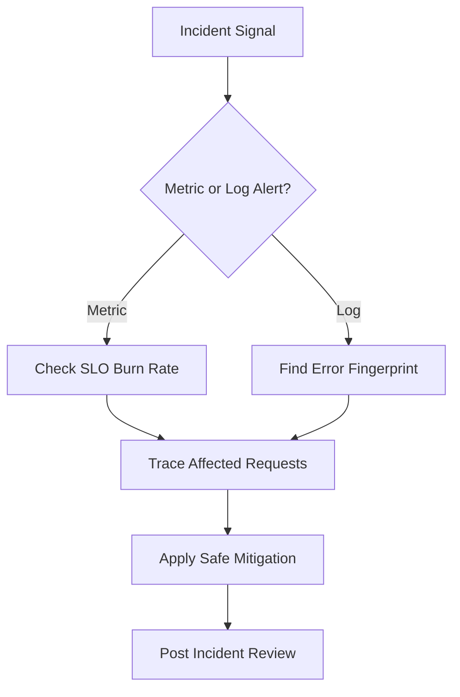
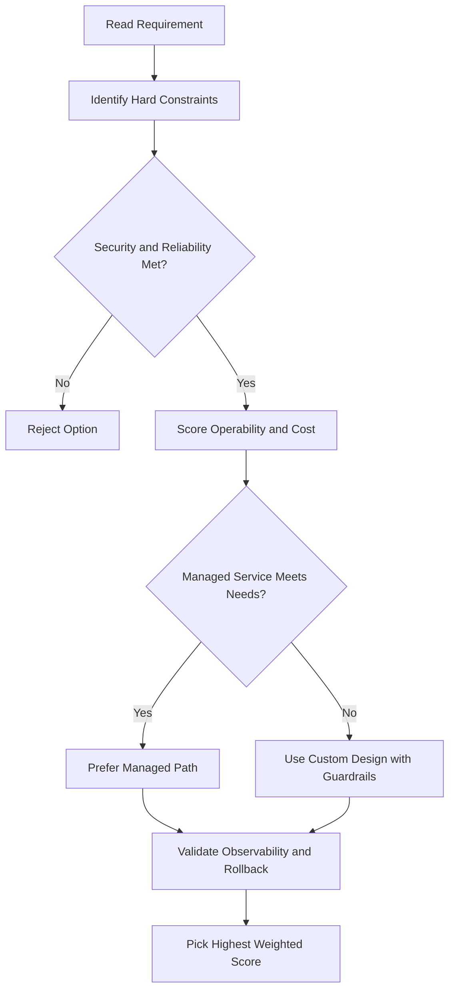
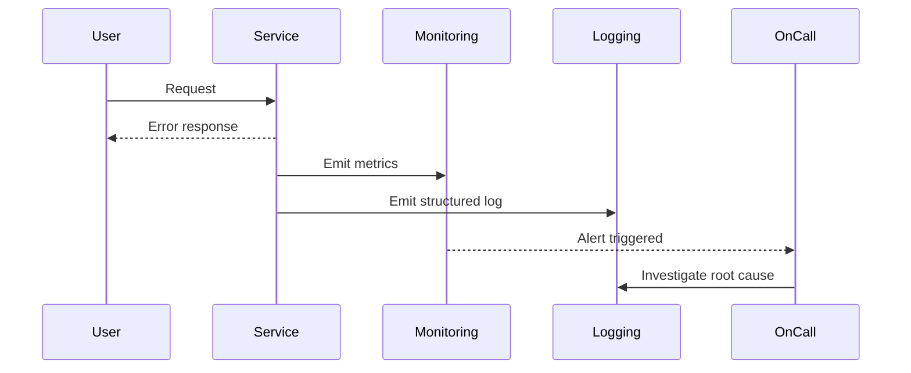

# Error Reporting

## What Is Error Reporting?

- **Counts, analyzes, and aggregates errors** in your running cloud services
- Centralized error management interface with sorting and filtering
- Supports **real-time notifications** when new errors are detected

---

## Supported Platforms

| Platform                 | Supported |
| ------------------------ | --------- |
| App Engine (Standard)    | ✅        |
| App Engine (Flexible)    | ✅        |
| Apps Script              | ✅        |
| Compute Engine           | ✅        |
| Cloud Run                | ✅        |
| Cloud Run Functions      | ✅        |
| Google Kubernetes Engine | ✅        |
| Amazon EC2               | ✅        |

---

## Supported Languages

Error Reporting can parse exception stack traces for:

- Go
- Java
- .NET
- Node.js
- PHP
- Python
- Ruby

## ACE Exam-Style Practice Questions

### Q1
A Error Reporting requirement asks to collect logs from all current and future production projects only. What should you do?

A. Configure manual exports in each project every month
B. Configure aggregated log sink at production folder level
C. Disable Cloud Logging and use VM files
D. Send logs to Cloud DNS

Answer: B
Trap: Folder-level aggregated sinks capture both existing and future child projects.

### Q2
In a Error Reporting incident, only a few requests are slow across many microservices. Which tool is best to identify the slow hop?

A. Cloud Trace
B. Cloud Storage lifecycle
C. Cloud Build trigger
D. Cloud Armor policy

Answer: A
Trap: Distributed tracing is designed for per-hop latency diagnosis.

<!-- ACE_DEEP_ENRICHMENT_START -->
## ACE Deep Enrichment

### Think Like a Google Engineer
- Primary optimization axis: SLO-driven reliability and faster mean time to recovery.
- Start with constraints first: SLO, security, compliance, latency, budget, and team operations capacity.
- Prefer managed services if they satisfy requirements with lower long-term operational toil.
- Minimize blast radius using environment isolation, least privilege, and failure-domain awareness.
- Design for day-2 operations: observability, rollback strategy, and quota or budget guardrails.

### Most Correct Option Filter (60 Seconds)
1. Eliminate options with broad access, single points of failure, or missing monitoring.
2. Confirm the option meets non-negotiables first: security and reliability requirements.
3. Compare remaining options on operational simplicity and long-term maintainability.
4. Use cost as an optimizer only after requirements and risk controls are satisfied.

### Weighted Decision Matrix
| Dimension | Weight | Strong Signal |
| --- | --- | --- |
| Security | 3 | Least privilege, secure defaults, no exposed blast radius |
| Reliability | 3 | Multi-zone or HA design, health checks, tested recovery path |
| Operability | 2 | Clear monitoring, alerting, rollout and rollback simplicity |
| Cost Efficiency | 2 | Right-sized resources, no waste, no reliability regression |
| Performance | 1 | Meets latency and throughput targets with headroom |

### Real-Life Scenario
A customer-facing API has intermittent latency spikes and error bursts. The team needs faster detection, cleaner triage, and safer remediation during peak traffic.

### Worked Example
- Define SLOs and monitor latency, error rate, and saturation.
- Correlate logs, metrics, and traces using request IDs.
- Create alert policies for burn-rate and critical error thresholds.
- Run incident playbooks and validate post-incident action items.

### Flowchart


### Optimization Decision Flow


### Interaction Sequence


### Extra Exam Practice (15 Questions)
#### Q1
Scenario Focus: Error Reporting
Latency increases only for one endpoint. What is the best first triage action?

A. Check endpoint-specific metrics and traces before broad scaling actions.
B. Restart all services immediately without diagnosis.
C. Rely only on CPU metrics and ignore user-facing latency.
D. Disable alerts during busy periods to avoid noise.

Answer: A
Why the other options are weaker: They typically ignore at least one hard constraint such as security, reliability, cost efficiency, or operational simplicity.
Google-engineer check: Reconfirm SLO fit, blast radius, and day-2 maintainability before finalizing.

#### Q2
Scenario Focus: Error Reporting
Which monitoring strategy best protects user experience?

A. Rely only on CPU metrics and ignore user-facing latency.
B. Track SLO-aligned latency and error burn-rate alerts.
C. Disable alerts during busy periods to avoid noise.
D. Investigate incidents only from one log line sample.

Answer: B
Why the other options are weaker: They typically ignore at least one hard constraint such as security, reliability, cost efficiency, or operational simplicity.
Google-engineer check: Reconfirm SLO fit, blast radius, and day-2 maintainability before finalizing.

#### Q3
Scenario Focus: Error Reporting
A team has logs but no trace correlation. What should they add?

A. Disable alerts during busy periods to avoid noise.
B. Investigate incidents only from one log line sample.
C. Add request correlation IDs across logs and traces.
D. Skip retrospectives once service is healthy again.

Answer: C
Why the other options are weaker: They typically ignore at least one hard constraint such as security, reliability, cost efficiency, or operational simplicity.
Google-engineer check: Reconfirm SLO fit, blast radius, and day-2 maintainability before finalizing.

#### Q4
Scenario Focus: Error Reporting
How should alerting be tuned to reduce noisy pages?

A. Investigate incidents only from one log line sample.
B. Skip retrospectives once service is healthy again.
C. Restart all services immediately without diagnosis.
D. Use severity-based alerts with actionable thresholds and runbooks.

Answer: D
Why the other options are weaker: They typically ignore at least one hard constraint such as security, reliability, cost efficiency, or operational simplicity.
Google-engineer check: Reconfirm SLO fit, blast radius, and day-2 maintainability before finalizing.

#### Q5
Scenario Focus: Error Reporting
What should happen after mitigation is applied?

A. Run a post-incident review and capture prevention tasks.
B. Skip retrospectives once service is healthy again.
C. Restart all services immediately without diagnosis.
D. Rely only on CPU metrics and ignore user-facing latency.

Answer: A
Why the other options are weaker: They typically ignore at least one hard constraint such as security, reliability, cost efficiency, or operational simplicity.
Google-engineer check: Reconfirm SLO fit, blast radius, and day-2 maintainability before finalizing.

#### Q6
Scenario Focus: Error Reporting
Two designs both satisfy the happy path for Error Reporting. Which choice is most correct?

A. Restart all services immediately without diagnosis.
B. Choose the option that preserves reliability and security while reducing operational burden.
C. Rely only on CPU metrics and ignore user-facing latency.
D. Disable alerts during busy periods to avoid noise.

Answer: B
Why the other options are weaker: They typically ignore at least one hard constraint such as security, reliability, cost efficiency, or operational simplicity.
Google-engineer check: Reconfirm SLO fit, blast radius, and day-2 maintainability before finalizing.

#### Q7
Scenario Focus: Error Reporting
What should you validate first before choosing an architecture for Error Reporting?

A. Rely only on CPU metrics and ignore user-facing latency.
B. Disable alerts during busy periods to avoid noise.
C. Validate SLO fit, blast radius, and least-privilege controls before comparing convenience.
D. Investigate incidents only from one log line sample.

Answer: C
Why the other options are weaker: They typically ignore at least one hard constraint such as security, reliability, cost efficiency, or operational simplicity.
Google-engineer check: Reconfirm SLO fit, blast radius, and day-2 maintainability before finalizing.

#### Q8
Scenario Focus: Error Reporting
A proposal lowers cost but increases failure risk. What is the best decision?

A. Disable alerts during busy periods to avoid noise.
B. Investigate incidents only from one log line sample.
C. Skip retrospectives once service is healthy again.
D. Reject it unless reliability and recovery objectives remain within required targets.

Answer: D
Why the other options are weaker: They typically ignore at least one hard constraint such as security, reliability, cost efficiency, or operational simplicity.
Google-engineer check: Reconfirm SLO fit, blast radius, and day-2 maintainability before finalizing.

#### Q9
Scenario Focus: Error Reporting
Which option best reflects optimization for SLO-driven reliability and faster mean time to recovery?

A. Select the design that best meets SLO-driven reliability and faster mean time to recovery while keeping constraints balanced.
B. Investigate incidents only from one log line sample.
C. Skip retrospectives once service is healthy again.
D. Restart all services immediately without diagnosis.

Answer: A
Why the other options are weaker: They typically ignore at least one hard constraint such as security, reliability, cost efficiency, or operational simplicity.
Google-engineer check: Reconfirm SLO fit, blast radius, and day-2 maintainability before finalizing.

#### Q10
Scenario Focus: Error Reporting
How should you evaluate a design that needs frequent manual interventions?

A. Skip retrospectives once service is healthy again.
B. Treat it as high risk and prefer automation-friendly designs with observability and rollback.
C. Restart all services immediately without diagnosis.
D. Rely only on CPU metrics and ignore user-facing latency.

Answer: B
Why the other options are weaker: They typically ignore at least one hard constraint such as security, reliability, cost efficiency, or operational simplicity.
Google-engineer check: Reconfirm SLO fit, blast radius, and day-2 maintainability before finalizing.

#### Q11
Scenario Focus: Error Reporting
Two options have similar latency. Which tie-breaker is best?

A. Restart all services immediately without diagnosis.
B. Rely only on CPU metrics and ignore user-facing latency.
C. Pick the option with stronger operability, clearer failure isolation, and simpler incident response.
D. Disable alerts during busy periods to avoid noise.

Answer: C
Why the other options are weaker: They typically ignore at least one hard constraint such as security, reliability, cost efficiency, or operational simplicity.
Google-engineer check: Reconfirm SLO fit, blast radius, and day-2 maintainability before finalizing.

#### Q12
Scenario Focus: Error Reporting
What is the best way to choose between a custom stack and a managed service?

A. Rely only on CPU metrics and ignore user-facing latency.
B. Disable alerts during busy periods to avoid noise.
C. Investigate incidents only from one log line sample.
D. Prefer managed services when they meet requirements with lower long-term maintenance effort.

Answer: D
Why the other options are weaker: They typically ignore at least one hard constraint such as security, reliability, cost efficiency, or operational simplicity.
Google-engineer check: Reconfirm SLO fit, blast radius, and day-2 maintainability before finalizing.

#### Q13
Scenario Focus: Error Reporting
How do you confirm a solution is production-ready for 

A. Verify monitoring, alerting, rollback path, quota and budget controls, and secure defaults.
B. Disable alerts during busy periods to avoid noise.
C. Investigate incidents only from one log line sample.
D. Skip retrospectives once service is healthy again.

Answer: A
Why the other options are weaker: They typically ignore at least one hard constraint such as security, reliability, cost efficiency, or operational simplicity.
Google-engineer check: Reconfirm SLO fit, blast radius, and day-2 maintainability before finalizing.

#### Q14
Scenario Focus: Error Reporting
Which pattern usually wins in ACE scenario tie-breakers?

A. Investigate incidents only from one log line sample.
B. Managed-service-first plus least-privilege access plus clear observability usually wins.
C. Skip retrospectives once service is healthy again.
D. Restart all services immediately without diagnosis.

Answer: B
Why the other options are weaker: They typically ignore at least one hard constraint such as security, reliability, cost efficiency, or operational simplicity.
Google-engineer check: Reconfirm SLO fit, blast radius, and day-2 maintainability before finalizing.

#### Q15
Scenario Focus: Error Reporting
What is the best final check before locking the answer?

A. Skip retrospectives once service is healthy again.
B. Restart all services immediately without diagnosis.
C. Run a weighted check across security, reliability, cost, performance, and operability.
D. Rely only on CPU metrics and ignore user-facing latency.

Answer: C
Why the other options are weaker: They typically ignore at least one hard constraint such as security, reliability, cost efficiency, or operational simplicity.
Google-engineer check: Reconfirm SLO fit, blast radius, and day-2 maintainability before finalizing.

### Quick Commands
```bash
gcloud monitoring policies list --project=PROJECT_ID
gcloud logging read "severity>=ERROR" --freshness=1d --project=PROJECT_ID --limit=30
gcloud alpha monitoring channels list --project=PROJECT_ID
gcloud logging metrics list --project=PROJECT_ID
```

### Fast Recall
- Observability is metrics plus logs plus traces together.
- Alerts should be actionable and aligned to SLO impact.
- Post-incident review turns outages into reliability improvements.
<!-- ACE_DEEP_ENRICHMENT_END -->