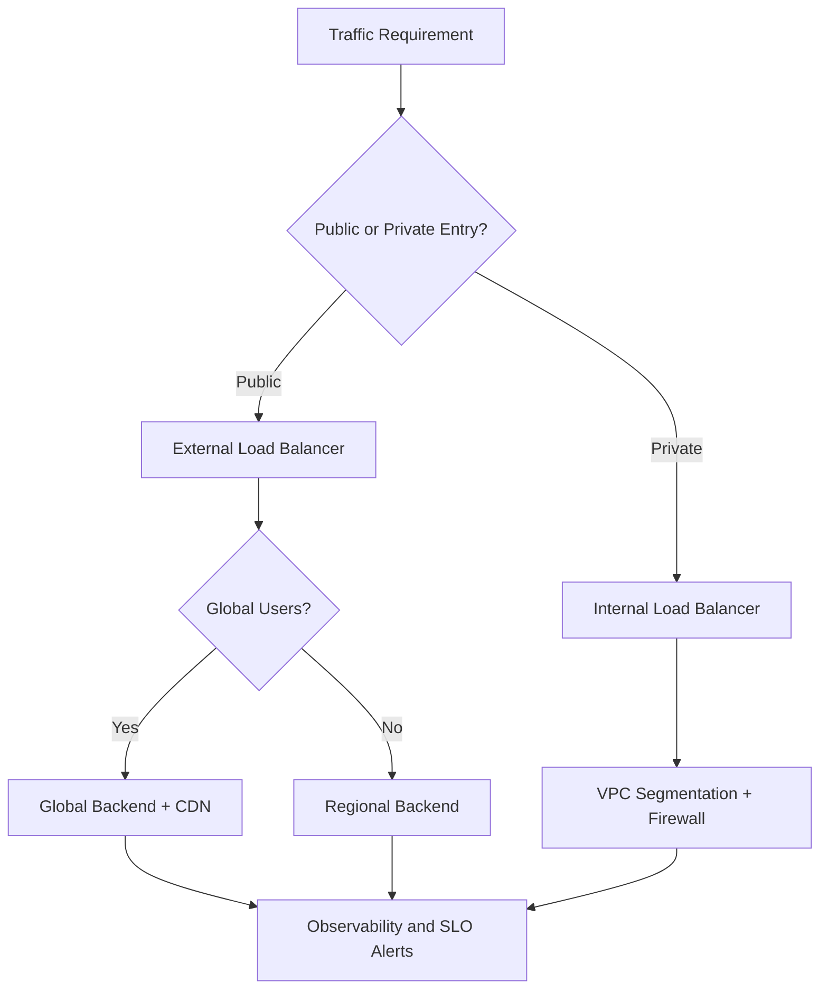
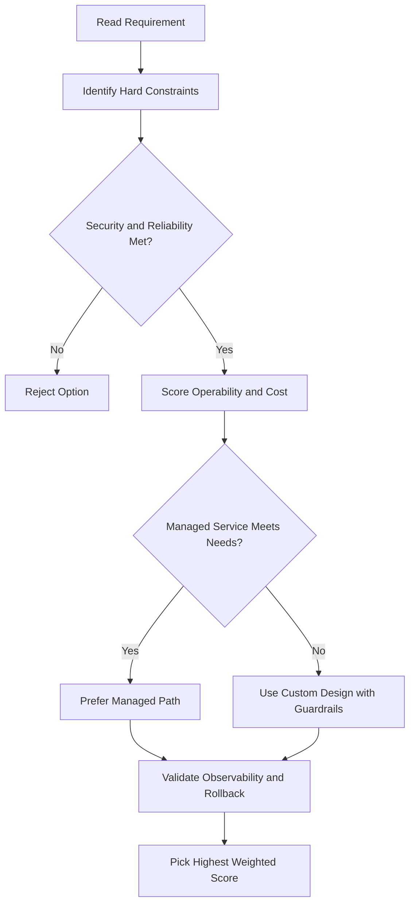
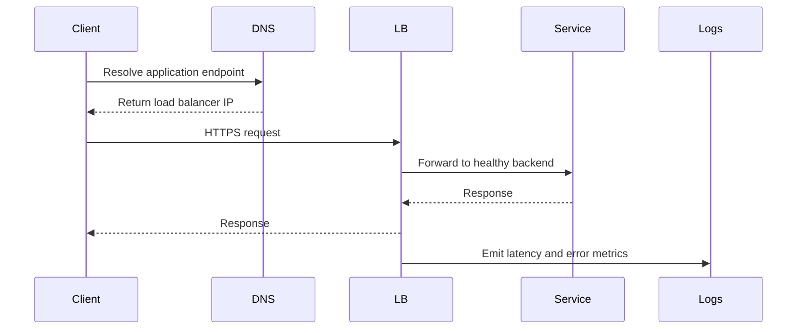

# Cloud VPN

## Overview

Two types of Cloud VPN gateways:

| Type | SLA | Routing | Use Case |
|---|---|---|---|
| Classic VPN | 99.9% | Static or dynamic (BGP via Cloud Router) | Low-volume data connections |
| HA VPN | 99.99% | Dynamic (BGP) only | High availability production connections |

Both use **IPsec VPN tunnels** to encrypt traffic over the public internet between your on-premises network and a Google Cloud VPC.

> Cloud VPN does **not** support client VPN (dial-in from user laptops). It's site-to-site only.

---

## Classic VPN

- Regional resource with a regional external IP address
- Supports: site-to-site VPN, static routes, dynamic routes (BGP), IKEv1 and IKEv2
- **MTU limit**: on-premises VPN gateway MTU cannot exceed **1460 bytes** (due to encryption/encapsulation overhead)

### How It Works

```
GCP VPC (us-east1, us-west1)
        │
  Cloud VPN Gateway (regional external IP)
        │
   VPN Tunnel (encrypted)     ← must establish TWO tunnels for a connection
        │
  On-premises VPN Gateway (external IP — physical device or software)
        │
   On-premises network
```

- Two VPN tunnels required — each defines the connection from its own gateway's perspective
- Traffic only passes when **both tunnels are established**

---

## HA VPN

- High availability VPN with **99.99% SLA**
- Two external IP addresses automatically assigned (one per interface) from unique address pools
- **Each interface supports multiple tunnels**
- Requires **dynamic (BGP) routing** — static routes not supported
- Routing modes: **active/active** or **active/passive** (configured via route priorities)

### To Achieve 99.99% SLA
Must configure **2 or 4 tunnels** from the HA VPN gateway to the peer.

### Supported Topologies

| Topology | Details |
|---|---|
| HA VPN → two peer VPN devices (each with own IP) | `TWO_IPS_REDUNDANCY`; second device provides failover and maintenance window |
| HA VPN → one peer device with two IPs | Single device, two interfaces |
| HA VPN → one peer device with one IP | Single interface — does NOT provide 99.99% SLA |
| HA VPN → AWS virtual private gateway | 4 tunnels total (2 per AWS gateway per HA VPN interface); transit gateway supports ECMP routing |
| HA VPN ↔ HA VPN (two GCP VPCs) | Interface 0 → Interface 0; Interface 1 → Interface 1; provides 99.99% |

### AWS Configuration
- Components: HA VPN gateway (2 interfaces) + 2 AWS virtual private gateways + external VPN gateway resource in GCP
- 4 tunnels total: 2 from AWS gateway 1 → HA VPN interface 0, 2 from AWS gateway 2 → HA VPN interface 1
- Only **transit gateway** supports ECMP (equal-cost multipath) routing — distributes traffic equally across active tunnels

---

## Cloud Router and Dynamic Routing (BGP)

Cloud Router enables dynamic routes — no need to update tunnel configuration when subnets change.

### How BGP Works with Cloud VPN

```
GCP VPC (Test subnet, Prod subnet)
  └─ Cloud Router
        └─ BGP session over VPN tunnel
              └─ On-premises VPN gateway (must support BGP)
                    └─ On-premises network (29 subnets)
```

- Adding a new **Staging** subnet in GCP or a new on-premises subnet → automatically advertised via BGP
- Instances in new subnets can send/receive traffic immediately

### BGP Link-Local Addresses
- Each end of the VPN tunnel needs an additional IP for the BGP session
- Must use **link-local addresses**: `169.254.0.0/16`
- These are not part of either network's IP space — used exclusively for BGP

---

## gcloud Commands

```bash
# Create a Classic VPN gateway
gcloud compute vpn-gateways create my-vpn-gateway \
  --network=my-vpc \
  --region=us-central1

# Create an HA VPN gateway
gcloud compute vpn-gateways create my-ha-vpn \
  --network=my-vpc \
  --region=us-central1

# List VPN gateways
gcloud compute vpn-gateways list

# Create an external VPN gateway (peer/on-premises)
gcloud compute external-vpn-gateways create my-peer-gateway \
  --interfaces=0=203.0.113.1

# Create a VPN tunnel
gcloud compute vpn-tunnels create my-tunnel \
  --peer-address=203.0.113.1 \
  --shared-secret=my-secret \
  --target-vpn-gateway=my-vpn-gateway \
  --region=us-central1 \
  --ike-version=2

# Create a Cloud Router for BGP
gcloud compute routers create my-router \
  --network=my-vpc \
  --region=us-central1 \
  --asn=65001

# Add a BGP interface to Cloud Router (link-local IP)
gcloud compute routers add-interface my-router \
  --interface-name=my-bgp-interface \
  --vpn-tunnel=my-tunnel \
  --ip-address=169.254.0.1 \
  --mask-length=30 \
  --region=us-central1

# Add BGP peer to Cloud Router
gcloud compute routers add-bgp-peer my-router \
  --peer-name=my-bgp-peer \
  --interface=my-bgp-interface \
  --peer-ip-address=169.254.0.2 \
  --peer-asn=65002 \
  --region=us-central1

# List VPN tunnels
gcloud compute vpn-tunnels list
```

## ACE Exam-Style Practice Questions

### Q1
For Cloud Vpn, you need highly available hybrid connectivity with dynamic route exchange. What should you choose?

A. HA VPN with Cloud Router
B. Static routes only over one tunnel
C. Cloud NAT only
D. Cloud CDN

Answer: A
Trap: Dynamic routing and high availability requirements usually indicate HA VPN plus BGP.

### Q2
In a Cloud Vpn design, multiple projects in one org need centralized networking administration. What is best?

A. Shared VPC
B. Separate isolated VPCs with no governance
C. One service account for every project owner
D. DNS forwarding only

Answer: A
Trap: Shared VPC centralizes subnet and firewall control across service projects.

<!-- ACE_DEEP_ENRICHMENT_START -->
## ACE Deep Enrichment

### Think Like a Google Engineer
- Primary optimization axis: Latency-resilience balance with private-by-default connectivity.
- Start with constraints first: SLO, security, compliance, latency, budget, and team operations capacity.
- Prefer managed services if they satisfy requirements with lower long-term operational toil.
- Minimize blast radius using environment isolation, least privilege, and failure-domain awareness.
- Design for day-2 operations: observability, rollback strategy, and quota or budget guardrails.

### Most Correct Option Filter (60 Seconds)
1. Eliminate options with broad access, single points of failure, or missing monitoring.
2. Confirm the option meets non-negotiables first: security and reliability requirements.
3. Compare remaining options on operational simplicity and long-term maintainability.
4. Use cost as an optimizer only after requirements and risk controls are satisfied.

### Weighted Decision Matrix
| Dimension | Weight | Strong Signal |
| --- | --- | --- |
| Security | 3 | Least privilege, secure defaults, no exposed blast radius |
| Reliability | 3 | Multi-zone or HA design, health checks, tested recovery path |
| Operability | 2 | Clear monitoring, alerting, rollout and rollback simplicity |
| Cost Efficiency | 2 | Right-sized resources, no waste, no reliability regression |
| Performance | 1 | Meets latency and throughput targets with headroom |

### Real-Life Scenario
An ecommerce platform serves customers across regions. The team must keep latency low, protect internal services, and survive zonal failures while controlling egress costs.

### Worked Example
- Place internet-facing services behind the correct external load balancer type.
- Keep internal services private with internal load balancers and private IP ranges.
- Use firewall rules by tags or service accounts, not wide open CIDR ranges.
- Add Cloud CDN or regional placement based on traffic profile and content type.

### Flowchart


### Optimization Decision Flow


### Interaction Sequence


### Extra Exam Practice (10 Questions)
#### Q1
Scenario Focus: Cloud VPN
A service must be reachable only from internal VMs. Which design is best?

A. Use an internal load balancer with private backend endpoints and private DNS.
B. Expose the service publicly and rely on app-level passwords.
C. Use one VM with a static external IP to simplify architecture.
D. Allow 0.0.0.0/0 ingress to speed up troubleshooting.

Answer: A
Why the other options are weaker: They typically ignore at least one hard constraint such as security, reliability, cost efficiency, or operational simplicity.
Google-engineer check: Reconfirm SLO fit, blast radius, and day-2 maintainability before finalizing.

#### Q2
Scenario Focus: Cloud VPN
You need to reduce global web latency for static assets. What should you choose?

A. Use one VM with a static external IP to simplify architecture.
B. Use an external application load balancer with Cloud CDN and cacheable content rules.
C. Allow 0.0.0.0/0 ingress to speed up troubleshooting.
D. Disable health checks to avoid accidental failover.

Answer: B
Why the other options are weaker: They typically ignore at least one hard constraint such as security, reliability, cost efficiency, or operational simplicity.
Google-engineer check: Reconfirm SLO fit, blast radius, and day-2 maintainability before finalizing.

#### Q3
Scenario Focus: Cloud VPN
Which firewall strategy best matches zero-trust network design?

A. Allow 0.0.0.0/0 ingress to speed up troubleshooting.
B. Disable health checks to avoid accidental failover.
C. Use least-privilege firewall policies scoped by service accounts or tags.
D. Route all traffic through manual bastion hops in production.

Answer: C
Why the other options are weaker: They typically ignore at least one hard constraint such as security, reliability, cost efficiency, or operational simplicity.
Google-engineer check: Reconfirm SLO fit, blast radius, and day-2 maintainability before finalizing.

#### Q4
Scenario Focus: Cloud VPN
A backend fails health checks in one zone. What architecture is best practice?

A. Disable health checks to avoid accidental failover.
B. Route all traffic through manual bastion hops in production.
C. Expose the service publicly and rely on app-level passwords.
D. Run multi-zone backends with health checks and automatic failover.

Answer: D
Why the other options are weaker: They typically ignore at least one hard constraint such as security, reliability, cost efficiency, or operational simplicity.
Google-engineer check: Reconfirm SLO fit, blast radius, and day-2 maintainability before finalizing.

#### Q5
Scenario Focus: Cloud VPN
You need private hybrid connectivity between on-prem and GCP. Which path is preferred?

A. Use HA VPN or Interconnect based on throughput and SLA requirements.
B. Route all traffic through manual bastion hops in production.
C. Expose the service publicly and rely on app-level passwords.
D. Use one VM with a static external IP to simplify architecture.

Answer: A
Why the other options are weaker: They typically ignore at least one hard constraint such as security, reliability, cost efficiency, or operational simplicity.
Google-engineer check: Reconfirm SLO fit, blast radius, and day-2 maintainability before finalizing.

#### Q6
Scenario Focus: Cloud VPN
Two designs both satisfy the happy path for Cloud VPN. Which choice is most correct?

A. Expose the service publicly and rely on app-level passwords.
B. Choose the option that preserves reliability and security while reducing operational burden.
C. Use one VM with a static external IP to simplify architecture.
D. Allow 0.0.0.0/0 ingress to speed up troubleshooting.

Answer: B
Why the other options are weaker: They typically ignore at least one hard constraint such as security, reliability, cost efficiency, or operational simplicity.
Google-engineer check: Reconfirm SLO fit, blast radius, and day-2 maintainability before finalizing.

#### Q7
Scenario Focus: Cloud VPN
What should you validate first before choosing an architecture for Cloud VPN?

A. Use one VM with a static external IP to simplify architecture.
B. Allow 0.0.0.0/0 ingress to speed up troubleshooting.
C. Validate SLO fit, blast radius, and least-privilege controls before comparing convenience.
D. Disable health checks to avoid accidental failover.

Answer: C
Why the other options are weaker: They typically ignore at least one hard constraint such as security, reliability, cost efficiency, or operational simplicity.
Google-engineer check: Reconfirm SLO fit, blast radius, and day-2 maintainability before finalizing.

#### Q8
Scenario Focus: Cloud VPN
A proposal lowers cost but increases failure risk. What is the best decision?

A. Allow 0.0.0.0/0 ingress to speed up troubleshooting.
B. Disable health checks to avoid accidental failover.
C. Route all traffic through manual bastion hops in production.
D. Reject it unless reliability and recovery objectives remain within required targets.

Answer: D
Why the other options are weaker: They typically ignore at least one hard constraint such as security, reliability, cost efficiency, or operational simplicity.
Google-engineer check: Reconfirm SLO fit, blast radius, and day-2 maintainability before finalizing.

#### Q9
Scenario Focus: Cloud VPN
Which option best reflects optimization for Latency-resilience balance with private-by-default connectivity?

A. Select the design that best meets Latency-resilience balance with private-by-default connectivity while keeping constraints balanced.
B. Disable health checks to avoid accidental failover.
C. Route all traffic through manual bastion hops in production.
D. Expose the service publicly and rely on app-level passwords.

Answer: A
Why the other options are weaker: They typically ignore at least one hard constraint such as security, reliability, cost efficiency, or operational simplicity.
Google-engineer check: Reconfirm SLO fit, blast radius, and day-2 maintainability before finalizing.

#### Q10
Scenario Focus: Cloud VPN
How should you evaluate a design that needs frequent manual interventions?

A. Route all traffic through manual bastion hops in production.
B. Treat it as high risk and prefer automation-friendly designs with observability and rollback.
C. Expose the service publicly and rely on app-level passwords.
D. Use one VM with a static external IP to simplify architecture.

Answer: B
Why the other options are weaker: They typically ignore at least one hard constraint such as security, reliability, cost efficiency, or operational simplicity.
Google-engineer check: Reconfirm SLO fit, blast radius, and day-2 maintainability before finalizing.

### Quick Commands
```bash
gcloud compute firewall-rules list --project=PROJECT_ID
gcloud compute forwarding-rules list --global --project=PROJECT_ID
gcloud compute backend-services get-health BACKEND_NAME --global --project=PROJECT_ID
gcloud compute routes list --project=PROJECT_ID
```

### Fast Recall
- Pick load balancer type by traffic pattern, not preference.
- Private services should stay private end to end.
- Health checks and multi-zone design are core reliability controls.
<!-- ACE_DEEP_ENRICHMENT_END -->