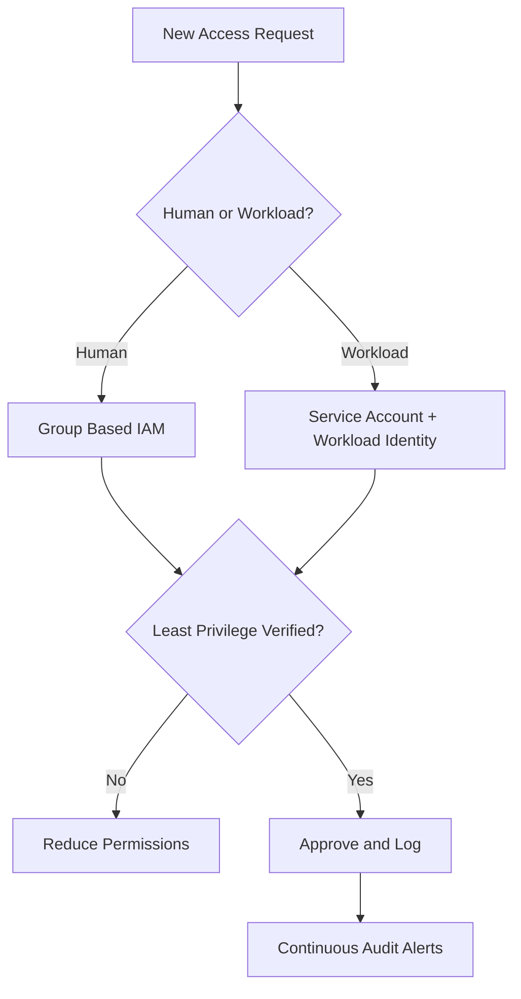
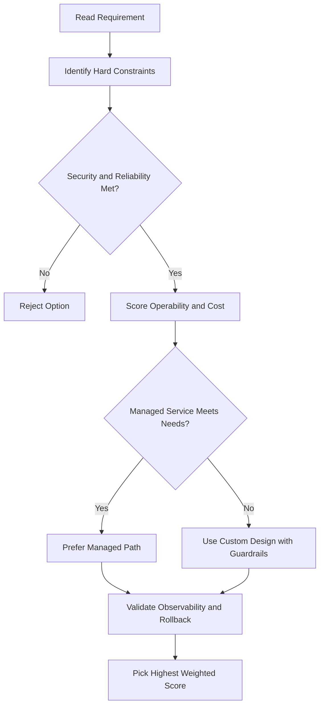
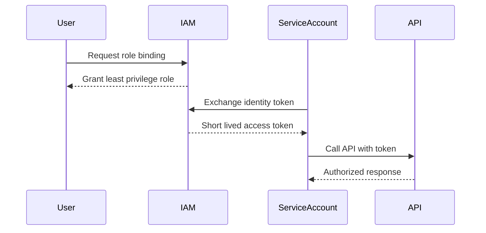

# Private GKE Cluster with Custom IAM Role — Lab Walkthrough

> Region: `us-east1` | Zone: `us-east1-c`

---

## Part 1 — Run in Cloud Shell

Sets up variables, creates the custom IAM role, provisions the service account, binds roles, and deploys the private GKE cluster.

```bash
# 1. Set Environment Variables
export REGION="us-east1"
export ZONE="us-east1-c"
export PROJECT_ID=$(gcloud config get-value project)
export SA_EMAIL="orca-gke-sa@$PROJECT_ID.iam.gserviceaccount.com"

# 2. Create Custom IAM Role
gcloud iam roles create orca_storage_editor \
    --project=$PROJECT_ID \
    --title="Custom Security Role" \
    --description="Custom IAM role for GKE to manage storage objects" \
    --permissions="storage.buckets.get,storage.objects.get,storage.objects.list,storage.objects.update,storage.objects.create" \
    --stage="GA"

# 3. Create Service Account
gcloud iam service-accounts create orca-gke-sa --display-name="Service Account"

# 4. Bind Roles to Service Account
gcloud projects add-iam-policy-binding $PROJECT_ID --member="serviceAccount:$SA_EMAIL" --role="projects/$PROJECT_ID/roles/orca_storage_editor"
gcloud projects add-iam-policy-binding $PROJECT_ID --member="serviceAccount:$SA_EMAIL" --role="roles/logging.logWriter"
gcloud projects add-iam-policy-binding $PROJECT_ID --member="serviceAccount:$SA_EMAIL" --role="roles/monitoring.metricWriter"
gcloud projects add-iam-policy-binding $PROJECT_ID --member="serviceAccount:$SA_EMAIL" --role="roles/monitoring.viewer"

# 5. Fetch JumpHost Internal IP
export JUMPHOST_INTERNAL_IP=$(gcloud compute instances describe orca-jumphost \
    --zone=$ZONE \
    --format='get(networkInterfaces[0].networkIP)')

# 6. Create Private GKE Cluster
gcloud container clusters create orca-cluster \
    --project=$PROJECT_ID \
    --zone=$ZONE \
    --num-nodes=1 \
    --network="orca-build-vpc" \
    --subnet="orca-build-subnet" \
    --service-account="$SA_EMAIL" \
    --enable-ip-alias \
    --enable-private-nodes \
    --enable-private-endpoint \
    --enable-master-authorized-networks \
    --master-authorized-networks="$JUMPHOST_INTERNAL_IP/32" \
    --master-ipv4-cidr="172.16.0.0/28"
```

> GKE cluster creation takes roughly **5 minutes** to complete.

---

## Part 2 — Connect to JumpHost and Deploy the App

Once Part 1 finishes, SSH into the jumphost from Cloud Shell:

```bash
gcloud compute ssh orca-jumphost --zone=us-east1-c
```

If prompted to generate SSH keys, press **Enter** to continue.

Then paste this entire block into the SSH session:

```bash
# Set variables inside the JumpHost VM
export REGION="us-east1"
export ZONE="us-east1-c"
export PROJECT_ID=$(gcloud config get-value project)

# Install GKE authentication plugin
sudo apt-get update && sudo apt-get install google-cloud-sdk-gke-gcloud-auth-plugin -y
echo "export USE_GKE_GCLOUD_AUTH_PLUGIN=True" >> ~/.bashrc
source ~/.bashrc

# Fetch cluster credentials over the internal network endpoint
gcloud container clusters get-credentials orca-cluster \
    --internal-ip \
    --project=$PROJECT_ID \
    --zone=$ZONE

# Deploy the test microservice
kubectl create deployment hello-server --image=gcr.io/google-samples/hello-app:1.0
```

Once the final command runs, exit the SSH window and click **Check my progress** across all tasks in the Qwiklabs dashboard.

---

## Key Concepts

- **Private cluster** — nodes have no public IPs; the control plane endpoint is also private (`--enable-private-endpoint`)
- **Master authorized networks** — only the jumphost's internal IP is allowed to reach the control plane
- **`--master-ipv4-cidr`** — dedicated CIDR block for the control plane VPC peering (`172.16.0.0/28`)
- **`--internal-ip` flag** on `get-credentials` — needed because the cluster endpoint is private; must be run from inside the same VPC (i.e., from the jumphost)
- **Custom IAM role** (`orca_storage_editor`) — grants only the specific storage permissions needed, following least-privilege
- **GKE auth plugin** (`gke-gcloud-auth-plugin`) — required for `kubectl` to authenticate with GKE clusters in newer SDK versions

## ACE Exam-Style Practice Questions

### Q1
In a Private Gke Cluster Iam Lab cluster, one microservice is CPU-heavy while others are general purpose. How should you optimize?

A. Keep one node pool and only increase pod priority
B. Create dedicated compute-optimized node pool for CPU-heavy workload and keep general-purpose pool for others
C. Disable autoscaling
D. Move workload to Cloud Storage

Answer: B
Trap: Node pools allow workload-specific machine-family optimization.

### Q2
A Private Gke Cluster Iam Lab deployment must be updated with minimal downtime. Which command pattern is best?

A. Delete and recreate service and deployment
B. kubectl set image deployment/NAME CONTAINER=NEW_IMAGE
C. Restart all cluster nodes
D. Create a new project for each version

Answer: B
Trap: Rolling image update is safer and faster than destructive redeploy patterns.

<!-- ACE_DEEP_ENRICHMENT_START -->
## ACE Deep Enrichment

### Think Like a Google Engineer
- Primary optimization axis: Security posture and blast-radius minimization.
- Start with constraints first: SLO, security, compliance, latency, budget, and team operations capacity.
- Prefer managed services if they satisfy requirements with lower long-term operational toil.
- Minimize blast radius using environment isolation, least privilege, and failure-domain awareness.
- Design for day-2 operations: observability, rollback strategy, and quota or budget guardrails.

### Most Correct Option Filter (60 Seconds)
1. Eliminate options with broad access, single points of failure, or missing monitoring.
2. Confirm the option meets non-negotiables first: security and reliability requirements.
3. Compare remaining options on operational simplicity and long-term maintainability.
4. Use cost as an optimizer only after requirements and risk controls are satisfied.

### Weighted Decision Matrix
| Dimension | Weight | Strong Signal |
| --- | --- | --- |
| Security | 3 | Least privilege, secure defaults, no exposed blast radius |
| Reliability | 3 | Multi-zone or HA design, health checks, tested recovery path |
| Operability | 2 | Clear monitoring, alerting, rollout and rollback simplicity |
| Cost Efficiency | 2 | Right-sized resources, no waste, no reliability regression |
| Performance | 1 | Meets latency and throughput targets with headroom |

### Real-Life Scenario
A fintech team is onboarding 40 engineers and 12 workloads in one quarter. They need strict access boundaries, auditability, and zero long-lived credentials while still shipping features fast.

### Worked Example
- Create separate projects for dev, staging, and prod so IAM and quotas are isolated.
- Map users to Google Groups and grant predefined roles at the narrowest scope.
- Use service accounts for workloads and rotate to short-lived credentials through Workload Identity.
- Enable audit logs and alert on policy changes and service account key creation.

### Flowchart


### Optimization Decision Flow


### Interaction Sequence


### Extra Exam Practice (10 Questions)
#### Q1
Scenario Focus: Private GKE Cluster with Custom IAM Role — Lab Walkthrough
Your team must grant temporary production access for incident response. Which approach is best?

A. Grant a time-bound least-privilege role through group membership and audit the binding.
B. Grant Owner role temporarily and remove it manually later.
C. Share one administrator account for faster troubleshooting.
D. Store service account keys in a shared drive because it is internal.

Answer: A
Why the other options are weaker: They typically ignore at least one hard constraint such as security, reliability, cost efficiency, or operational simplicity.
Google-engineer check: Reconfirm SLO fit, blast radius, and day-2 maintainability before finalizing.

#### Q2
Scenario Focus: Private GKE Cluster with Custom IAM Role — Lab Walkthrough
A workload is still using a JSON key file in source control. What is the best fix?

A. Share one administrator account for faster troubleshooting.
B. Move to service account impersonation or Workload Identity and disable long-lived keys.
C. Store service account keys in a shared drive because it is internal.
D. Apply organization-level broad roles so future access requests are avoided.

Answer: B
Why the other options are weaker: They typically ignore at least one hard constraint such as security, reliability, cost efficiency, or operational simplicity.
Google-engineer check: Reconfirm SLO fit, blast radius, and day-2 maintainability before finalizing.

#### Q3
Scenario Focus: Private GKE Cluster with Custom IAM Role — Lab Walkthrough
Which setup best reduces blast radius across environments?

A. Store service account keys in a shared drive because it is internal.
B. Apply organization-level broad roles so future access requests are avoided.
C. Use separate projects per environment with narrow IAM bindings at project or resource level.
D. Skip audit logs to reduce logging costs during non-peak hours.

Answer: C
Why the other options are weaker: They typically ignore at least one hard constraint such as security, reliability, cost efficiency, or operational simplicity.
Google-engineer check: Reconfirm SLO fit, blast radius, and day-2 maintainability before finalizing.

#### Q4
Scenario Focus: Private GKE Cluster with Custom IAM Role — Lab Walkthrough
What should you monitor first for IAM abuse detection?

A. Apply organization-level broad roles so future access requests are avoided.
B. Skip audit logs to reduce logging costs during non-peak hours.
C. Grant Owner role temporarily and remove it manually later.
D. Alert on IAM policy changes, service account key creation, and high-risk privilege grants.

Answer: D
Why the other options are weaker: They typically ignore at least one hard constraint such as security, reliability, cost efficiency, or operational simplicity.
Google-engineer check: Reconfirm SLO fit, blast radius, and day-2 maintainability before finalizing.

#### Q5
Scenario Focus: Private GKE Cluster with Custom IAM Role — Lab Walkthrough
A developer needs read-only billing visibility. Which decision is best?

A. Assign a billing viewer role at the required scope instead of broad project editor access.
B. Skip audit logs to reduce logging costs during non-peak hours.
C. Grant Owner role temporarily and remove it manually later.
D. Share one administrator account for faster troubleshooting.

Answer: A
Why the other options are weaker: They typically ignore at least one hard constraint such as security, reliability, cost efficiency, or operational simplicity.
Google-engineer check: Reconfirm SLO fit, blast radius, and day-2 maintainability before finalizing.

#### Q6
Scenario Focus: Private GKE Cluster with Custom IAM Role — Lab Walkthrough
Two designs both satisfy the happy path for Private GKE Cluster with Custom IAM Role — Lab Walkthrough. Which choice is most correct?

A. Grant Owner role temporarily and remove it manually later.
B. Choose the option that preserves reliability and security while reducing operational burden.
C. Share one administrator account for faster troubleshooting.
D. Store service account keys in a shared drive because it is internal.

Answer: B
Why the other options are weaker: They typically ignore at least one hard constraint such as security, reliability, cost efficiency, or operational simplicity.
Google-engineer check: Reconfirm SLO fit, blast radius, and day-2 maintainability before finalizing.

#### Q7
Scenario Focus: Private GKE Cluster with Custom IAM Role — Lab Walkthrough
What should you validate first before choosing an architecture for Private GKE Cluster with Custom IAM Role — Lab Walkthrough?

A. Share one administrator account for faster troubleshooting.
B. Store service account keys in a shared drive because it is internal.
C. Validate SLO fit, blast radius, and least-privilege controls before comparing convenience.
D. Apply organization-level broad roles so future access requests are avoided.

Answer: C
Why the other options are weaker: They typically ignore at least one hard constraint such as security, reliability, cost efficiency, or operational simplicity.
Google-engineer check: Reconfirm SLO fit, blast radius, and day-2 maintainability before finalizing.

#### Q8
Scenario Focus: Private GKE Cluster with Custom IAM Role — Lab Walkthrough
A proposal lowers cost but increases failure risk. What is the best decision?

A. Store service account keys in a shared drive because it is internal.
B. Apply organization-level broad roles so future access requests are avoided.
C. Skip audit logs to reduce logging costs during non-peak hours.
D. Reject it unless reliability and recovery objectives remain within required targets.

Answer: D
Why the other options are weaker: They typically ignore at least one hard constraint such as security, reliability, cost efficiency, or operational simplicity.
Google-engineer check: Reconfirm SLO fit, blast radius, and day-2 maintainability before finalizing.

#### Q9
Scenario Focus: Private GKE Cluster with Custom IAM Role — Lab Walkthrough
Which option best reflects optimization for Security posture and blast-radius minimization?

A. Select the design that best meets Security posture and blast-radius minimization while keeping constraints balanced.
B. Apply organization-level broad roles so future access requests are avoided.
C. Skip audit logs to reduce logging costs during non-peak hours.
D. Grant Owner role temporarily and remove it manually later.

Answer: A
Why the other options are weaker: They typically ignore at least one hard constraint such as security, reliability, cost efficiency, or operational simplicity.
Google-engineer check: Reconfirm SLO fit, blast radius, and day-2 maintainability before finalizing.

#### Q10
Scenario Focus: Private GKE Cluster with Custom IAM Role — Lab Walkthrough
How should you evaluate a design that needs frequent manual interventions?

A. Skip audit logs to reduce logging costs during non-peak hours.
B. Treat it as high risk and prefer automation-friendly designs with observability and rollback.
C. Grant Owner role temporarily and remove it manually later.
D. Share one administrator account for faster troubleshooting.

Answer: B
Why the other options are weaker: They typically ignore at least one hard constraint such as security, reliability, cost efficiency, or operational simplicity.
Google-engineer check: Reconfirm SLO fit, blast radius, and day-2 maintainability before finalizing.

### Quick Commands
```bash
gcloud projects get-iam-policy PROJECT_ID
gcloud projects add-iam-policy-binding PROJECT_ID --member=group:team@example.com --role=roles/viewer
gcloud iam service-accounts list --project=PROJECT_ID
gcloud logging read "protoPayload.methodName=\"SetIamPolicy\"" --freshness=7d --project=PROJECT_ID --limit=20
```

### Fast Recall
- Least privilege beats convenience in all exam scenarios.
- Prefer groups for humans and service accounts for workloads.
- Avoid long-lived keys whenever possible.
<!-- ACE_DEEP_ENRICHMENT_END -->